# Public site and sign-in

Part of the [HapieCoin feature guide](README.md). 69 traced features on 13 screens; 59 built and tested, 10 still mock-only (listed in the backlog).

## What it does

The public site is what a stranger sees before an account exists: the landing page with live BTC / ETH / XAUT tiles, the sign-in and sign-up forms, the legal pages, a free payoff-chart preview that needs no account, and every trader's optional public page at `/t/<handle>` with their verified P&L.

Sign-up is email plus password with a one-time code by email. Sign-in also accepts Google (when configured), a passkey, and, for accounts that turned it on, an authenticator code as a second factor. Referral codes are read from the sign-up link.

## Try it

1. Open `/`. The three price tiles go live within a few seconds (the gateway feed). Scroll: the nav links move you between sections without changing the route.
2. Click **Get Started**, then **Sign Up**. Enter an email and a password; on the local stack the code is printed in the API log as `[mail] to=<email> otp=<code>`.
3. Sign out and sign in again with the password. If you turned two-factor on (Settings → Security), the code step appears after the password.
4. Open `/payoff-preview` without signing in: pick a preset, drag the target price, toggle the layers.
5. Turn on your public page (Settings → Public page), then open `/t/<your handle>` in a private window and try the share buttons.

## Screens

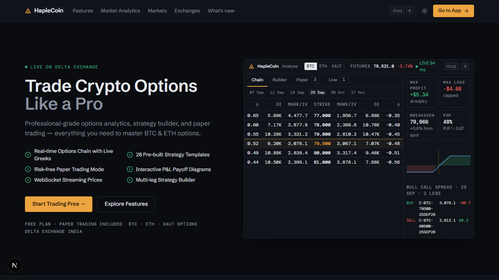
*Landing page, dark*

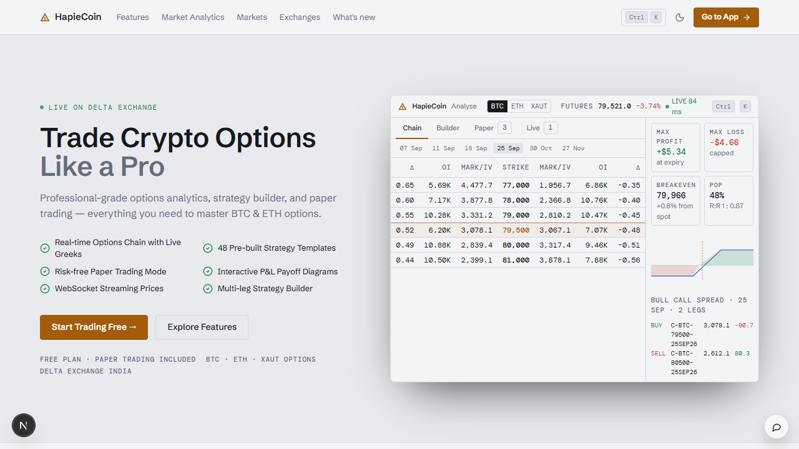
*Landing page, light*

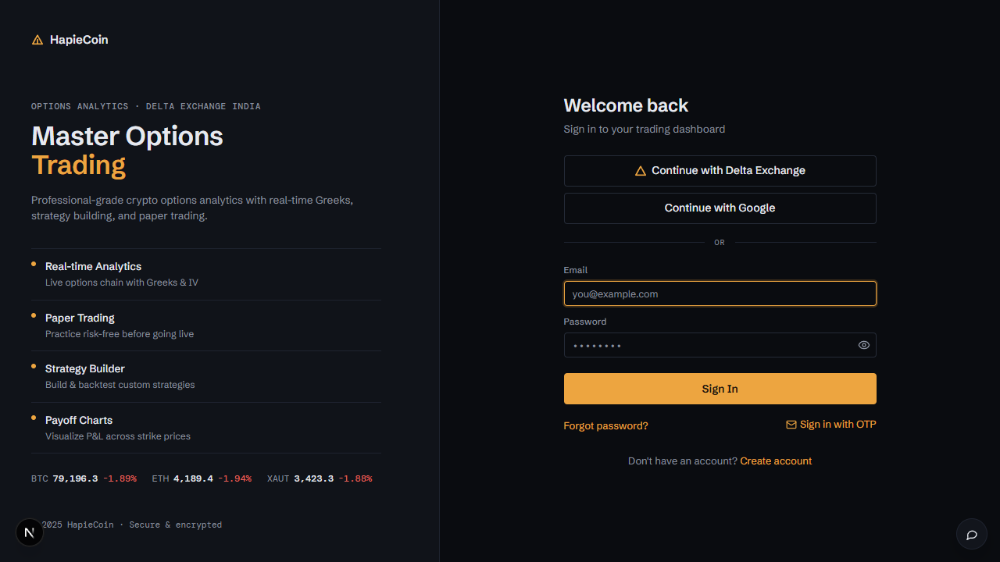
*Sign in*

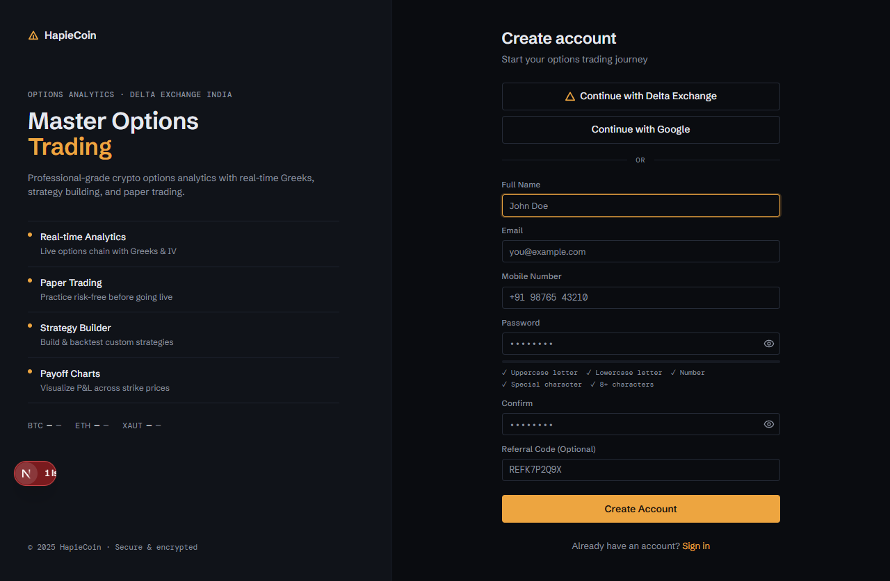
*Sign up*

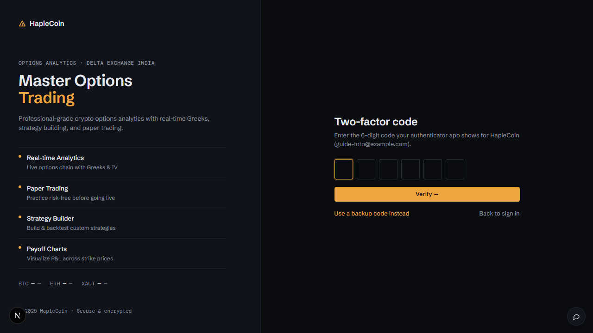
*The authenticator code step after the password*

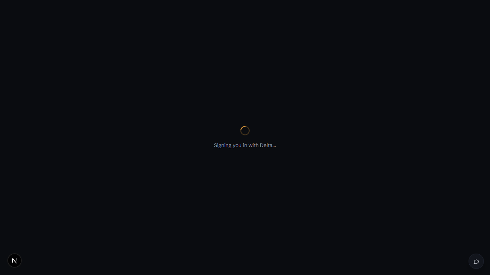
*Sign in with Delta Exchange (SSO return)*

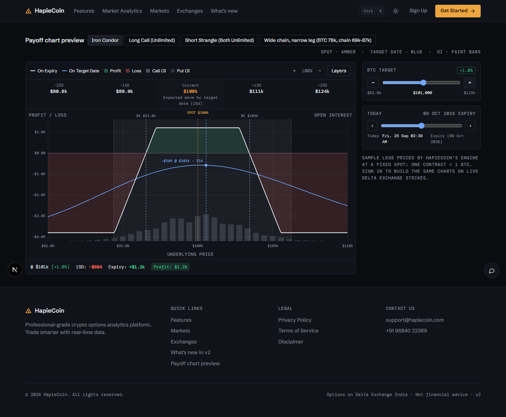
*Payoff chart preview, no account needed*

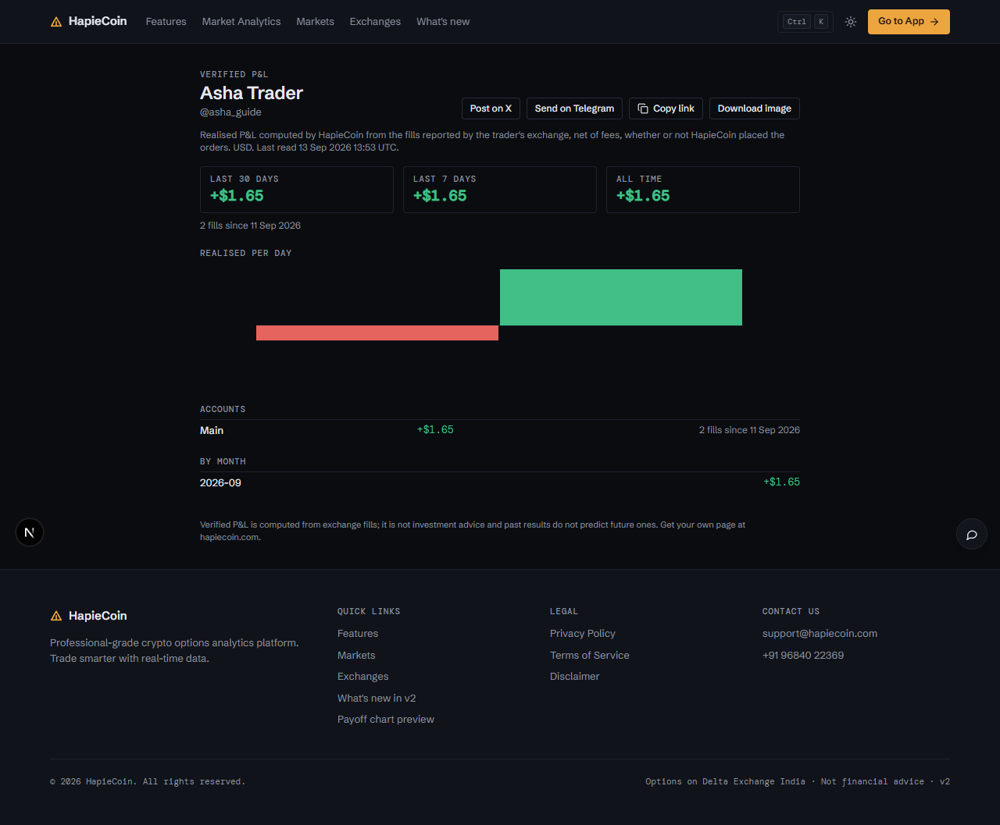
*A trader's public page with verified P&L and share bar*

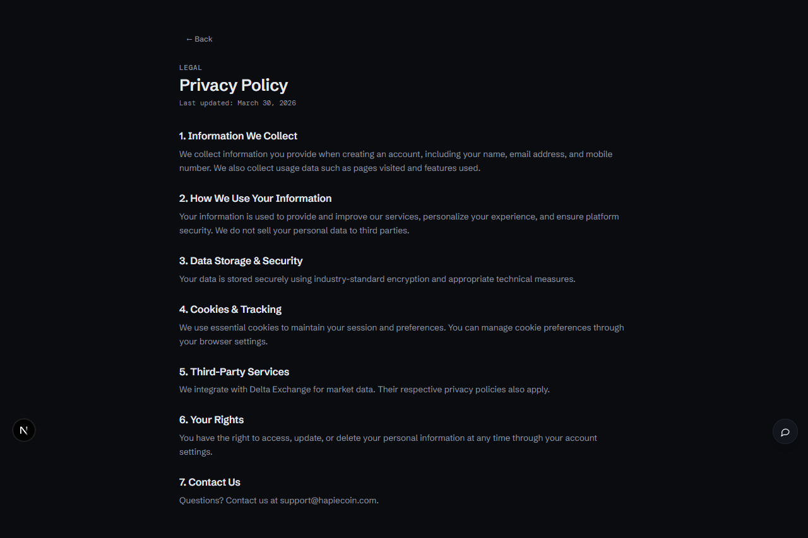
*Privacy policy*

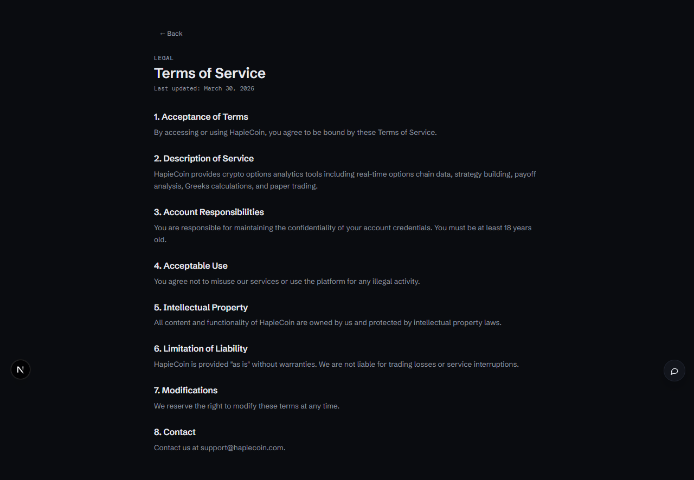
*Terms of service*

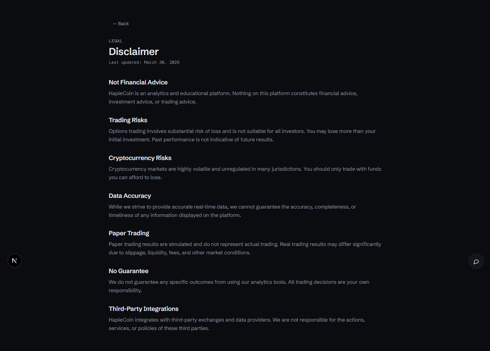
*Disclaimer*

## Every feature, in detail

Each row is one traced feature from the build spec: the id, what it is, how it behaves (the acceptance rule the tests check), and how it is tested. Status "mock-only" means the screen exists but the data feed behind it is not connected yet.

### Landing page · `/`

| ID | Feature | How it behaves | Status | Tested by |
|---|---|---|---|---|
| HC-PB-001 | Sticky 56px panel-tone header with amber Δ mark logo (→ home), text nav (Features / Market Analytics / Markets / Exchanges / What's new), Ctrl K button, theme toggle, Sign Up, Get Started → | Nav links smooth-scroll to landing sections without changing the route; Ctrl K opens CG.palette; Sign Up → #/auth?tab=signup, Get Started → #/auth | built | e2e (Playwright) |
| HC-PB-002 | Header swaps to “Go to App →” when the visitor is logged in | Listens to CG 'auth' events and CG.state.loggedIn; hides Sign Up / Get Started and shows Go to App → #/analyse | built | e2e (Playwright) |
| HC-PB-003 | Theme toggle (moon / sun icon) | Calls CG.theme.toggle(); icon flips on the 'theme' event; whole page re-skins via CSS variables | built | e2e (Playwright) |
| HC-PB-004 | Hero: ‘LIVE ON DELTA EXCHANGE’ mono tag with pulsing dot, headline “Trade Crypto Options / Like a Pro” (second line muted, no gradient), lead paragraph, 6 check bullets | Copy unchanged; dark ground, no gradient washes | mock-only | unit (pricing) · visual (screenshot diff) · security |
| HC-PB-005 | Hero buttons “Start Trading Free →” and “Explore Features ⌄” | Start Trading Free navigates to #/auth; Explore Features smooth-scrolls to the Platform Features section | built | e2e (Playwright) |
| HC-PB-006 | Hero product visual: terminal mock built from live CG.chain / CG.analyze data — top bar (asset segments, futures price, ATM IV, expected move, feed, Ctrl K), 11-row mirrored chain (Δ · OI · Mark/IV \| Strike \| Mark/IV · OI · Δ, ITM tint, amber ATM row, OI bars, leg outlines), builder strip, payoff tiles + chart, scenario matrix, portfolio bar | CG.pubTerminal(kind) (alias CG.pubMock); the BTC price in the mock updates on every tick | mock-only | unit (pricing) · visual (screenshot diff) · security |
| HC-PB-007 | Floating hero chips replaced by data inside the terminal (Bull Call Spread legs with Δ/Θ, max profit / max loss / breakeven / POP tiles, 5×4 P&L matrix) | Absolutely positioned cards around the mock; the mini frame lifts on hover | mock-only | unit (pricing) · visual (screenshot diff) |
| HC-PB-008 | Stats strip: 28 Built-in Strategies · Real-time Greeks & IV · 2 Assets Supported · Paper Trading (mono values, hairline cells) | Numeric values count up from 0 when the row scrolls into view (IntersectionObserver, 1.5s; skipped under reduced-motion) | built | unit (pricing) · e2e (Playwright) |
| HC-PB-009 | Live Markets · Powered by Delta Exchange with LIVE tag and BTCUSD / ETHUSD / XAUTUSD tiles (price, 24h %, sparkline, H/L, IV) | Tiles update and flash on every 'tick' | built | unit (pricing) · e2e (Playwright) · security |
| HC-PB-010 | WHY HAPIECOIN? “Stop Guessing. Start Trading Smart” — two-column comparison table: Without HapieCoin (× rows, muted) vs With HapieCoin (✓ rows) | Same 5 + 5 statements as v1 rendered as a table | mock-only | visual (screenshot diff) · api contract |
| HC-PB-011 | PLATFORM FEATURES tabs (amber underline, auto-rotate progress): Real-time Options Chain / Strategy Builder & Payoff / Paper & Live Trading, each with its terminal mock variant | Variants: chain (chain + builder + payoff + matrix), builder (legs table + templates + payoff + Greeks strip), trading (positions list + wallet tiles + P&L history) | built | unit (pricing) · e2e (Playwright) · security |
| HC-PB-012 | CAPABILITIES “Built for Serious Traders” — 6 hairline cells (two wide) in one bordered grid | 4-column grid; the two “large” cards span 2 columns exactly like the original; hover lift | mock-only | visual (screenshot diff) · api contract · security |
| HC-PB-013 | MARKET ANALYTICS “Liquidations & Market Pulse” — 24H Total Liq / Long Liq / Short Liq / Top Coin stat cells | Values come from CG.mock.global (liq24h, longLiq24h, shortLiq24h, topLiqCoin) formatted as $214.00M etc. | mock-only | visual (screenshot diff) |
| HC-PB-014 | “Live liquidation pattern · last 40 intervals” bar sparkline | 40 bars from the last 40 entries of CG.mock.liqHistory; height ∝ long+short, red when long liquidations dominate, green otherwise; bars grow in on view and show a tooltip with the hourly values | mock-only | unit (pricing) · visual (screenshot diff) · security |
| HC-PB-015 | “Explore Analytics →” button | Navigates to #/analytics (Market Analytics area) | built | e2e (Playwright) |
| HC-PB-016 | EVERYTHING YOU NEED “Full Feature List” — 6 hairline cards × 6 bullets | Exact bullet copy from the bundle's jot[] array rendered in a 3-column grid | mock-only | visual (screenshot diff) |
| HC-PB-017 | Testimonials marquee removed — replaced by the “What’s new in v2” strip | See the new entries below | built | e2e (Playwright) |
| HC-PB-018 | INTEGRATIONS “Supported Exchanges” — Delta Exchange (● LIVE, Connected via API) plus CoinDCX, CoinSwitch, Mudrex (Coming Soon) | Text-logo tiles; the live card is highlighted, coming-soon cards are dimmed to 60% like the original | mock-only | unit (pricing) · visual (screenshot diff) · api contract · security |
| HC-PB-019 | CTA panel “Ready to Trade Smarter?” with amber accent stripe (no gradient) and “Create Free Account →” | Gradient primary→accent band; button navigates to #/auth | built | e2e (Playwright) |
| HC-PB-020 | Footer: brand blurb, Quick Links (Features / Markets / Exchanges / What’s new in v2), Legal, Contact Us, mono bottom line | Rendered by the shared CG.chrome['footer'] override so every screen with 
 gets the same footer; Quick Links scroll to landing sections (navigating home first when needed), Legal links route, email is a mailto:, phone opens wa.me in a new tab | built | unit (pricing) · e2e (Playwright) |
| HC-PB-021 | Smooth-scroll section anchors with sticky-header offset | data-scroll links call scrollIntoView on data-anchor targets (scroll-margin-top 64px) instead of changing the hash, so they never collide with the hash router | built | unit (pricing) · e2e (Playwright) |
| HC-PB-022 | Dark theme support | All colours use the shell's CSS variables; verified with clone/shots/public-landing-dark.png | built | e2e (Playwright) |
| HC-PB-053 | “What’s new in v2” strip (replaces testimonials): Scenario matrix · Vol & Structure tabs · Alerts · Command palette · Journal · Share links, each with an inline SVG icon, NEW tag and one-liner; “Full feature inventory →” link | CG.mock.landing.whatsNew; anchor #whats-new reachable from the header nav and footer | built | unit (pricing) · e2e (Playwright) · api contract |
| HC-PB-054 | Terminal mock top bar shows live ATM IV / IV rank / expected move from CG.chrome.marketStats and the Ctrl K hint | Behaves as in the v2 mock. | built | unit (pricing) · e2e (Playwright) · security |
| HC-PB-055 | Terminal mock scenario matrix: 5 prices × Today / +6d / +13d / Expiry P&L cells, colour intensity scaled by magnitude | Each cell is a CG.analyze(legs, asset, {targetDays, min, max, points:2}) call | built | unit (pricing) · e2e (Playwright) |
| HC-PB-056 | Terminal mock portfolio bar mirrors the app: strategies, Net Δ, margin used, day P&L, alerts armed, basis, CCY | Reads CG.chrome.portfolioData() when the chrome part is present | built | unit (pricing) · e2e (Playwright) · api contract |
| HC-PB-057 | Live Markets tiles gained a 40-point sparkline and the asset IV | Behaves as in the v2 mock. | built | unit (pricing) · e2e (Playwright) · security |
| HC-PB-058 | Hero meta line: FREE PLAN · PAPER TRADING INCLUDED · BTC · ETH · XAUT OPTIONS · DELTA EXCHANGE INDIA (mono micro-labels) | Behaves as in the v2 mock. | built | unit (pricing) · e2e (Playwright) |
| HC-PB-059 | Ctrl K button in the public header opens the command palette (Home / Sign in / legal / payoff preview commands available while logged out) | Behaves as in the v2 mock. | built | unit (pricing) · e2e (Playwright) |
| HC-PB-060 | Both themes: dark-first obsidian ground; light variant is the cool paper/graphite reading — no gradients, no card shadows, hairline separation | Behaves as in the v2 mock. | built | e2e (Playwright) |

### Sign in / Sign up · `/auth`

| ID | Feature | How it behaves | Status | Tested by |
|---|---|---|---|---|
| HC-PB-023 | Split layout: panel-tone brand column (mono eyebrow, “Master Options Trading” with amber word, paragraph, 4 hairline feature rows, live futures ticker, mono copyright) + form column | Glows and grid backgrounds removed | mock-only | unit (pricing) · visual (screenshot diff) · security |
| HC-PB-024 | Tab state driven by the URL (?tab=login \| otp-login \| otp-verify \| signup \| verify-email \| forgot \| reset-password) | Every tab change navigates to #/auth?tab=… (preserving next= and ref=) so browser back/forward moves between steps; sub-steps that need an email fall back to their parent step on a cold visit | built | unit (pricing) · e2e (Playwright) · api contract · security |
| HC-PB-025 | Logged-in visitors are redirected away from /auth | show() checks CG.state.loggedIn and navigates to ?next= or /analyse | built | e2e (Playwright) |
| HC-PB-026 | Login card: “Welcome back · Sign in to your trading dashboard”, Continue with Delta Exchange, OR divider, mono uppercase field labels, amber Sign In, Forgot password? / Sign in with OTP, Create account | Email required / format validated inline (“Email is required”, “Invalid email”); password < 6 chars → toast “Login failed · Invalid credentials.”; success → CG.auth.login(email), toast “Welcome back! · Logged in successfully.”, navigate to ?next= or /analyse | built | unit (pricing) · e2e (Playwright) · api contract · security |
| HC-PB-027 | Password visibility toggle (eye / eye-off) | Button switches the input type between password and text and swaps the icon; present on every password field | built | e2e (Playwright) · security |
| HC-PB-028 | Continue with Delta Exchange | Navigates to #/auth/delta which simulates the OAuth hand-off | built | unit (pricing) · e2e (Playwright) |
| HC-PB-029 | Sign in with OTP: “We'll send a one-time code to your registered email”, Email, Send OTP, New here? Create an account first, ← Back to login | Validates the email, toast “OTP Sent · Check your email for the OTP.” and moves to ?tab=otp-verify | built | e2e (Playwright) · api contract · security |
| HC-PB-030 | Enter OTP: “Code sent to <email>”, 6 DM Mono digit boxes (auto-advance, backspace, paste), Verify & Login, “Resend OTP in 30s” countdown → “Resend OTP” | Boxes auto-advance, support backspace and paste; any 6 digits succeed (e.g. 123456) → toast “Welcome! · Logged in successfully” + login; incomplete code → “Error · Enter valid OTP”; resend → toast “OTP Resent” and the 30s timer restarts | built | e2e (Playwright) · api contract · security |
| HC-PB-031 | Create account form: Full Name, Email, Mobile Number, Password, Confirm, Referral Code (Optional) placeholder REF_XXXXXXX, Create Account, Already have an account? Sign in | Referral code is prefilled from ?ref= (referral links); validations: name required, email format, 10-digit mobile, all password rules, confirm must match (“Passwords do not match”), referral pattern REF_…; success → toast “Account created! · Please verify your email with the OTP sent.” → ?tab=verify-email | built | e2e (Playwright) · api contract · security |
| HC-PB-032 | Live password rules: ✓ Uppercase letter · ✓ Lowercase letter · ✓ Number · ✓ Special character · ✓ 8+ characters (+ strength bar) | Each rule turns green as the typed password satisfies it; bar colour goes red → amber → green | built | unit (pricing) · e2e (Playwright) · security |
| HC-PB-033 | Verify your email: “We've sent a 6-digit OTP to <email>”, 6 boxes, Verify Email, “Didn't receive the code? Resend in 30s”, ← Back to sign up | Incomplete → toast “Verification failed · Please enter the complete 6-digit OTP”; success → toast “Email verified! · You can now sign in.” and returns to the login tab with the email prefilled; resend → “OTP resent · A new OTP has been sent to your email.” | built | unit (pricing) · e2e (Playwright) · api contract · security |
| HC-PB-034 | Reset password: “Enter your email and we'll send you an OTP”, Email Address, Send OTP, ← Back to sign in | Validates the email, toast “OTP sent! · Check your email for the OTP.” → ?tab=reset-password | built | e2e (Playwright) · api contract · security |
| HC-PB-035 | Set new password: “Enter the OTP sent to <email> and your new password”, OTP, New Password (rules), Confirm Password, Reset Password, resend countdown, ← Back | OTP must be 6 digits, new password must pass all rules and match; success → toast “Password reset! · You can now sign in with your new password.” → login tab | built | e2e (Playwright) · api contract · security |
| HC-PB-036 | ?next= deep-link support | Protected screens redirect to /auth?next=/path; after any successful login the user lands on that path | built | e2e (Playwright) · api contract |
| HC-PB-061 | Live futures ticker (BTC / ETH / XAUT price and 24h %) under the feature rows, updated every tick | Behaves as in the v2 mock. | built | unit (pricing) · e2e (Playwright) · security |
| HC-PB-062 | Mono inputs for mobile number, referral code and OTP; password strength bar + mono rule list | Behaves as in the v2 mock. | built | e2e (Playwright) · api contract · security |
| HC-PB-065 | Continue with Google (Better Auth social sign-in): the button shows only when the API has Google configured; the OAuth callback is served on the web origin so the session cookie is first-party and /analyse opens signed in | authClient.signIn.social({ provider: "google", callbackURL: next }); BETTER_AUTH_URL = web origin (ADR-019) | built | e2e (Playwright) · api contract |

### Delta Exchange sign-in · `/auth/delta`

| ID | Feature | How it behaves | Status | Tested by |
|---|---|---|---|---|
| HC-PB-037 | Full-screen spinner “Signing you in with Delta…”, then login | After 1.5s: CG.auth.login(), toast “Welcome! · Signed in with Delta.”, navigate to /analyse (timer cancelled if the user leaves) | built | unit (pricing) · e2e (Playwright) · api contract |

### SSO return · `/sso`

| ID | Feature | How it behaves | Status | Tested by |
|---|---|---|---|---|
| HC-PB-038 | “Signing you in…” spinner then redirect | After 1s logs the user in and navigates to ?sso_return= (when it is an in-app path) or /analyse | built | e2e (Playwright) |

### Privacy Policy · `/privacy`

| ID | Feature | How it behaves | Status | Tested by |
|---|---|---|---|---|
| HC-PB-039 | ← Back button, LEGAL eyebrow, title, mono “LAST UPDATED” line, 7 sections in a two-column definition layout | Back goes to the previous screen (history.back) or home when opened directly; sections 1–7 use the bundle's exact headings and paragraphs | built | e2e (Playwright) |

### Terms of Service · `/terms`

| ID | Feature | How it behaves | Status | Tested by |
|---|---|---|---|---|
| HC-PB-040 | ← Back button, title, mono last-updated line, 8 two-column sections | Exact copy incl. “provided "as is" without warranties” | built | e2e (Playwright) |

### Disclaimer · `/disclaimer`

| ID | Feature | How it behaves | Status | Tested by |
|---|---|---|---|---|
| HC-PB-041 | ← Back button, title, mono last-updated line, 7 two-column sections (Not Financial Advice … Third-Party Integrations) | Exact copy from the bundle | built | e2e (Playwright) |

### Payoff chart preview · `/payoff-preview`

| ID | Feature | How it behaves | Status | Tested by |
|---|---|---|---|---|
| HC-PB-042 | Preset chips: Iron Condor · Long Call (Unlimited) · Short Strangle (Both Unlimited) · Wide chain, narrow leg (BTC 78k, chain 69k-87k) | Legs, prices and IVs copied from the bundle (Uot/zot/Vot/Wot); selecting a preset resets zoom, target and date and re-renders; spot 100k (78k for the wide-chain case) is passed to CG.analyze via opts.spot with lots sized so 1 contract = 1 BTC | built | unit (pricing) · e2e (Playwright) |
| HC-PB-043 | Legend: On Expiry (ink) · On Target Date (blue) · Profit · Loss · Call OI · Put OI (faint) — click toggles the layer | Legend items are clickable and toggle the matching chart layer (struck-through when off) | built | e2e (Playwright) |
| HC-PB-044 | Zoom In / 100% / Zoom Out | Zoom narrows or widens the price range around spot (×1.25 steps, 50%–400%); clicking the percentage resets; the target slider range follows | built | e2e (Playwright) |
| HC-PB-045 | Layers popover (“Chart Layers”): Expiry P&L, Target Date P&L, Profit / Loss Fill, Open Interest, SD Bands, Breakevens | Switch rows toggle each SVG layer live; closes on outside click | built | unit (pricing) · e2e (Playwright) · security |
| HC-PB-046 | SD header: −2SD / −1SD / Current / +1SD / +2SD with “Expected move by target date (Nd)” | Log-normal bands from the legs' average IV over the selected horizon; ±1SD is shaded on the chart with dashed edges | built | unit (pricing) · e2e (Playwright) |
| HC-PB-047 | SVG payoff chart restyled to the reference: single ink expiry line with green/red fills, blue target-date curve, amber SPOT pill + line, faint neutral OI bars, dashed ±1σ band labels, dashed breakevens with BE labels, blue target-price marker with P&L label | Colours only via tokens: --foreground, --curve, --spot, --profit, --loss, --muted-foreground | built | unit (pricing) · e2e (Playwright) |
| HC-PB-048 | Hover crosshair + tooltip | Moving over the plot shows a vertical crosshair, markers on both curves and a tooltip with the price, Expiry P&L and target-date P&L | built | unit (pricing) · e2e (Playwright) |
| HC-PB-049 | Summary line “@ $100k (+0.0%) · 15D: +$… · Expiry: +$… · Profit/Loss pill” (mono) | Recomputed from CG.analyze at the target price for both the target date and expiry; the pill turns red “Loss: $…” when negative | built | unit (pricing) · e2e (Playwright) |
| HC-PB-050 | BTC TARGET slider with −/+ buttons, % chip and $ label | Range slider (step $100) and ±$500 buttons move a target marker on the chart and update the summary on every input event | built | e2e (Playwright) |
| HC-PB-051 | TODAY date slider (Today ↔ Expiry) with ‹ › day buttons and info hint — defaults to mid-way so the target curve is visible | Slider from day 0 to expiry (30d); the blue target-date curve, SD header and “ND:” summary value follow the selected day; label shows e.g. “Fri, 18 Sep 02:30 PM” | built | e2e (Playwright) |
| HC-PB-063 | Header note “Spot · amber · Target date · blue · OI · faint bars”; preset buttons use a neutral selected state | Behaves as in the v2 mock. | built | e2e (Playwright) |
| HC-PB-064 | Target-price marker: dashed blue line, hollow dot on the active curve and “+$… @ price” label when the target differs from spot | Behaves as in the v2 mock. | built | unit (pricing) · e2e (Playwright) |

### Not found · `*`

| ID | Feature | How it behaves | Status | Tested by |
|---|---|---|---|---|
| HC-PB-052 | Not found: ERROR eyebrow, 64px mono “404”, “Oops! Page not found”, outline “Return to Home” | Catch-all screen; Return to Home → #/ | built | e2e (Playwright) |

### Auth · Two-factor code · `/auth?tab=totp`

| ID | Feature | How it behaves | Status | Tested by |
|---|---|---|---|---|
| HC-PB-068 | Second factor at sign-in: the 6-digit code from the authenticator app, or a backup code | A password sign-in on an account with 2FA on answers twoFactorRedirect and the form moves to the code step (no session yet); six boxes for the app code, 'Use a backup code instead' for a saved code (each works once), 'Back to sign in'; a wrong code says 'That code is not right.' Email codes and Google are refused for such an account with 'This account uses an authenticator app: sign in with your password and the code' | built | unit (api + web), e2e |

### Auth · Sign in · `/auth`

| ID | Feature | How it behaves | Status | Tested by |
|---|---|---|---|---|
| HC-PB-069 | Sign in with a passkey | Above the Delta and Google buttons when the browser has WebAuthn: one tap asks the device for the passkey and signs the account in without the password; an account with two-factor on is refused with 'This account uses an authenticator app: sign in with your password and the code' (ADR-078); a closed prompt and a device without a passkey each get one sentence | built | unit (web), e2e |

### Public trader page · `/t/<handle>`

| ID | Feature | How it behaves | Status | Tested by |
|---|---|---|---|---|
| HC-PB-066 | A trader's verified P&L on a public page: totals net of fees always, the daily chart, accounts and months when the trader turned them on, 404 alike for an unknown handle or a page that is off | PublicHeader + Footer like /s/<code>; the body reads GET /v1/public/traders/<handle> (unauthenticated, Cache-Control public max-age=60) whose shape is publicTraderFrom: name, handle, all / 30-day / 7-day net, fills, since, last read, partial flag, and only the opted-in sections; never account ids, commissions, balances, positions, products or the Journal comparison; generateMetadata carries the 30-day figure into the title and description for link previews; USD only | built | unit (schema + api + web), e2e |

### Public trader page · share · `/t/<handle>`

| ID | Feature | How it behaves | Status | Tested by |
|---|---|---|---|---|
| HC-PB-067 | Share the page: post on X, send on Telegram, copy the link, download a 1200×630 PNG card | Intent links built from the 30-day figure net of fees and the page URL (twitter.com/intent/tweet, t.me/share/url), opened in a new tab; Copy link through the clipboard; the card drawn on a canvas in the browser (dark, amber rule, name, handle, three figures, fills and since, the URL) and saved as hapiecoin-<handle>-verified-pnl.png through a data URL, no library and no server rendering; the same bar sits in the Public page dialog | built | unit (web), e2e |

