# Workspace chrome, settings and dialogs

Part of the [HapieCoin feature guide](README.md). 114 traced features on 25 screens; 113 built and tested, 1 still mock-only (listed in the backlog).

## What it does

Everything around the workspace: the header (asset pills, futures price with 24 h change, feed status, exchange chip, currency toggle, alerts bell, theme, settings and account menus), the portfolio bar at the bottom, and the settings dialogs behind the gear.

Settings cover the profile, exchange API keys (several labelled keys per exchange, one per Delta sub-account), the display currency and conversion rate, lot sizes, the P&L basis (mark or bid/ask), the Mindful trading pause, security (two-factor with an authenticator app, backup codes, passkeys), exchanges (admin), and the public page. The command palette (Ctrl K), the keyboard shortcuts sheet (?), the product tour and the HapieCoin Assistant are reachable from the same menu. Exchange keys are stored encrypted on the server and never shown again after saving.

## Try it

1. On `/analyse` press **Ctrl K**: search for any tab, dialog or page and jump to it. Press **?** for the shortcuts sheet.
2. Gear → **Profile**: change the name and avatar. Gear → **Currency**: switch INR / USD and watch every figure in the workspace follow.
3. Gear → **API Settings**: add a Delta API key with a label (read-only keys are refused for live trading; the whitelist IP is shown). Add a second labelled key to see accounts.
4. Gear → **Security**: turn two-factor on with an authenticator app, save the backup codes, then add a passkey and sign in with it.
5. Gear → **Mindful trading**: set a daily-loss threshold and pause length; the pause shows before a live order when you are down on the day.
6. Gear → **Take a tour** for the guided overlay; click the chat bubble bottom-right for the assistant and try “Explain this strategy”.

## Screens

*The analyse header and workspace*

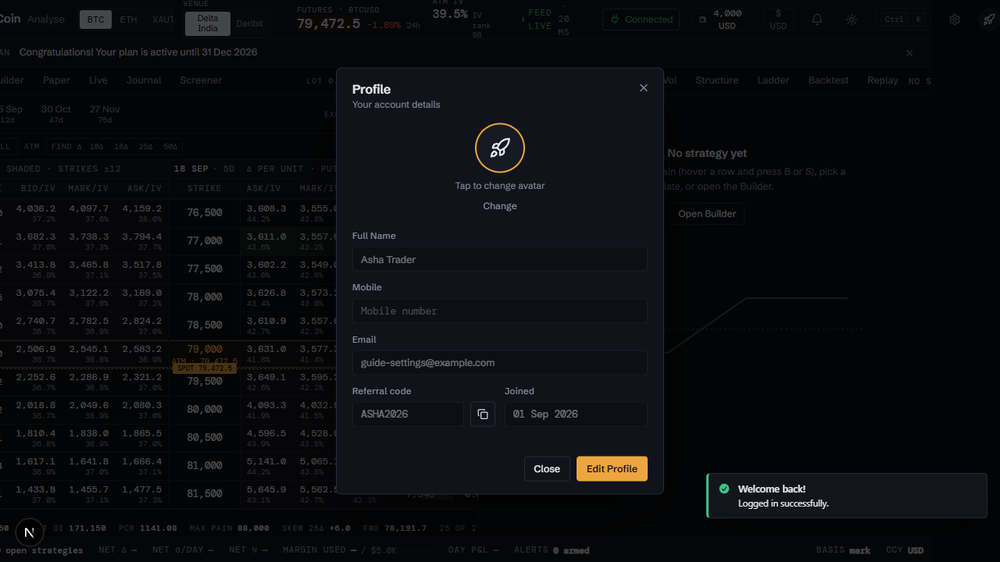
*Profile*

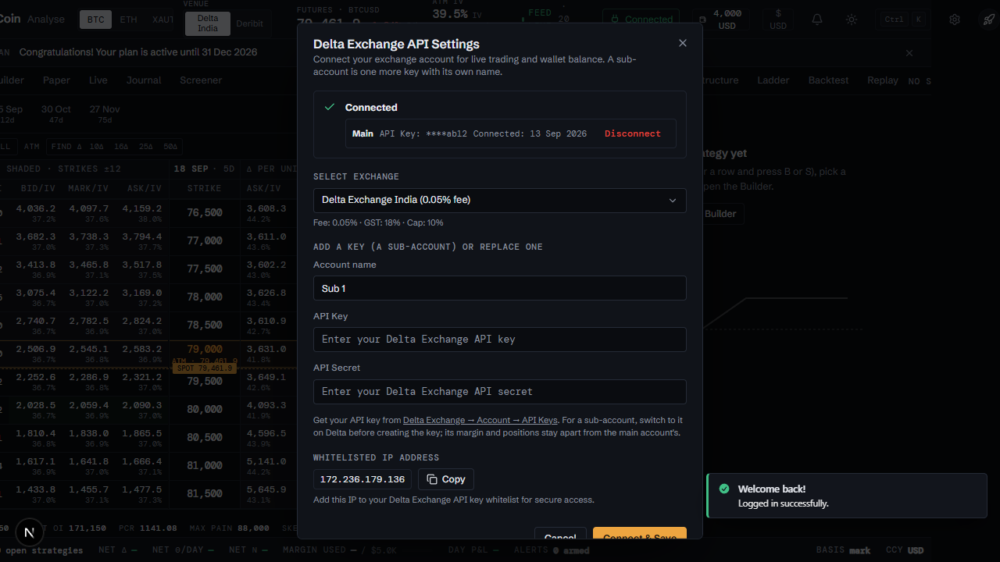
*API keys and accounts*

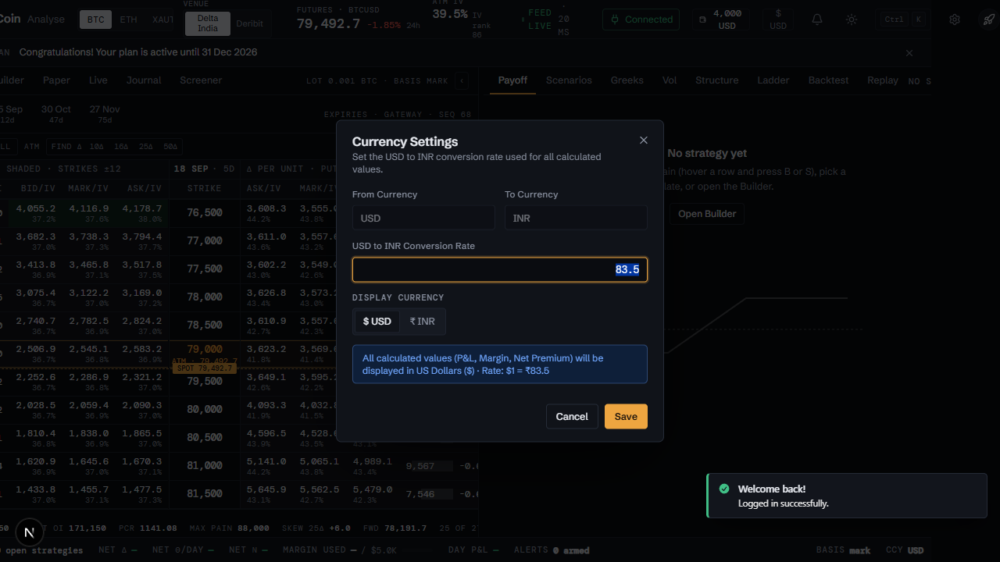
*Currency*

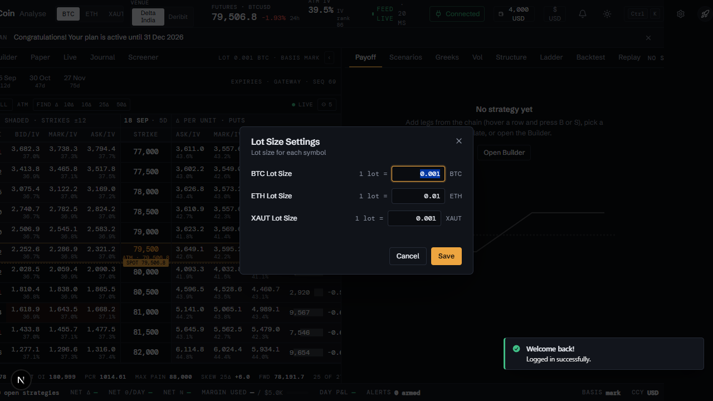
*Lot sizes*

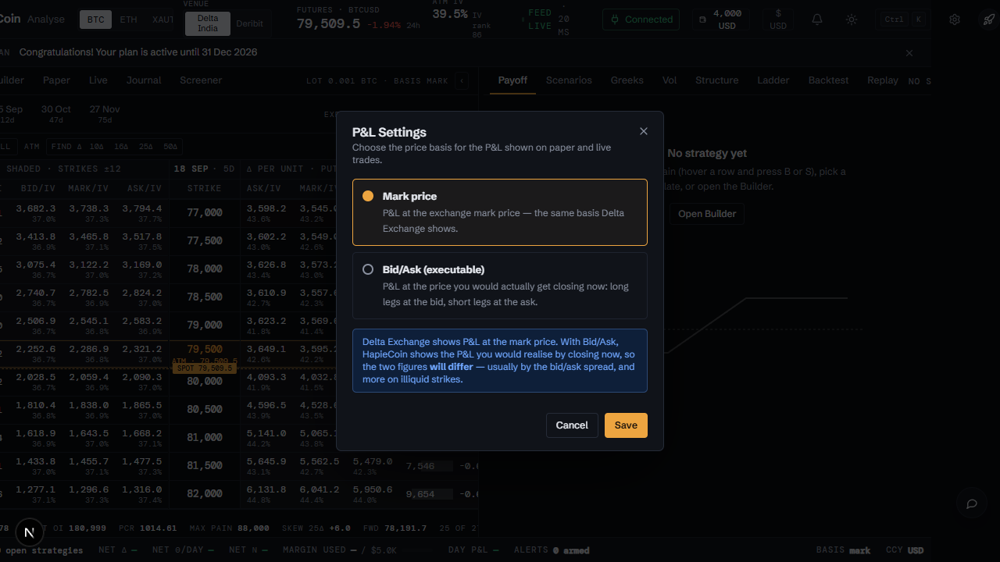
*P&L basis*

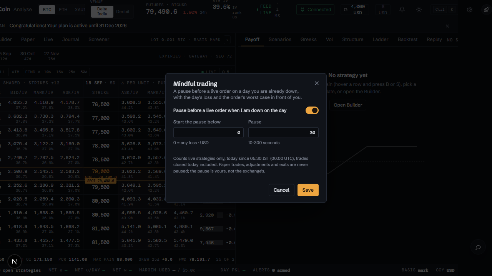
*Mindful trading*

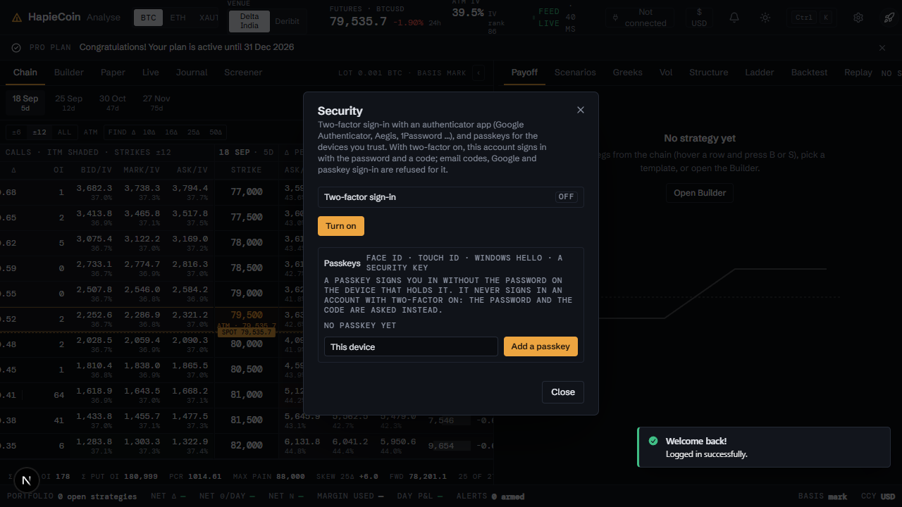
*Security: two-factor and passkeys*

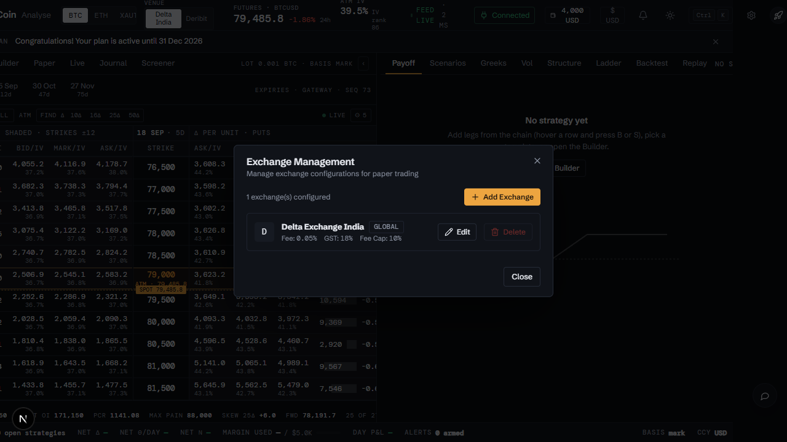
*Exchange management (admin)*

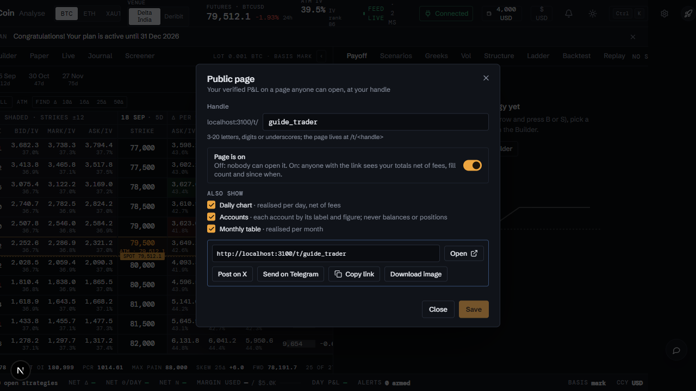
*Public page*

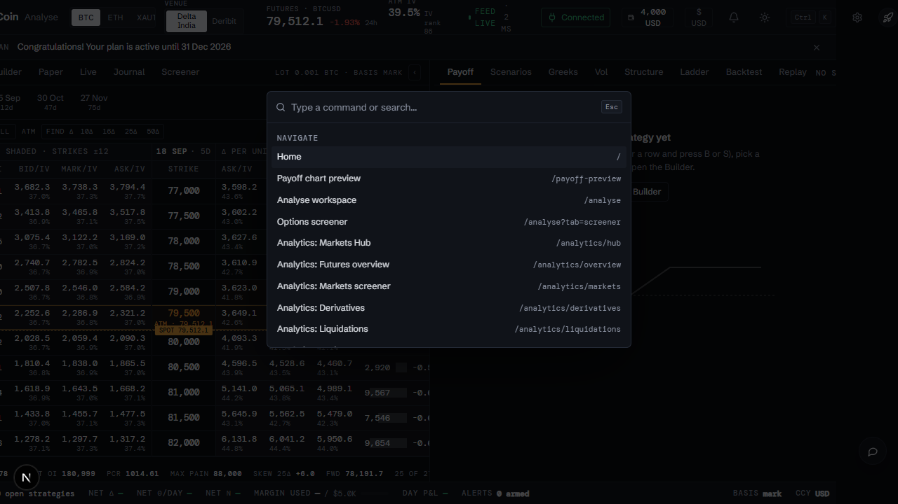
*Command palette*

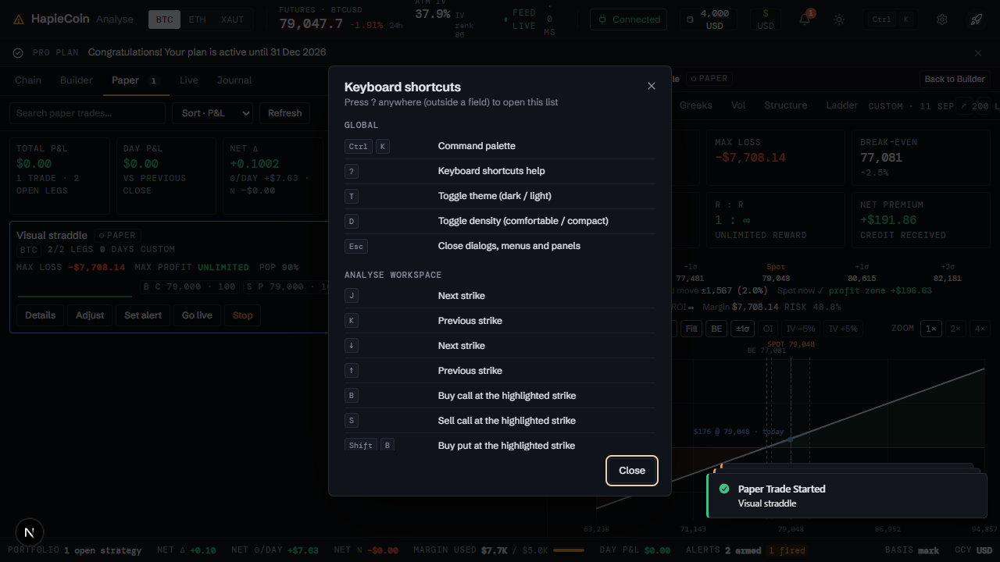
*Keyboard shortcuts*

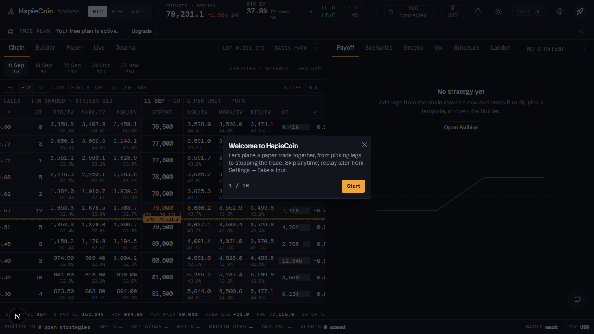
*Product tour, welcome*

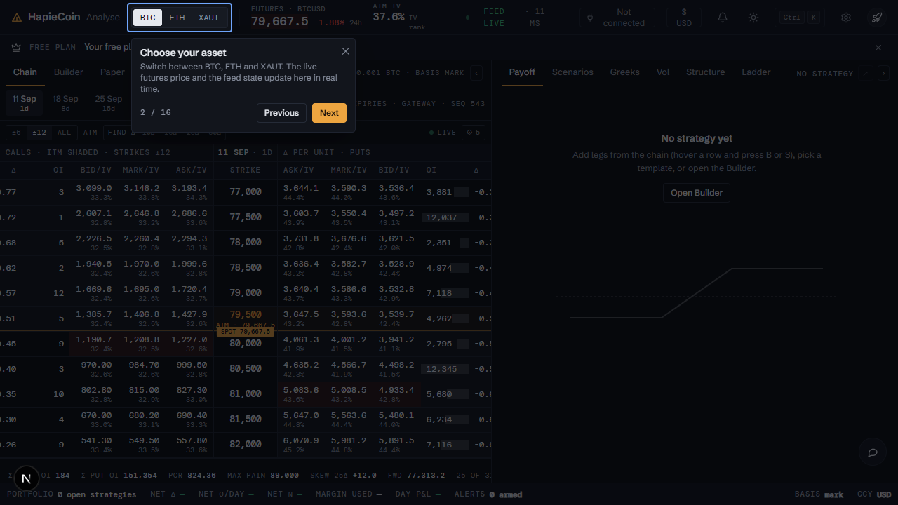
*Product tour, anchored step*

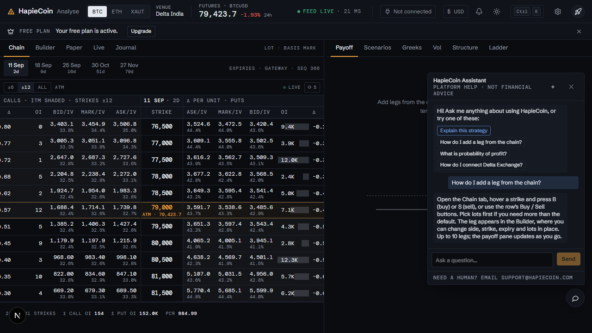
*HapieCoin Assistant*

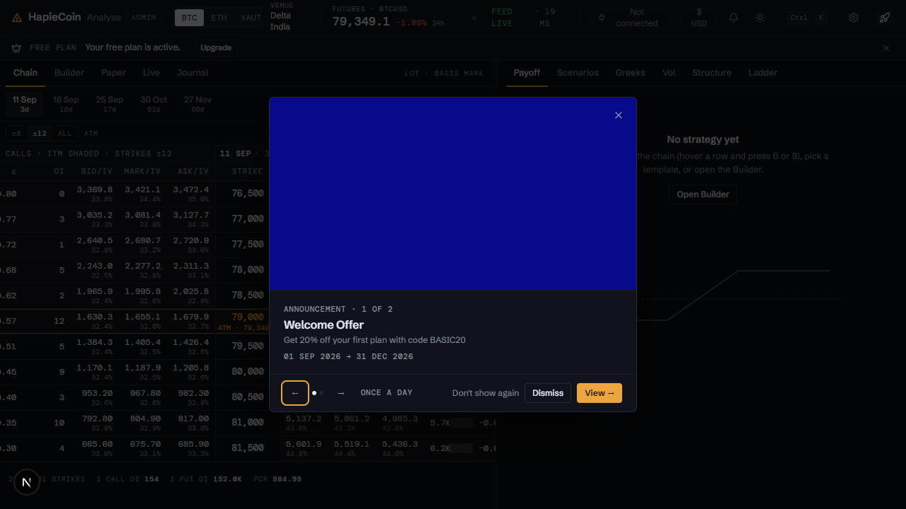
*Banner flyer*

## Every feature, in detail

Each row is one traced feature from the build spec: the id, what it is, how it behaves (the acceptance rule the tests check), and how it is tested. Status "mock-only" means the screen exists but the data feed behind it is not connected yet.

### Shared chrome · App header (analyse) · `/analyse`

| ID | Feature | How it behaves | Status | Tested by |
|---|---|---|---|---|
| HC-SH-001 | Logo (amber Δ mark + HapieCoin · Analyse) → /analyse | Rendered by CG.chrome['app-header'] variant 'analyse'; 50px panel-tone header with hairline bottom border; link to #/analyse | built | e2e (Playwright) · api contract · security |
| HC-SH-002 | Admin badge next to logo (admin only, neutral mono chip) → /admin/users | Shown when CG.auth.isAdmin(); hidden for normal users | built | e2e (Playwright) · api contract · security |
| HC-SH-003 | Asset switcher: BTC / ETH / XAUT segmented control (data-tour=asset-select) + 'Venue: Delta India' | Clicking a segment sets CG.state.asset, saves state, emits 'asset' and toasts; CG.chrome.openAssetMenu() dropdown kept for compatibility | built | unit (pricing) · e2e (Playwright) |
| HC-SH-004 | Futures price + 24h % (DM Mono, tabular figures) with live flash on every tick | Label 'FUTURES · BTCUSD'; price flashes green/red vs previous tick; 24h % derived from base price | built | unit (pricing) · e2e (Playwright) · security |
| HC-SH-005 | 24h Change ± % (green/red) beside the price | Same cell as the price, semantic profit/loss colour | built | e2e (Playwright) |
| HC-SH-006 | Feed status as text '● FEED LIVE · 84 ms' (latency jitters on each tick) — click pauses / reconnects | Replaces the green pill; dot turns grey when paused, amber while connecting; emits 'live-feed' and toasts | built | unit (pricing) · e2e (Playwright) · security |
| HC-SH-007 | 'Exchange' chip: Not connected / Connected (green when connected) → API Settings dialog | Opens the Delta Exchange API Settings dialog; turns green with 'Connected' when CG.state.exchangeConnected | built | unit (pricing) · e2e (Playwright) · api contract |
| HC-SH-008 | Wallet balance chip ($1,000.00) when exchange connected | Opens balance popover: Available / Margin Used / Total Equity from CG.mock.wallet + 'Click to refresh' (refreshes numbers, toast) | built | unit (pricing) · e2e (Playwright) |
| HC-SH-009 | Market Analytics moved out of the header into the settings menu, default-header tabs and the command palette | Settings → Market Analytics link, 'Market Analytics' tab on the default header, palette 'Market Analytics · …' commands | built | e2e (Playwright) |
| HC-SH-010 | Currency toggle moved to the portfolio bar (CCY item) and settings menu / palette ('Display currency → INR') | CG.chrome.toggleCurrency() keeps the v1 behaviour (emits currency-settings-changed + currency, toasts) | built | e2e (Playwright) |
| HC-SH-011 | Theme toggle (moon/sun) · 'Switch to Dark Mode' / 'Switch to Light Mode' | CG.theme.toggle(); header re-renders icon and title on 'theme' event | built | e2e (Playwright) |
| HC-SH-012 | 'Take a tour' moved to the settings menu and the command palette | CG.chrome.startTour() unchanged | built | e2e (Playwright) |
| HC-SH-013 | Settings gear (data-tour=settings-menu) | Opens the settings dropdown menu | built | e2e (Playwright) |
| HC-SH-014 | Plan banner auto-inserted under the analyse header | If the screen has no data-cg=plan-banner placeholder the header appends one | built | e2e (Playwright) |
| HC-SH-077 | ATM IV + 'IV rank N' (mono) | From CG.analyse.stats {atmIv, ivRank} when the analyse part emits 'analyse:stats'; otherwise computed from the ATM row of CG.chain(asset, expiry) and a per-asset IV range (CG.mock.ivRange). Exposed as CG.chrome.marketStats(asset) | built | unit (pricing) · e2e (Playwright) |
| HC-SH-078 | 'EXP. MOVE · 25 SEP  ± 7,693 1σ' expected move for the selected expiry | spot × ATM IV × √(dte/365); re-rendered on tick, 'asset', 'expiry', 'analyse:expiry' and 'analyse:stats' | built | unit (pricing) · e2e (Playwright) |
| HC-SH-079 | Alerts bell with armed-count badge (red when an alert has triggered) → Alerts dialog | Badge re-rendered on 'alerts-changed' / 'alert-triggered' | built | e2e (Playwright) · api contract |
| HC-SH-080 | Density toggle (comfortable / compact) | Sets CG.state.density, CG.saveState(), CG.emit('density', value) and html[data-density]; --cg-row = 36px / 28px; keyboard D | built | e2e (Playwright) |
| HC-SH-081 | 'Ctrl K · Command' button opens the command palette (data-tour=command-palette) | Behaves as in the v2 mock. | built | e2e (Playwright) |
| HC-SH-082 | User avatar → Account menu (My Profile / My Subscription / My Referrals / Logout) on both header variants | Behaves as in the v2 mock. | built | e2e (Playwright) · api contract |
| HC-SH-083 | Responsive trimming: venue and Command label hide ≤1500px, expected move ≤1330px, ATM IV ≤1180px, sub-labels ≤1000px | CSS media queries; header never overflows at 1440 / 1280 / 1100 / 960 (pw/check-v2-widths.js) | built | unit (pricing) · e2e (Playwright) |

### Shared chrome · App header (default) · `/subscription`

| ID | Feature | How it behaves | Status | Tested by |
|---|---|---|---|---|
| HC-SH-015 | Logo → /analyse (or / when logged out) | CG.chrome['app-header'] default variant used by every non-analyse logged-in page | built | e2e (Playwright) |
| HC-SH-016 | Text tabs Analyse · Market Analytics · Subscription · Referrals · Admin with an amber underline on the active route | Replaces the 'Go to Analyse' button; active tab from CG.current.path (Market Analytics also active on /terminal/*) | built | unit (pricing) · e2e (Playwright) · api contract · security |
| HC-SH-017 | 'Market Analytics' tab (active state on /analytics/* and /terminal/*) | Navigates to /analytics; highlighted when current path starts with /analytics | built | unit (pricing) · e2e (Playwright) |
| HC-SH-018 | 'Admin' nav link + badge (admin only) → /admin/users | Only rendered when CG.auth.isAdmin() | built | e2e (Playwright) · api contract · security |
| HC-SH-019 | Alerts bell, density toggle, theme toggle, Ctrl K button, settings gear on the default header | Same controls as the analyse header | built | e2e (Playwright) · api contract |
| HC-SH-020 | User avatar button → Account menu | Menu shows name/email, My Profile, My Subscription, My Referrals, Logout | built | e2e (Playwright) · api contract |
| HC-SH-021 | 'Sign In' button when logged out | Header re-renders on 'auth'; Sign In navigates to /auth | built | e2e (Playwright) |
| HC-SH-084 | Logged-out variant: Home · Market Analytics tabs, theme, Ctrl K, 'Sign in' primary button | Behaves as in the v2 mock. | built | e2e (Playwright) |

### Shared chrome · Settings menu · `/analyse`

| ID | Feature | How it behaves | Status | Tested by |
|---|---|---|---|---|
| HC-SH-022 | Section 'Account': My Profile / My Subscription / My Referrals | My Profile opens the Profile dialog; the others navigate to /subscription and /referrals | built | e2e (Playwright) · api contract |
| HC-SH-023 | Section 'Preferences': API Settings, Currency Settings (value), Lot Size Settings, P&L Settings (value), Exchange Setup, Alerts (armed count), Keyboard shortcuts (?), Density (value), Command palette (Ctrl K), Market Analytics, Take a tour, theme | Each opens the matching dialog / starts the tour / toggles theme | built | unit (pricing) · e2e (Playwright) · api contract |
| HC-SH-024 | Section 'Admin' (admin only): Subscription Plans, Menu Pricing, Coupon Codes, User Subscriptions, Banners, Promotional Emails, Users | Links to /admin/subscriptions, /admin/menu-pricing, /admin/coupons, /admin/user-subscriptions, /admin/banners, /admin/emails, /admin/users | built | e2e (Playwright) · api contract · security |
| HC-SH-025 | Section 'Support': Email Us (mailto:support@hapiecoin.com), WhatsApp Us (wa.me/919684022369, new tab) | External links with rel=noopener | built | e2e (Playwright) · api contract |
| HC-SH-026 | Logout → Confirm Logout dialog | 'Are you sure you want to sign out? You'll need to sign in again to access your account.' → CG.auth.logout() + toast 'Logged out · You have been signed out.' | built | e2e (Playwright) |

### Shared chrome · Profile dialog · `/analyse`

| ID | Feature | How it behaves | Status | Tested by |
|---|---|---|---|---|
| HC-SH-027 | Profile · Your account details | CG.chrome.openSettings('profile') | built | e2e (Playwright) |
| HC-SH-028 | Avatar picker (rocket / diamond / lightning) · 'Tap to change avatar' · 'Choose your avatar' · Change | Tapping the avatar or Change reveals the picker; picking updates CG.mock.user.avatar, header avatar and toasts 'Avatar updated' | built | e2e (Playwright) |
| HC-SH-029 | Fields: Full Name ('Your name'), Mobile ('Mobile number'), Email (read-only), Referral code (+copy), Joined | Read-only until Edit Profile; copy button toasts 'Copied' | built | e2e (Playwright) · api contract |
| HC-SH-030 | Edit Profile → Save ('Saving...') | Validates name, 600ms 'Saving...' then updates CG.mock.user, emits 'profile-updated', toast 'Profile updated' | built | e2e (Playwright) |

### Shared chrome · API Settings dialog · `/analyse`

| ID | Feature | How it behaves | Status | Tested by |
|---|---|---|---|---|
| HC-SH-031 | Delta Exchange API Settings · status block | 'Checking connection...' spinner (700ms) then 'Not Connected · Enter your Delta Exchange API credentials to enable live trading.' or connected block with 'API Key: ••••1a2b', 'Connected: <date>', 'Wallet: $1,000.00' | built | unit (pricing) · e2e (Playwright) · api contract · security |
| HC-SH-032 | Select Exchange (brokers with '(0.05% fee)') + 'Fee: 0.05% · GST: 18% · Cap: 10%' | Select lists CG.mock.brokers; fee line updates on change; selection stored in CG.mock.apiCredentials.brokerId | built | unit (pricing) · e2e (Playwright) · api contract · security |
| HC-SH-033 | API Credentials: API Key + API Secret (password) inputs | Placeholders 'Enter your Delta Exchange API key' / 'Enter your Delta Exchange API secret' | built | unit (pricing) · e2e (Playwright) · api contract · security |
| HC-SH-034 | Connect & Save (validation → 'Connecting...' 1s → connected) | Empty key/secret → destructive toast 'Save Failed'; success sets CG.state.exchangeConnected, emits 'exchange-changed' + 'broker-credentials-changed', toast 'Exchange Connected · API credentials saved to server' | built | unit (pricing) · e2e (Playwright) · api contract · security |
| HC-SH-035 | 'Get your API key from Delta Exchange → Account → API Keys' link (new tab) | External link with rel=noopener noreferrer | built | unit (pricing) · e2e (Playwright) · api contract · security |
| HC-SH-036 | Whitelisted IP Address 172.236.179.136 + Copy + hint | Copy writes to clipboard and toasts 'Copied · IP address copied to clipboard'; hint 'Add this IP to your Delta Exchange API key whitelist for secure access.' | built | unit (pricing) · e2e (Playwright) · api contract · security |
| HC-SH-037 | Disconnect Exchange (only when connected) | Clears credentials, CG.state.exchangeConnected=false, toast 'Exchange Disconnected · Delta Exchange credentials removed' | built | unit (pricing) · e2e (Playwright) · api contract · security |
| HC-SH-123 | Accounts: several labelled keys per exchange (Delta sub-accounts) | API Settings lists every connected key with its name, masked key, date and its own Disconnect; the form proposes the next free name (Main, Sub 1, …), a known name replaces that key, at most five per exchange; the wallet chip names the account it reads once there is more than one; a key a live strategy trades through cannot be removed (409 with the count) | built | unit (api + web), e2e |

### Shared chrome · Currency Settings dialog · `/analyse`

| ID | Feature | How it behaves | Status | Tested by |
|---|---|---|---|---|
| HC-SH-038 | From Currency (USD) → To Currency (INR) + 'USD to INR Conversion Rate' input | Rate defaults to CG.state.conversionRate (83.5) | built | e2e (Playwright) |
| HC-SH-039 | Display currency tabs ($ USD / ₹ INR) + note 'All calculated values (P&L, Margin, Net Premium) will be displayed in … · Rate: $1 = ₹83.5' | Note updates live as rate / currency change | built | unit (pricing) · e2e (Playwright) · security |
| HC-SH-040 | Save ('Saving...') / Cancel | Validates rate > 0; sets CG.state.conversionRate + currency, emits 'currency-settings-changed', toast 'Currency conversion saved' | built | e2e (Playwright) |

### Shared chrome · Lot Size Settings dialog · `/analyse`

| ID | Feature | How it behaves | Status | Tested by |
|---|---|---|---|---|
| HC-SH-041 | Lot size for each symbol: BTC / ETH / XAUT rows '1 lot = [0.001] BTC' | Inputs pre-filled from CG.state.lotSizes | built | e2e (Playwright) |
| HC-SH-042 | Save → 'Lot sizes saved' | Validates > 0 (else 'Failed to save lot sizes'), stores CG.state.lotSizes, emits 'lot-sizes-changed' | built | e2e (Playwright) |

### Shared chrome · P&L Settings dialog · `/analyse`

| ID | Feature | How it behaves | Status | Tested by |
|---|---|---|---|---|
| HC-SH-043 | Radio group 'P&L price basis': Mark price / Bid/Ask (executable) with descriptions | aria radiogroup; click selects; Save stores CG.state.pnlBasis ('mark' \| 'bid_ask') and emits 'pnl-basis-changed' | built | unit (pricing) · e2e (Playwright) |
| HC-SH-044 | Explanatory note about mark vs bid/ask differences | Static info alert with the bundle text ('…so the two figures will differ — usually by the bid/ask spread, and more on illiquid strikes.') | mock-only | visual (screenshot diff) · api contract |

### Shared chrome · Exchange Management dialog · `/analyse`

| ID | Feature | How it behaves | Status | Tested by |
|---|---|---|---|---|
| HC-SH-045 | Exchange Management · Manage exchange configurations for paper trading · list of exchange cards (name, Preferred/GLOBAL badges, Fee %, GST %, Fee Cap %) | Rendered from CG.mock.brokers | built | unit (pricing) · e2e (Playwright) |
| HC-SH-046 | Add Exchange → 'Add New Exchange · Configure exchange fee structure' form | Fields Exchange Name ('e.g., Delta Exchange India'), Fee Percentage (%) 'Percentage of notional value', GST Percentage (%), Fee Cap (% of premium) 'Maximum fee as percentage of premium'; Create pushes to CG.mock.brokers, toast 'Success · Exchange created successfully' | built | unit (pricing) · e2e (Playwright) |
| HC-SH-047 | Validation 'Exchange name is required' | Inline error + destructive toast 'Validation Error' | built | unit (pricing) · e2e (Playwright) |
| HC-SH-048 | Edit → 'Edit Exchange' form → Update | Mutates the broker in CG.mock.brokers, toast 'Exchange updated successfully', emits 'brokers-changed' | built | e2e (Playwright) |
| HC-SH-049 | Delete → confirm 'Delete Exchange · This action cannot be undone' + warning | Body 'Are you sure you want to delete this exchange?' + '⚠️ Warning: Any strategies using this exchange will need to be reconfigured.'; confirm removes from CG.mock.brokers, toast 'Exchange deleted successfully' | built | e2e (Playwright) |

### Shared chrome · Plan banner · `/analyse`

| ID | Feature | How it behaves | Status | Tested by |
|---|---|---|---|---|
| HC-SH-050 | Expired: 'Your plan has expired.' + Renew Plan | CG.chrome['plan-banner'] reads CG.mock.subscription; button → /subscription | built | e2e (Playwright) |
| HC-SH-051 | Free: 'Your free plan is active.' + Upgrade | Shown when planId is p_free / status free | built | unit (pricing) · e2e (Playwright) |
| HC-SH-052 | Expiring: 'Your plan expires soon — N days left.' + Renew Plan | Shown when expiresAt is within 7 days of CG.NOW | built | e2e (Playwright) |
| HC-SH-053 | Active: 'Congratulations! Your plan is active until 31 Dec 2026' (dismissable) | Dismiss hides it for the session (sessionStorage); re-renders on 'subscription-changed' | built | unit (pricing) · e2e (Playwright) |
| HC-SH-109 | Slim 28px one-line strip: state stripe (green active / amber expiring / red expired / blue free), plan name micro-label, message, outline action, dismiss | Same four states and dismiss persistence as v1 | built | unit (pricing) · e2e (Playwright) |

### Shared chrome · Upgrade Required dialog · `/analyse`

| ID | Feature | How it behaves | Status | Tested by |
|---|---|---|---|---|
| HC-SH-054 | CG.chrome.upgradeRequired(message): 'Upgrade Required' + message + 'Subscribe Here →' + Dismiss | Subscribe navigates to /subscription and closes; Dismiss closes | built | e2e (Playwright) |

### Shared chrome · Banner flyers · `/analyse`

| ID | Feature | How it behaves | Status | Tested by |
|---|---|---|---|---|
| HC-SH-055 | Flyer popup carousel of active CG.mock.banners (dark panel with amber accent stripe, ANNOUNCEMENT n of N, title, description, date range) | CG.chrome.showFlyers(); gradients removed | built | unit (pricing) · e2e (Playwright) |
| HC-SH-056 | Previous / Next arrows + dots in the footer row, frequency label, 'View' link, close | Arrows cycle; View opens the banner link (hapiecoin.com links become hash routes, others open in a new tab) | built | e2e (Playwright) · api contract |

### Shared chrome · HapieCoin Assistant · `/analyse`

| ID | Feature | How it behaves | Status | Tested by |
|---|---|---|---|---|
| HC-SH-057 | Floating 40px chat bubble bottom-right on every screen, docked above the portfolio bar on /analyse (bottom 56px) | CSS var --cgc-dock set on route; data-tour=chat-launcher | built | e2e (Playwright) |
| HC-SH-058 | Drag to move (pointer events) with remembered position | Drag > 5px moves the button (clamped to viewport) and stores position in localStorage; a plain click toggles the panel | built | e2e (Playwright) |
| HC-SH-059 | Panel header 'HapieCoin Assistant · Platform help · not financial advice' (or visitor mode) with an 'Explain this strategy' quick-action button on /analyse | Subtitle depends on CG.state.loggedIn | built | e2e (Playwright) · api contract |
| HC-SH-060 | Greeting 'Hi! Ask me anything about using HapieCoin — or try one of these:' + 4 suggestion chips | Chips send the question immediately | built | e2e (Playwright) · api contract |
| HC-SH-061 | Input 'Ask a question…' + Send; mock streamed answers | Keyword matching over 11 canned answers (legs/chain, POP, connect Delta, mark vs bid/ask, paper trades, templates, Greeks, margin, lot size, plans, currency) typed out over ~1.5s; fallback answer otherwise; visitor note when logged out | built | unit (pricing) · e2e (Playwright) |
| HC-SH-062 | Footer 'Need a human? Email' (mailto:support@hapiecoin.com, new tab) | External mailto link with rel=noreferrer | built | e2e (Playwright) · api contract |
| HC-SH-063 | Close button / Escape closes the panel | Panel removed; conversation kept for the session | built | e2e (Playwright) |
| HC-SH-110 | “Explain this strategy” quick action (header sparkle button, first suggestion chip on /analyse, palette command) summarises CG.analyse.legs | CG.chrome.explainStrategy(): classifies the legs (CG.chrome.strategyName), lists legs, net debit/credit, max profit/loss, breakevens with % from spot, POP, reward:risk, margin, Greeks and a bias / risk / theta read-out from CG.analyze | built | unit (pricing) · e2e (Playwright) |
| HC-SH-111 | New canned answers for alerts, shortcuts / palette and density | Behaves as in the v2 mock. | built | e2e (Playwright) · api contract |

### Shared chrome · Product tour · `/analyse`

| ID | Feature | How it behaves | Status | Tested by |
|---|---|---|---|---|
| HC-SH-064 | driver.js-style overlay with cut-out around the target (SVG mask) + highlight ring + popover (title, description, 'x of N', Previous / Next / Done, close) | CG.chrome.startTour(); targets located by [data-tour=…]; popover centred when the target is not in the DOM; keyboard ← → Esc | built | unit (pricing) · e2e (Playwright) |
| HC-SH-065 | Step 1 'Welcome to HapieCoin' (Start button, no target) | Text from the bundle | built | e2e (Playwright) · api contract |
| HC-SH-066 | Step 2 'Choose your asset' (asset-select) | Highlights the asset selector | built | e2e (Playwright) |
| HC-SH-067 | Step 3 'Your workspaces' (options-chain) | Highlights the workspace / chain area; emits tour-step with tab 'options-chain' | built | e2e (Playwright) |
| HC-SH-068 | Step 4 'Add a leg — try it now' (advances on 'cg-tour:leg-added') | Waits for the analyse screen to emit CG.emit('cg-tour:leg-added'); Next also works | built | e2e (Playwright) |
| HC-SH-069 | Step 5 'Your strategy legs' (strategy-legs, tab builder) | Highlights the legs panel | built | e2e (Playwright) |
| HC-SH-070 | Step 6 'Payoff and analytics' (payoff-panel) | Highlights the payoff panel | built | unit (pricing) · e2e (Playwright) |
| HC-SH-071 | Step 7 'Start a paper trade' (paper-trade-button, advances on 'cg-tour:save-dialog-open') | Highlights the Paper Trade button | built | e2e (Playwright) |
| HC-SH-072 | Step 8 'Name your strategy' (save-dialog, advances on 'cg-tour:trade-modal-open') | Popover above the modal (z-index 150) | built | unit (pricing) · e2e (Playwright) |
| HC-SH-073 | Step 9 'Review and start' (trade-modal, advances on 'cg-tour:paper-started') | Highlights the trade preview modal | built | e2e (Playwright) |
| HC-SH-074 | Steps 10–12 'Your trade is running' (paper-tab), 'Track P&L and details' (paper-pnl), 'Stop a paper trade' (paper-stop) | Tour step 12 text: 'Stop a paper trade — Use Stop when you are done. Choose whether to archive it so the result stays in your journal.' Steps 10–12 switch the left tab to Paper automatically. | built | unit (pricing) · e2e (Playwright) |
| HC-SH-075 | Steps 13–15 'Settings' (settings-menu), 'Ask the HapieCoin Assistant' (chat-launcher) and 'Command palette' (command-palette) | Highlights the gear and the floating chat button; Done closes with a toast | built | e2e (Playwright) · api contract |
| HC-SH-076 | Auto-start once on /analyse (CG.state.tourDone) after the flyer popup closes; 'Take a tour' restarts; navigates to /analyse first if started elsewhere | cg_tour_done equivalent persisted in CG.state via CG.saveState() | built | unit (pricing) · e2e (Playwright) |
| HC-SH-112 | Step 15 'Command palette' targets the Ctrl K button (data-tour=command-palette) | CG.chrome.TOUR_STEPS.length === 15 | built | e2e (Playwright) |

### Shared chrome · Command palette · `/analyse`

| ID | Feature | How it behaves | Status | Tested by |
|---|---|---|---|---|
| HC-SH-085 | Open with Ctrl K / ⌘ K anywhere (even inside inputs), the header button, Settings → Command palette or CG.palette.open() | CG.palette.open(query?) / close() / toggle() / isOpen(); overlay closes on Esc or backdrop click | built | e2e (Playwright) |
| HC-SH-086 | Search input with fuzzy matching on label + keywords + hint (substring first, then subsequence with word-start bonus); matched characters underlined | Best hit surfaced first as “Best match” | built | e2e (Playwright) |
| HC-SH-087 | Grouped results: Recent · Navigate · Actions · Settings (custom groups appended) | Recent shows the last 5 used commands (CG.state.recentCommands, persisted via CG.saveState) | built | e2e (Playwright) |
| HC-SH-088 | Keyboard: ↑ ↓ / Tab move, ↵ runs, Esc closes; mouse hover selects, click runs | Footer shows the key hints and the number of registered commands | built | e2e (Playwright) |
| HC-SH-089 | Registry API for other parts: CG.palette.register({id,label,group,keywords,hint,kbd,icon,when,run}) → unregister fn; CG.palette.unregister(id); CG.palette.list(); CG.palette.run(id) | Emits 'palette:open', 'palette:close', 'palette:run' {id,label} | built | e2e (Playwright) · api contract |
| HC-SH-090 | Default Navigate commands: Home, Sign in, Analyse workspace, My Subscription, My Referrals, all Admin pages, all Market Analytics sections, all Terminal pages, Feature inventory, Payoff chart preview, legal pages | User routes only when logged in, admin routes only for admins; every other static screen is auto-discovered from section[data-route][data-title] on open | built | unit (pricing) · e2e (Playwright) · api contract · security |
| HC-SH-091 | Default Actions: Switch asset → BTC / ETH / XAUT, Toggle theme (T), Toggle density (D), New alert…, Alerts center, Take a tour, Keyboard shortcuts (?), Explain this strategy (on /analyse), Ask the assistant, Show announcements, Pause / resume live feed, Logout | Behaves as in the v2 mock. | built | unit (pricing) · e2e (Playwright) · api contract · security |
| HC-SH-092 | Default Settings: Open API Settings / Currency Settings / Lot Size Settings / P&L Settings / Exchange Setup / Profile, Display currency → INR/USD | Behaves as in the v2 mock. | built | unit (pricing) · e2e (Playwright) · api contract |
| HC-SH-093 | Empty state “No commands match …” with hints | Behaves as in the v2 mock. | built | e2e (Playwright) |

### Shared chrome · Keyboard shortcuts · `/analyse`

| ID | Feature | How it behaves | Status | Tested by |
|---|---|---|---|---|
| HC-SH-101 | Global keydown dispatcher (ignores typing in inputs / textareas / selects / contenteditable and open dialogs, except Ctrl K and Esc) | CG.shortcuts.combo(e) normalises to e.g. 'ctrl+k', 'shift+e', '?'; CG.emit('shortcut', {key, event}) before the handler | built | e2e (Playwright) |
| HC-SH-102 | Help dialog on “?” (also Settings → Keyboard shortcuts, palette): table of kbd + description grouped Global / Analyse workspace / other | Rows without a handler are marked “handled by the workspace” | built | e2e (Playwright) |
| HC-SH-103 | Default rows: Ctrl K palette, ? help, T theme, D density, Esc close (menus, palette, assistant), j / k strike cursor, B / S add leg, E next expiry, Shift E previous expiry | E / Shift E fall back to CG.analyse.setExpiry(), then the expiry strip buttons, then CG.state.expiry + events | built | e2e (Playwright) |
| HC-SH-104 | API: CG.shortcuts.register(key, description, handler, {group, always}) → unregister fn; unregister(key); list(); open(); close() | Registering an existing key overrides it (the analyse part owns j/k/B/S) | built | e2e (Playwright) · api contract |

### Shared chrome · Portfolio bar · `/analyse`

| ID | Feature | How it behaves | Status | Tested by |
|---|---|---|---|---|
| HC-SH-105 | 32px status bar rendered into 
 (or a fixed bottom bar appended to /analyse when the placeholder is absent) | html.cgc-pbar-fixed-on shrinks .an-shell by 32px in the fallback; toasts and the assistant dock above it | built | unit (pricing) · e2e (Playwright) |
| HC-SH-106 | Items: Portfolio · N open strategies (live count) · Net Δ · Net Θ/day · Net ν · Margin used $x / $y with bar · Day P&L · Alerts N armed (+ fired badge) · Basis mark\|bid/ask · CCY USD\|INR | Values from CG.portfolio.compute() when the trading part provides it, else computed from CG.mock.strategies (PAPER/LIVE, open legs) with CG.analyze; CG.chrome.portfolioData() | built | unit (pricing) · e2e (Playwright) · api contract · security |
| HC-SH-107 | Re-renders on 'tick', 'portfolio-changed', 'analyse:strategies-changed', 'alerts-changed', 'alert-triggered', 'pnl-basis-changed', 'currency-settings-changed', 'lot-sizes-changed', 'broker-balance-changed', 'density' | Behaves as in the v2 mock. | built | e2e (Playwright) · api contract |
| HC-SH-108 | Clicks: Portfolio → Paper tab (analyse:set-tab), Margin → wallet popover / API settings, Alerts → alerts dialog, Basis → P&L Settings, CCY → Currency Settings | Behaves as in the v2 mock. | built | unit (pricing) · e2e (Playwright) · api contract |

### Shared chrome · Density · `/analyse`

| ID | Feature | How it behaves | Status | Tested by |
|---|---|---|---|---|
| HC-SH-113 | html[data-density="comfortable\|compact"] set at boot from CG.state.density and on every change; --cg-row CSS variable (36px / 28px) for dense rows in any part | CG.chrome.setDensity(v), CG.chrome.toggleDensity(); event 'density' | built | e2e (Playwright) |

### Shared chrome · Settings menu · Public page dialog

| ID | Feature | How it behaves | Status | Tested by |
|---|---|---|---|---|
| HC-SH-127 | Public page settings: choose a handle, switch the page on, pick what it shows, get the link and the share bar | Account menu → Public page (both headers). Handle input (3–20 letters, digits or underscores, lower-cased; reserved words refused; a taken handle refuses with That handle is taken), the on/off switch disabled until the handle is valid, checkboxes Daily chart / Accounts / Monthly table, Save; once on: the /t/<handle> link with Open and the share bar (X, Telegram, copy link, download image); renaming warns that shared links break. GET/PUT /v1/public-page behind the session, audited | built | unit (api + web), e2e |

### Shared chrome · Settings menu · Security

| ID | Feature | How it behaves | Status | Tested by |
|---|---|---|---|---|
| HC-SH-129 | Security settings: turn two-factor sign-in on with an authenticator app, see the backup codes once, turn it off | Settings menu → Security (the row reads '2FA on' or '2FA off'; palette 'Open Security'). Turning on: 1 the password, 2 the key in groups of four with Copy and the otpauth link for an app on the same device (no QR image, GAPS #94), 3 the first code the app shows; nothing changes until that code is right; then ten backup codes, shown once, with Copy all. Turning off asks for the password. With it on, the account signs in with password + code only | built | unit (api + web), e2e |

### Settings · API Settings / Mindful trading / Lot Size · `/analyse`

| ID | Feature | How it behaves | Status | Tested by |
|---|---|---|---|---|
| HC-SH-136 | A fresh authenticator code before a sensitive change on an account with two-factor sign-in on | When /v1/me says the authenticator is on, the API Settings dialog (Connect & Save, Disconnect), the Mindful dialog and the Lot Size dialog show a six-box Authenticator code field; the mutations send it as the X-Second-Factor header; the API refuses 403 SECOND_FACTOR_REQUIRED without it, 403 SECOND_FACTOR_INVALID on a wrong code and 429 SECOND_FACTOR_LOCKED after five wrong codes in fifteen minutes; the refusal shows under the field; the code is cleared after each save. Theme, density, currency and P&L basis never ask; an account without the authenticator is never asked | built | unit (api + web) |

### Settings · Security · Passkeys · `/analyse`

| ID | Feature | How it behaves | Status | Tested by |
|---|---|---|---|---|
| HC-SH-137 | Passkeys: add one with a name, see the list, rename, remove | The Security dialog lists the account's passkeys from the auth plugin (name, added date); Add a passkey asks the browser (Face ID, Touch ID, Windows Hello, a security key) and records it under the name given (default 'This device'); Rename is inline; Remove asks once inline; a browser without WebAuthn sees a note instead of Add. The client plugin and its WebAuthn library load on first use, in their own chunk. The copy says a passkey never signs in an account with two-factor on | built | unit (web + api), e2e |

### Settings · Mindful trading

| ID | Feature | How it behaves | Status | Tested by |
|---|---|---|---|---|
| HC-TR-183 | Mindful trading preference: on / off, threshold, seconds | UserSettings.mindful { enabled, thresholdUsd, pauseSeconds } (defaults on, any loss, 30 s; 10–300 s; defaulted so an older client's PUT keeps validating; jsonb column with the same default); the Mindful trading dialog from the settings menu (the row reads '30 s' or 'off'), the palette ('Open Mindful trading') and the bar's Day P&L tile; switching it off shows 'The pause is there for the day you most want to skip it' | built | unit (pricing) · e2e (Playwright) |

### Venues · venue switch

| ID | Feature | How it behaves | Status | Tested by |
|---|---|---|---|---|
| HC-SH-124 | Header venue chip: the workspace follows the chosen venue (chains, quotes, expiries, lot sizes, create bodies), data-only venues gated | the workspace store owns the venue (persisted, unknown ids fall back to Delta India); switching clears the Builder after a confirm when legs exist and moves the asset to one the venue lists; useChain / useChains / useLegQuotes, the chain panel and the option details subscribe on the venue; expiries come from the gateway's feed.venues[id] with that venue's settlement hour; market history sends venue=; lot sizes take the venue's listed lot off the default; the trade-mode dialog blocks Live on a data-only venue with the plain reason, the exchange form names its venue; loading a strategy, opening the workbench or a share link switches to the strategy's venue first; strategy figures use the strategy's venue lot size and settlement hour; the API refuses an asset the venue does not list; spot stays the default venue's index (GAPS #86) | built | unit (web) |

### Venues · spot per venue

| ID | Feature | How it behaves | Status | Tested by |
|---|---|---|---|---|
| HC-SH-126 | The header price and every spot-based figure follow the chosen venue: spot topics carry the venue and each venue session feeds its own index | schema: spot:<venue>:<asset> (the bare spot:<asset> aliases Delta India) and a v field on the spot frame; gateway: one spot per venue and asset, the perpetual watched on the topic's venue session, store keys per venue, /healthz feed.venues[id].spot; venues: the Deribit session knows its perpetuals so BTC-PERPETUAL ticks; web: spot cached per venue, useSpot follows the workspace venue, the paper book and the alert engine read each strategy's / alert's venue, the landing and sign-in strips stay on Delta India, the futures label names the venue's perpetual | built | unit (gateway) |

