# Options chain and the analysis tabs

Part of the [HapieCoin feature guide](README.md). 119 traced features on 21 screens; 118 built and tested, 1 still mock-only (listed in the backlog).

## What it does

The workspace is two panes: the chain on the left (with the Builder, Paper, Live, Journal and Screener tabs) and the analysis pane on the right (Payoff, Greeks, Ladder, Scenarios, Vol, Structure, Alerts, Backtest, Replay).

The chain lists every strike the exchange lists for the chosen expiry, calls and puts around a fixed centre strike column, live from the gateway feed, with the ATM row and spot marked. Hovering a row (tapping on a phone) shows B / S / lots controls; keys B, S, Shift+B, Shift+S add legs. Columns are configurable. The analysis pane prices whatever is in the Builder with Black-76: the payoff at expiry and at a target date, greeks, a price ladder, a price × date scenario matrix, IV rank and realised vs implied vol, term structure and skew. The Screener ranks every listed option on the live chain; Backtest runs a template over our own recorded end-of-day chains; Replay scrubs a recorded expiry by day or 5-minute pass.

## Try it

1. Pick BTC, an expiry, and a strike range (±6 / ±12 / ATM / delta filters). Hover the ATM call row and click **B**; hover the ATM put row and click **S**.
2. Open the gear in the chain toolbar: hide a column, reorder, then **Done**.
3. Analysis pane: **Payoff** (toggle layers, drag the target date), **Greeks**, **Ladder**, **Scenarios** (try Smooth), **Vol**, **Structure**.
4. Left pane: **Screener** ranks options by IV rank, premium per day and skew across every expiry.
5. Analysis pane: **Backtest** runs the chosen template over the recorded days; **Replay** scrubs a past expiry's chain by day, then by 5-minute pass.
6. Click **Share** on the strip: copy the link, open it in a private window.

## Screens

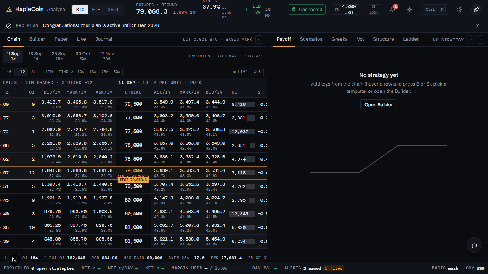
*Chain with payoff, dark*

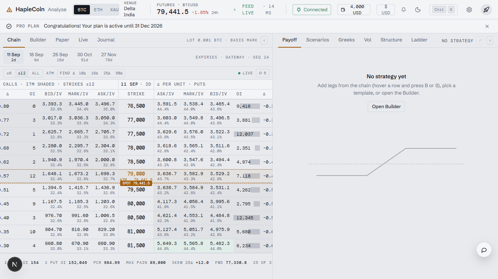
*Chain with payoff, light*

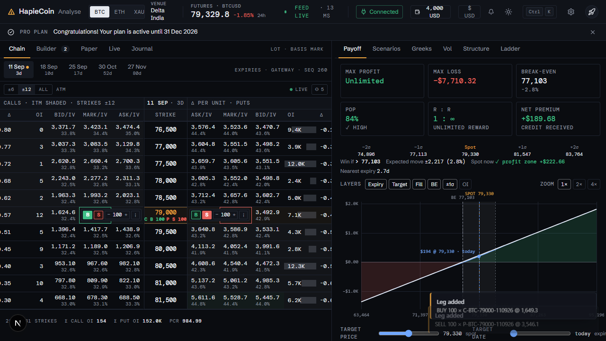
*Two legs on the chain with the row controls*

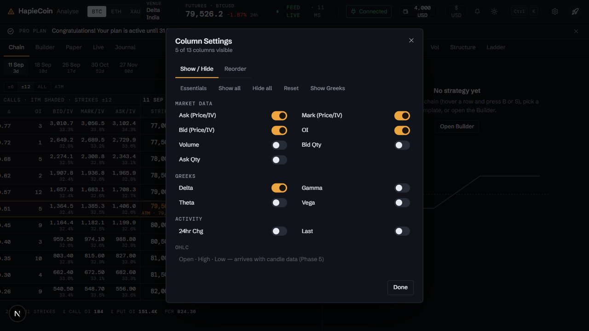
*Column settings*

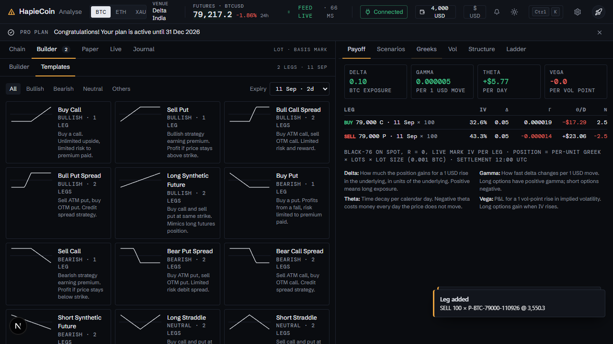
*Greeks*

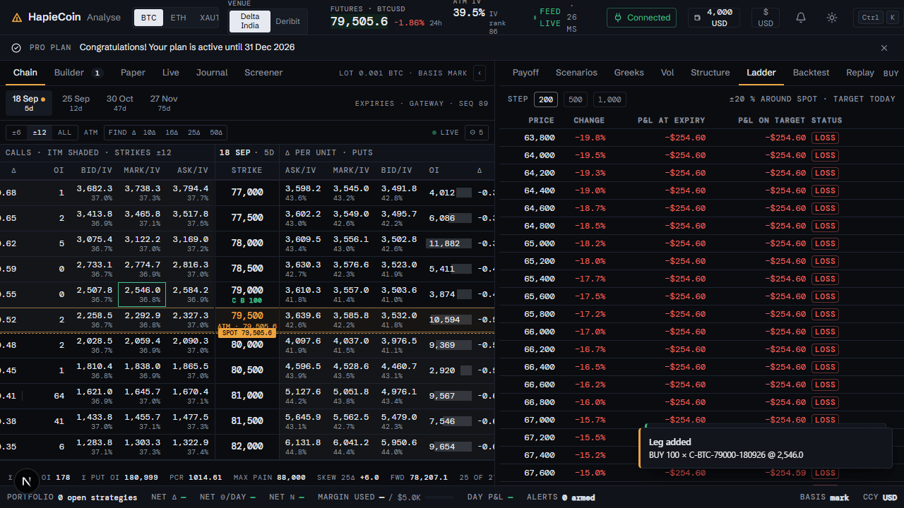
*Ladder*

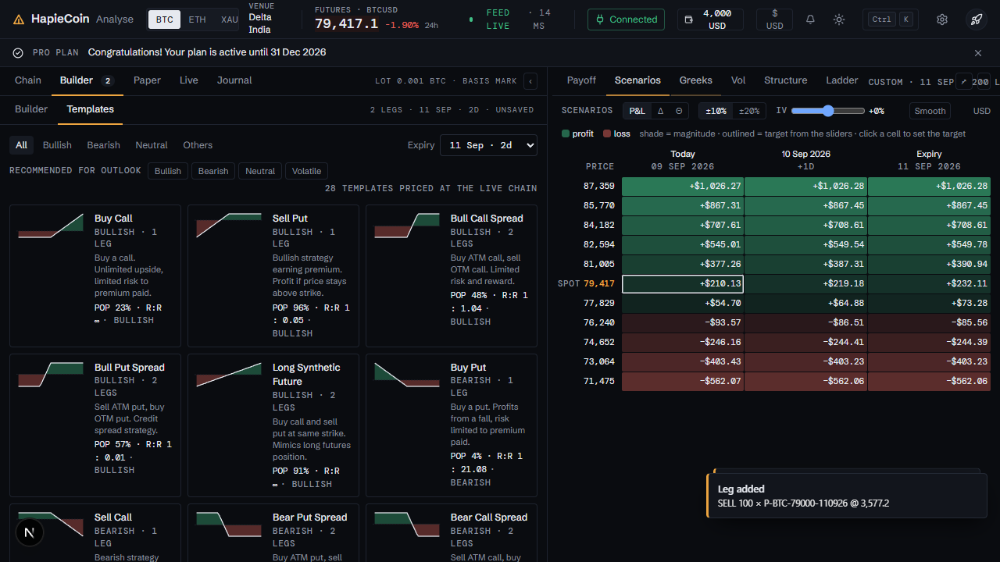
*Scenarios*

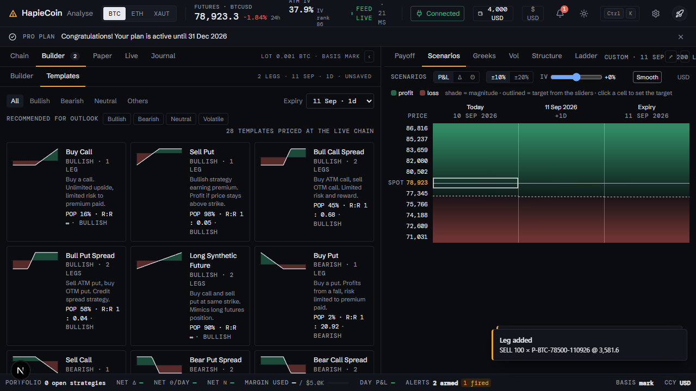
*Scenarios, smooth heat map*

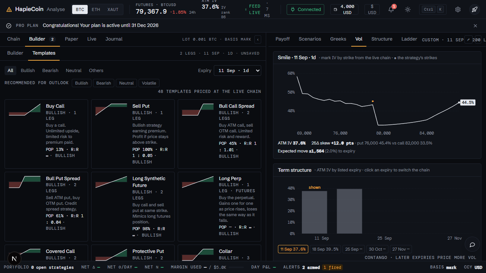
*Vol: IV rank and realised vs implied*

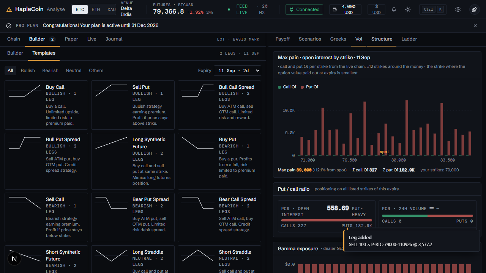
*Structure: term structure and skew*

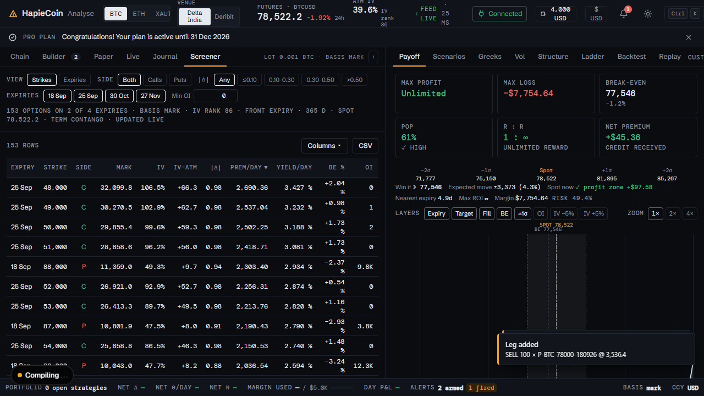
*Options screener*

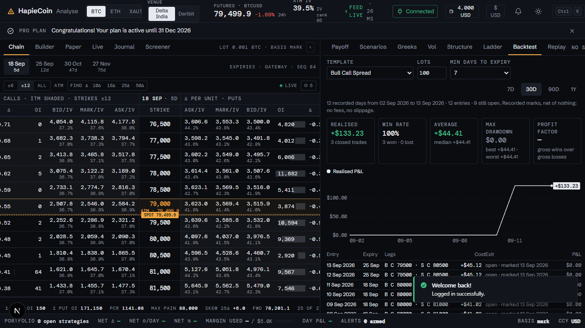
*Backtest*

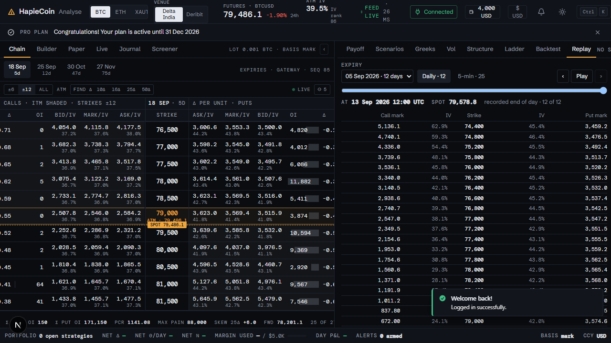
*Replay*

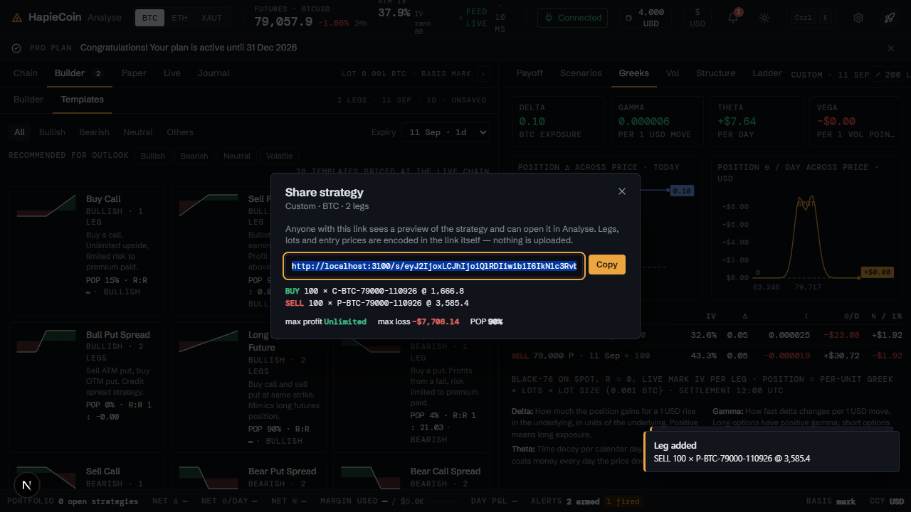
*Share a strategy*

## Every feature, in detail

Each row is one traced feature from the build spec: the id, what it is, how it behaves (the acceptance rule the tests check), and how it is tested. Status "mock-only" means the screen exists but the data feed behind it is not connected yet.

### Analyse workspace · `/analyse`

| ID | Feature | How it behaves | Status | Tested by |
|---|---|---|---|---|
| HC-WS-001 | Two-pane workspace (chain left ≈55%, analysis right ≈45%) below the app header, above the fixed portfolio bar; each pane scrolls internally | Flex shell sized to 100vh minus the measured header + plan banner height and a reserved 44px bottom strip for the chrome portfolio bar (measured: fixed bar → padding, in-flow bar → subtracted); ResizeObservers keep it in sync | built | e2e (Playwright) |
| HC-WS-002 | Resizable divider between the panes (drag 35–70%, double-click resets to 55%) | Width persisted in CG.state.analyseSplit; chart re-renders to the new width | built | unit (pricing) · e2e (Playwright) |
| HC-WS-003 | Responsive stacking below 1000px with a segmented 'Chain \| Analysis' toggle | Media query stacks the panes; the toggle sets data-mobile on the shell to show one pane at a time | built | unit (pricing) · e2e (Playwright) |
| HC-WS-004 | Shared chrome placeholders: app header (variant 'analyse'), plan banner and portfolio bar | 
, 
 and 
 are rendered by the chrome part; the workspace measures them | built | unit (pricing) · e2e (Playwright) |
| HC-WS-005 | Left tab bar: Chain · Builder · Paper · Live · Journal with small mono count pills | data-lptab chain\|strategy\|paper\|live\|journal (same data-tour ids as v1); pills show active legs / paper / live / closed strategy counts and hide at 0; the trading module mounts its .lp-panel[data-tab] panels into #analyse-left-panels | built | unit (pricing) · e2e (Playwright) · security |
| HC-WS-006 | Deep links #/analyse?tab=strategy&panel=scenarios (panel = payoff \| scenarios \| greeks \| vol \| structure \| ladder; the v1 values analytics → payoff and pnl → ladder still resolve) | query.tab / query.panel are read in show(); the last tab is persisted in CG.state.analyseTab / analyseRightTab | built | unit (pricing) · e2e (Playwright) |
| HC-WS-063 | Shared workspace state CG.analyse {legs, name, strategyId, asset, expiry, targetDays, targetPrice, mode, stats, setExpiry(), setRightTab(), findDelta()} and events analyse:addLeg / analyse:legs-changed / analyse:tab / analyse:set-tab / analyse:right-tab / analyse:expiry / analyse:target / analyse:stats | State object created here; leg mutations belong to the trading part (chain only emits analyse:addLeg, with a local fallback); the right pane re-renders on analyse:legs-changed and on every tick | built | unit (pricing) · e2e (Playwright) |
| HC-WS-064 | Tab count pills: Builder = active legs, Paper / Live = strategy counts, Journal = closed strategies | renderCounts() on analyse:legs-changed / analyse:strategies-changed; pills hide at 0 | built | unit (pricing) · e2e (Playwright) · security |
| HC-WS-065 | Pane collapse buttons ‹ › give either pane the full width; a ⋮ handle restores both | CG.state.analyseCollapse = left \| right \| ""; the chart re-renders to the new width | built | unit (pricing) · e2e (Playwright) |
| HC-WS-066 | Density: comfortable rows (36px) / compact rows (28px) for the chain and the ladder | root[data-density] follows CG.state.density and CG.on('density') | built | e2e (Playwright) |
| HC-WS-067 | Tab-bar micro info: 'Lot 0.001 BTC · Basis mark' (left) and 'Bull Call Spread · 25 Sep · 20 lots' (right) | Rebuilt on legs / lot-size / basis changes | built | e2e (Playwright) |
| HC-WS-068 | Header stats feed: CG.emit('analyse:stats', {atmIv, ivRank, ivPercentile, expectedMove, expiry, spot, pcr, maxPain, skew25}) on show, expiry, asset and every tick; also stored in CG.analyse.stats | Consumed by the chrome header (ATM IV · IV rank · expected move) | built | unit (pricing) · e2e (Playwright) |
| HC-WS-069 | Command palette commands: Switch expiry → <date> (one per expiry), Load template → <name> (skipped when the trading module registers its own), Toggle chain Greeks, Find strike by delta…, Share strategy link, Analyse → <tab> | CG.palette.register({id,label,group:"Analyse",keywords,run}) guarded; commands navigate to /analyse first when needed | built | unit (pricing) · e2e (Playwright) |
| HC-WS-070 | Keyboard shortcuts listed in the ? help: J / K, ↑ / ↓, B / S, Shift+B / Shift+S, E / Shift+E, Enter | CG.shortcuts.register(key, description, handler, {group:"Analyse workspace"}) with a document fallback when the registry is absent | built | e2e (Playwright) |
| HC-WS-107 | Phase 1 live chain shell: expiries discovered from the gateway (fallback list only when it exposes none); the chain lists exactly the strikes the venue instrument list holds for the selected expiry, marks the ATM row and shows FEED LIVE / stale from the gateway sequence numbers | apps/web ChainPanel + ChainTable over the gateway reducer; strikes never come from a fixed step (ADR-006) | built | unit (pricing) · e2e (Playwright) · security |
| HC-WS-108 | Phase 1 chain rows: strike, call and put marks from the coalesced gateway deltas, one row per venue strike (no synthetic strikes, no gaps filled) | ChainTable renders the reducer state; q frames patch only changed fields | built | unit (pricing) · e2e (Playwright) |

### Options chain · `/analyse`

| ID | Feature | How it behaves | Status | Tested by |
|---|---|---|---|---|
| HC-WS-007 | Expiry strip with two-line chips '25 Sep / 21d' (07 Sep … 26 Mar); an amber dot marks expiries that hold legs of the current strategy | Chips rendered from CG.EXPIRIES; click sets CG.analyse.expiry + CG.state.expiry, re-renders the chain, emits analyse:expiry and toasts | built | e2e (Playwright) |
| HC-WS-008 | Expiry strip scroll arrows ‹ › (only shown when the strip overflows) | Overflow measured after render / resize; arrows scroll the strip by 220px | built | e2e (Playwright) |
| HC-WS-009 | LIVE pill in the chain toolbar (Live → Connecting → Static and back) | Toggles CG.analyse.mode; in static mode ticks stop updating the chain | built | unit (pricing) · e2e (Playwright) · security |
| HC-WS-010 | Gear button in the chain toolbar → Column Settings dialog | Opens the v1 Column Settings dialog (show / hide, reorder, quick buttons) | built | e2e (Playwright) · api contract · security |
| HC-WS-015 | Sticky two-row header: 'CALLS · ITM shaded · strikes ±12' \| '25 Sep · 19d' \| 'Δ per contract · PUTS', then the column labels Δ · OI · Bid/IV · Mark/IV · Ask/IV \| Strike \| Ask/IV · Mark/IV · Bid/IV · OI · Δ | Column order is defined once from the strike outward (price triplet inboard, OI and Δ outboard) and mirrored on the calls side | built | unit (pricing) · e2e (Playwright) · api contract · security |
| HC-WS-016 | 41 strikes around ATM from CG.chain(asset, expiry) with a strike-range control (±6 / ±12 / all), auto-scrolled to ATM | Range persisted in CG.state.chainRange (default: every listed strike, ADR-093; a saved ±12, the older default, is replaced once); the footer reports "n of 41 strikes" | built | e2e (Playwright) |
| HC-WS-017 | Strike cell: mono price; the ATM row is a single amber band with an 'ATM' micro tag; leg pills ('C B 10', 'P S 10') sit under the strike | tr.atm background hsl(--primary/.09) with amber strike text; the sub-line is rebuilt on every legs change | built | e2e (Playwright) |
| HC-WS-018 | Price cells (Bid / Mark / Ask) show the price at 1dp with the IV at 1dp underneath; calls right-aligned, puts left-aligned; neutral ink (colour is reserved for buy/sell and P&L) | cellInner() renders  + ; INR mode converts premiums at CG.state.conversionRate (0dp) | built | unit (pricing) · e2e (Playwright) |
| HC-WS-019 | OI column drawn as a thin inward bar anchored at the outer edge (calls grow towards the strike from the left, puts from the right) | 2px bar width proportional to max OI of the chain; value shown as an integer | built | e2e (Playwright) |
| HC-WS-020 | ITM tint: call cells below spot and put cells above spot get a 4% foreground tint | td.itm{background:hsl(var(--foreground)/.04)}; hover replaces it with the raised surface tone | built | e2e (Playwright) |
| HC-WS-021 | Optional columns: Γ (6dp), Θ (1dp), ν (1dp), Volume, Bid Qty, Ask Qty, 24hr Chg (signed, coloured), Last, Open, High, Low; Δ (2dp) is shown by default | Toggled in Column Settings; the Greeks chip in the toolbar adds/removes Γ Θ ν in one click | built | unit (pricing) · e2e (Playwright) |
| HC-WS-022 | Live price updates with flash animation | On every 'tick' (2.5s) the chain is re-quoted; changed Bid/Mark/Ask/Last cells get .flash-up / .flash-down; if the ATM strike shifts the table is rebuilt keeping the scroll position | built | unit (pricing) · e2e (Playwright) · security |
| HC-WS-023 | Row hover reveals a floating control on both sides: [B] [S] [− 10 +] lot stepper [ⓘ] | .an-ctl inside the inboard cell; − / + step through the lot presets, clicking the number opens a preset menu, ⓘ opens option details; also shown on the keyboard-highlighted row | built | e2e (Playwright) |
| HC-WS-024 | B / S add a leg (CALL on the calls side, PUT on the puts side) at the mark price with the chosen lots | Emits CG.emit('analyse:addLeg', {type, side, strike, expiry, lots, price, iv, symbol, asset}); if no handler appends within the same tick it appends to CG.analyse.legs itself and emits analyse:legs-changed; toast 'Leg Added'; max 10 active legs → toast 'Limit Reached · Maximum 10 active legs allowed per strategy' | built | unit (pricing) · e2e (Playwright) |
| HC-WS-025 | Lot stepper presets (1 · 2 · 5 · 10 · 25 · 50 · 100 · 250 · 500 · 1000), default 10, "× lot size" shown as the stepper tooltip and in the option details dialog | CG.state.chainLots persisted; all steppers update together | built | e2e (Playwright) |
| HC-WS-026 | ⓘ icon (or Enter on the highlighted row) → option details dialog titled with the Delta-style symbol (e.g. C-BTC-79500-250926) | Dialog shows mark price, IV badge, 24h change, Δ, a 24h sparkline of mark price + IV (mock series), stats grid (Bid / Ask, OI, Volume, Bid / Ask Qty, Delta, Gamma, Theta, Vega, 24h Chg, Last, Open / High, Low) and Buy / Sell buttons with a lots selector | built | unit (pricing) · e2e (Playwright) |
| HC-WS-027 | Existing strategy legs are marked in the chain: 'C B 10' / 'P S 10' pills under the strike, the mark cell outlined green/red, a green/red stripe on the row's left edge, filled B / S buttons and an amber dot on the expiry chip | renderPills() runs on analyse:legs-changed and after every chain render | built | e2e (Playwright) |
| HC-WS-028 | Keyboard: j / k or ↑ / ↓ move the highlighted strike (amber outline), B / S add a call leg, Shift+B / Shift+S a put, E / Shift+E cycle the expiry, Enter opens details, Esc clears | Registered through CG.shortcuts.register(key, description, handler) when the chrome registry exists (so they appear in the ? help) with a document-level fallback; ignored while typing or when a dialog is open; hovering a row moves the highlight | built | e2e (Playwright) |
| HC-WS-029 | Chain footer: Σ Call OI · Σ Put OI · PCR · Max pain · Skew 25Δ · Fwd · 'n of 41 strikes · hover a row for B / S' | Skew 25Δ = IV(25Δ put) − IV(25Δ call) in vol points; Fwd from ATM put-call parity (K + C − P); max pain = strike minimising total option value | built | unit (pricing) · e2e (Playwright) |
| HC-WS-030 | Asset switch (BTC / ETH / XAUT) from the header | Listens to CG.on('asset'): sets CG.analyse.asset, resets the target price, reloads the chain and every analysis panel | built | e2e (Playwright) |
| HC-WS-031 | Currency toggle (USD / INR) re-formats premiums, P&L, tiles, greeks and axes; strikes stay in USD (contract terms) | Listens to CG.on('currency-settings-changed') and re-renders using CG.fmt.money / conversion rate | built | unit (pricing) · e2e (Playwright) |
| HC-WS-071 | Mirrored column order: Δ · OI · Bid/IV · Mark/IV · Ask/IV \| Strike \| Ask/IV · Mark/IV · Bid/IV · OI · Δ (price triplet inboard, Δ and OI outboard) with Δ visible by default at 2dp | DEFAULT_ORDER / ESSENTIALS in the column model; column settings still reorder from the strike outward | built | unit (pricing) · e2e (Playwright) · api contract · security |
| HC-WS-072 | Strike range control ±6 / ±12 / all in the chain toolbar | CG.state.chainRange; the header hint and footer count follow | built | e2e (Playwright) |
| HC-WS-073 | Greeks expand toggle adds Γ Θ ν columns next to Δ on both sides | setGreeksCols() edits the column state (persisted) and re-renders; chip state mirrors the columns | built | unit (pricing) · e2e (Playwright) |
| HC-WS-074 | Find strike by Δ chips (10Δ · 16Δ · 25Δ · 50Δ): scrolls to the call and put strikes nearest that delta, pulses both rows, highlights the call strike and toasts the pair | nearestDelta() over the full chain; widens the strike range when the hits fall outside it; the palette command opens a dialog with a custom Δ input | built | unit (pricing) · e2e (Playwright) |
| HC-WS-075 | Spot hairline between the two strikes bracketing spot with a 'SPOT 79,521' tag; ATM row as a single amber band | A zero-height spot row is inserted after the last strike ≤ spot and moves on ticks; the neighbouring strike cells get extra padding so the tag never covers a label | built | e2e (Playwright) |
| HC-WS-076 | Row height 36px (28px compact), IV 1dp under 1dp prices, Δ 2dp, OI integers with thousands separators | Fixed precision per column | built | unit (pricing) · e2e (Playwright) |
| HC-WS-077 | Two-line expiry chips '25 Sep / 21d' with an amber dot on expiries that hold legs; scroll arrows appear only on overflow | Behaves as in the v2 mock. | built | e2e (Playwright) |
| HC-WS-078 | Keyboard highlight row (amber outline) also shows the B / S controls; hovering another row moves the highlight | tr.hl styling; hover sync keeps mouse and keyboard in step | built | e2e (Playwright) |
| HC-WS-079 | Header group row hints: "ITM shaded · strikes ±12" and "Δ per contract" | Behaves as in the v2 mock. | built | e2e (Playwright) |
| HC-WS-080 | Footer additions: Skew 25Δ (IV put − IV call at 25Δ) and Fwd (from ATM put-call parity) | Behaves as in the v2 mock. | built | unit (pricing) · e2e (Playwright) |

### Column Settings · `/analyse`

| ID | Feature | How it behaves | Status | Tested by |
|---|---|---|---|---|
| HC-WS-011 | Show / Hide tab with grouped switches: Market Data (Ask (Price/IV), Mark (Price/IV), Bid (Price/IV), OI, Volume, Bid Qty, Ask Qty), Greeks (Delta, Gamma, Theta, Vega), Activity (24hr Chg, Last), OHLC (Open, High, Low) | Each row toggles the column; the chain re-renders instantly and the 'x of 16' counter updates | built | unit (pricing) · e2e (Playwright) |
| HC-WS-012 | Quick buttons Essentials · Show All · Hide all · Reset | Essentials = Ask · Mark · Bid · OI · Δ (the v2 default); Show All / Hide all / Reset; each change re-renders the chain and toasts | built | e2e (Playwright) |
| HC-WS-013 | Reorder tab – 'Drag columns to change their display order (left → right).' | HTML5 drag & drop list (dragstart/dragover/dragend) plus ▲/▼ buttons; hidden columns are badged; order applies from the strike outward and is mirrored on the Calls side | built | e2e (Playwright) · api contract · security |
| HC-WS-014 | Persistence of column visibility and order | Saved as CG.state.chainCols {v:2, order, visible} (v1 layouts are migrated to the v2 default) | built | e2e (Playwright) · api contract · security |

### Analysis pane · `/analyse`

| ID | Feature | How it behaves | Status | Tested by |
|---|---|---|---|---|
| HC-WS-032 | Right tab bar: Payoff · Scenarios · Greeks · Vol · Structure · Ladder with the strategy summary ("Bull Call Spread · 25 Sep · 20 lots"), Share and collapse buttons (data-tour="payoff-panel") | The v1 Analytics tab was merged into the Payoff tab as the Analytics strip; the v1 P&L Table became the Ladder tab | built | unit (pricing) · e2e (Playwright) |

### Payoff Diagram · `/analyse`

| ID | Feature | How it behaves | Status | Tested by |
|---|---|---|---|---|
| HC-WS-033 | Six summary tiles: Max profit ('at ≥ 80,512' / 'unlimited upside') · Max loss ('at ≤ 79,319') · Net debit / credit with the per-BTC line ('465.8 / BTC · 10 lots') · Breakeven(s) with % from spot · POP ('lognormal · IV 42.4%') · R:R ('1 : 1.15') | Hairline-separated tiles, no cards; extremes located from the expiry payoff, per-unit premium = net premium / (lot size × gcd of lots) | built | unit (pricing) · e2e (Playwright) |
| HC-WS-034 | Empty state 'No strategy yet · Hover a chain row and press B / S, or load a template from the Builder' with a ghost chart and the spot marker | Shown when CG.analyse.legs has no active legs; tiles show — | built | unit (pricing) · e2e (Playwright) |
| HC-WS-035 | Legend toggles: At expiry (ink line) · On <target date> (blue curve); layer chips OI · ±SD · BE · IV −5% · IV +5% | Clicking a legend item or chip flips the layer (persisted in CG.state.chartLayers) | built | unit (pricing) · e2e (Playwright) |
| HC-WS-036 | Zoom controls − 100% + (50% … 300%), click the percentage to reset | Rescales the x-axis range (spot ± 20% / zoom) and the target-price slider range; persisted in CG.state.chartZoom | built | e2e (Playwright) |
| HC-WS-037 | Layers popover: At-expiry P&L line · Target-date P&L curve · Profit / loss fill · Open interest bars · ±1σ expected-move band · Breakeven markers · IV −5% curve · IV +5% curve | Checkbox list in a CG.menu popover; each toggle re-renders the SVG; persisted in CG.state.chartLayers | built | unit (pricing) · e2e (Playwright) |
| HC-WS-038 | Expected-move band: ±1σ shaded band on the chart with dashed edges labelled "+1σ 85.1k" / "−1σ 73.9k" (replaces the v1 -2SD…+2SD header row) | σ = spot × ATM IV × √(days/365) for the target date or expiry | built | unit (pricing) · e2e (Playwright) |
| HC-WS-039 | SVG payoff chart in the direction-a style: ink at-expiry line, blue target-date curve, green/red fills, faint grid, $ axis, max profit / max loss tags at the plateaus, amber spot marker | Rendered from CG.analyze(points 201) over the zoomed price range; re-renders on ticks, legs, sliders, layers, theme and resize | built | unit (pricing) · e2e (Playwright) |
| HC-WS-040 | Breakeven dashed verticals labelled 'BE 81,454' | One dashed line + label per breakeven inside the visible range (layer 'Breakevens') | built | unit (pricing) · e2e (Playwright) |
| HC-WS-041 | Spot marker: amber dashed hairline with the 'SPOT 79,521' tag at the top of the chart (the only accent colour on the chart) | Drawn at the live futures price; the pill sits above the plot area | built | unit (pricing) · e2e (Playwright) · security |
| HC-WS-042 | Faint open-interest bars per strike (call + put combined) along the bottom of the chart with a tooltip per bar | Bars from CG.chain(asset, expiry) rows inside the visible range, scaled to 40% of the plot height; hover title shows strike and OI | built | e2e (Playwright) |
| HC-WS-043 | ±1σ band with dashed edges (see the expected-move band entry) | Layer "sd"; the ±2σ guides of v1 were dropped in favour of the labelled ±1σ band | built | e2e (Playwright) |
| HC-WS-044 | Target-price marker: dashed blue line, dot on the target-date curve and a '+$1.7 @ 81,921' label; clicking the chart sets the target price | AN.targetPrice; emits analyse:target | built | e2e (Playwright) |
| HC-WS-045 | Hover crosshair with tooltip '16 Sep @ 82,879 +4.2% · +$2.28 · exp +$5.33' | mousemove over the plot snaps to the nearest sample, moves the crosshair + dots on both curves and positions an HTML tooltip; survives live re-renders | built | unit (pricing) · e2e (Playwright) · security |
| HC-WS-046 | Spot-zone readout ('Spot now ✓ profit zone / ✗ loss zone') in the Analytics strip (replaces the v1 chart footer) | P&L at spot at expiry from CG.analyze | built | unit (pricing) · e2e (Playwright) |
| HC-WS-047 | Target price slider: '− 81,900 +3.0% +' value, amber SPOT tick on the track, fill, knob and five price ticks | Hidden native range over a custom track; steps move by 1/5 of the strike step; range follows the zoom | built | unit (pricing) · e2e (Playwright) |
| HC-WS-048 | Target date slider: 'Today · 06 Sep · 19d left' / 'Wed 16 Sep · 9d left', ‹ › day steps, ticks Today · mid dates · Expiry | AN.targetDays 0…max DTE of the legs; legend and tooltips show the chosen date | built | e2e (Playwright) |
| HC-WS-049 | Automatic re-rendering on price ticks, leg changes, asset / expiry / currency / lot-size changes, density, theme and pane resize | CG.on('tick' \| 'analyse:legs-changed' \| 'asset' \| 'currency-settings-changed'), window resize and a ResizeObserver on the chart host | built | e2e (Playwright) |
| HC-WS-109 | Multi-expiry positions (calendars, diagonals) value their expiry figures at the nearest expiry | When the option legs span more than one expiry the payoff pane values max profit, max loss, break-evens and POP at the nearest expiry with the later legs keeping their time value (the calendar convention); the strip says “Expiry figures on <date> · later legs keep time value”; a settled expiry is skipped; single-expiry positions keep the exact intrinsic curve; two legs across expiries are named Call / Put Calendar (same strike) or Diagonal; the built-in calendar templates take their far leg from the next listed expiry’s chain (its strike and mark used to come from the near chain) | built | unit (pricing) · e2e (Playwright) |

### Payoff · Analytics strip · `/analyse`

| ID | Feature | How it behaves | Status | Tested by |
|---|---|---|---|---|
| HC-WS-050 | Max profit with ROI → 'Max ROI 6% on margin' in the Analytics strip under the tiles (merged from the v1 Analytics tab) | ROI = max profit / margin; ∞ when unlimited | built | unit (pricing) · e2e (Playwright) |
| HC-WS-051 | Max loss as % of capital → 'Margin $94 · risk 5%' in the Analytics strip | Loss % = \|max loss\| / required margin; 'Unlimited' when infinite | built | unit (pricing) · e2e (Playwright) · api contract |
| HC-WS-052 | Expected required margin → 'Margin $94.38' in the Analytics strip and 'Margin est.' in the greeks strip | CG.analyze(...).margin | built | unit (pricing) · e2e (Playwright) |
| HC-WS-053 | Breakeven points → Breakeven tile ('79,966 · +0.6% from spot', or two values) plus 'Spot now ✓/✗ zone' in the strip | Title switches Point/Points by count; zone from the expiry P&L at the live spot | built | unit (pricing) · e2e (Playwright) · security |
| HC-WS-054 | R/R with grade → 'R:R 1.15 balanced' (✓ favorable ≥2 / balanced ≥1 / high risk / unlimited exposure) in the strip and the R : R tile | rewardRisk from CG.analyze; unlimited profit shows 'Unlimited', unlimited loss shows 'Unlimited exposure' | built | e2e (Playwright) |
| HC-WS-055 | Probability of profit with grade → 'POP 47.7% moderate' (✓ high ≥60 / moderate ≥40 / low) in the strip and the POP tile | Lognormal POP from CG.analyze (green ≥50%, red below) | built | unit (pricing) · e2e (Playwright) |
| HC-WS-056 | Win if price → 'Win if > 79,966' / '77,660 – 81,341' / '< a or > b' / 'any price' in the strip | Derived from the breakevens and the sign of the expiry P&L on each side | built | unit (pricing) · e2e (Playwright) |
| HC-WS-057 | Net premium → 'Net debit $4.66 · 465.8 / BTC' tile (credit / debit label switches) | Signed net premium from CG.analyze | built | unit (pricing) · e2e (Playwright) |
| HC-WS-058 | Max ROI → 'Max ROI 6% on margin' in the strip | Max profit / required margin (Unlimited when infinite) | built | unit (pricing) · e2e (Playwright) |

### Greeks · `/analyse`

| ID | Feature | How it behaves | Status | Tested by |
|---|---|---|---|---|
| HC-WS-059 | Greeks tab tiles: Total Delta (directional exposure) · Total Gamma (Δ change per $1) · Total Theta ($/day) · Total Vega ($ per 1% IV), hairline-separated | Values from CG.analyze(...).greeks: delta 4dp (coloured by sign), gamma 6dp, theta 4dp (coloured), vega 4dp | built | unit (pricing) · e2e (Playwright) |
| HC-WS-060 | Leg-wise Greeks table: BUY/SELL · strike C/P · expiry, Lots, IV, Δ, Γ, Θ/day, ν and a 'Portfolio total' row | Per-leg Black-76 greeks × lots × lot size × side sign; totals match the tiles | built | unit (pricing) · e2e (Playwright) |
| HC-WS-061 | 'Understanding Greeks' explanations for Delta, Gamma, Theta and Vega | Static explanatory cards (Delta and Gamma/Vega texts as in the original) | mock-only | unit (pricing) · visual (screenshot diff) |
| HC-WS-101 | Position Δ and Θ across the price axis: two small charts (re-pricing every leg at 49 prices ±20% around spot on the target date) with strike dots and the spot hairline | Behaves as in the v2 mock. | built | e2e (Playwright) |
| HC-WS-102 | Greeks tab restyled: hairline tiles, mono table (Θ and ν in currency), compact explanations | Behaves as in the v2 mock. | built | unit (pricing) · e2e (Playwright) |

### Ladder · `/analyse`

| ID | Feature | How it behaves | Status | Tested by |
|---|---|---|---|---|
| HC-WS-062 | Ladder tab: P&L by underlying price with columns Price · Change from spot · At expiry · On <target date> · Status (profit / loss / breakeven / spot pills) | Rows every step from −20% to +20% around spot; the spot row is highlighted amber and breakeven rows are inserted (dashed); sticky header; auto-scrolls to spot | built | unit (pricing) · e2e (Playwright) |
| HC-WS-103 | Step selector (250 / 500 / 1000 for BTC; ½× / 1× / 2× the strike step for other assets) | CG.state.ladderStep | built | e2e (Playwright) |
| HC-WS-104 | 'At expiry' and 'On <target date>' P&L columns, 'Change from spot', status pills; spot row highlighted amber; breakeven rows inserted; sticky header; auto-scroll to spot | Behaves as in the v2 mock. | built | unit (pricing) · e2e (Playwright) |

### Payoff · `/analyse`

| ID | Feature | How it behaves | Status | Tested by |
|---|---|---|---|---|
| HC-WS-081 | Analytics strip under the tiles (merged Analytics tab): POP with grade · R:R with grade · Max ROI · Margin with risk % · Win if · Spot now zone | Wraps to a second line on narrow panes | built | unit (pricing) · e2e (Playwright) |
| HC-WS-082 | Chart restyled to the reference: ink expiry line, blue target curve, green/red fills, amber SPOT tag + dashed hairline, ±1σ dashed edges with labels, faint OI bars, BE labels, max profit / max loss tags | Behaves as in the v2 mock. | built | e2e (Playwright) |
| HC-WS-083 | IV −5% and IV +5% layers: dashed blue target-date curves computed with CG.analyze(legs, asset, {ivShift:±0.05}) | Chips + layers popover; persisted in CG.state.chartLayers | built | unit (pricing) · e2e (Playwright) |
| HC-WS-084 | Target marker '+$1.7 @ 81,921' on the curve; clicking the chart sets the target price | setTargetPrice(price, true) | built | e2e (Playwright) |
| HC-WS-085 | Sliders restyled: custom track with fill, knob, amber SPOT tick with label, five price ticks; date ticks Today · mid dates · Expiry | Behaves as in the v2 mock. | built | unit (pricing) · e2e (Playwright) |
| HC-WS-086 | Net greeks strip under the sliders: Net Δ · Net Γ · Net Θ / day · Net ν / 1% IV · Margin est. · 'USD per strategy · 20 lots · mark basis' | Behaves as in the v2 mock. | built | unit (pricing) · e2e (Playwright) |
| HC-WS-087 | Tooltip format '16 Sep @ 82,879 +4.2% · +$2.28 · exp +$5.33' | Behaves as in the v2 mock. | built | e2e (Playwright) |

### Scenarios · `/analyse`

| ID | Feature | How it behaves | Status | Tested by |
|---|---|---|---|---|
| HC-WS-088 | Price × date P&L matrix: rows −10% … +10% in 2% steps (or ±20% in 4% steps), columns today · +25% · +50% · +75% · expiry−1d · expiry, cells shaded by magnitude with mono values | Each cell = CG.analyze(…, {targetDays, spot, min:S, max:S}).pnlTarget; rows carry a SPOT label | built | unit (pricing) · e2e (Playwright) |
| HC-WS-089 | Mode toggle P&L \| Δ \| Θ re-computes the grid as position delta or theta per day at each price × date | positionGreeksAt(legs, S, daysElapsed, ivShift) re-prices every leg with Black-76 | built | unit (pricing) · e2e (Playwright) |
| HC-WS-090 | IV shift slider −20% … +20% re-computes the grid through CG.analyze(…, {ivShift}) | Debounced; persisted in CG.state.scnIv | built | unit (pricing) · e2e (Playwright) |
| HC-WS-091 | Target cell (nearest to the slider target price and date) is outlined; its row / column headers are emphasised; clicking a cell sets the target price and date | Round-trips through setTargetPrice / setTargetDays | built | e2e (Playwright) |
| HC-WS-092 | Smooth toggle renders the same grid as a bilinearly interpolated canvas heat field with column separators, dashed zero (breakeven) contour, amber spot line and the target outline | ImageData interpolation between cell centres; colours read from the theme tokens so both themes work | built | unit (pricing) · e2e (Playwright) |
| HC-WS-093 | Hover tooltip on cells and on the canvas ('81,129 · 16 Sep · +1.1'; canvas values are interpolated) | Behaves as in the v2 mock. | built | e2e (Playwright) |

### Vol · `/analyse`

| ID | Feature | How it behaves | Status | Tested by |
|---|---|---|---|---|
| HC-WS-094 | Smile · <expiry>: mark IV across the 41 strikes with the strategy's strikes as amber dots, spot hairline, ATM IV and 25Δ skew readout | From CG.chain(asset, expiry); re-renders on expiry changes | built | unit (pricing) · e2e (Playwright) |
| HC-WS-095 | Term structure: ATM IV per expiry across CG.EXPIRIES as bars (active expiry amber, click a bar to switch expiry) with contango / backwardation note | Behaves as in the v2 mock. | built | unit (pricing) · e2e (Playwright) |
| HC-WS-096 | IV rank (1y): rank, percentile, current, 1y low / high on a gauge with an interpretation line | Generated 365-day ATM IV history (mean-reverting log process seeded per asset, pinned to the current ATM IV) | built | unit (pricing) · e2e (Playwright) |
| HC-WS-097 | Realised vs implied: 30-day realised vol (from a generated price series) vs the ATM IV history over 365 days, with the IV − RV spread | Behaves as in the v2 mock. | built | unit (pricing) · e2e (Playwright) |

### Structure · `/analyse`

| ID | Feature | How it behaves | Status | Tested by |
|---|---|---|---|---|
| HC-WS-098 | Max pain: amber marker + label over call / put OI bars per strike (±12 around ATM) with spot hairline and strategy-strike ticks | Max pain = strike minimising Σ call OI × max(K − Ki, 0) + put OI × max(Ki − K, 0) | built | unit (pricing) · e2e (Playwright) |
| HC-WS-099 | Put / call ratio for open interest and 24h volume with call/put share bars and a positioning note | Behaves as in the v2 mock. | built | e2e (Playwright) |
| HC-WS-100 | Gamma exposure (GEX) profile: Σ γ × OI × lot × spot² × 1% per strike (calls +, puts −) as signed bars with a zero line, net GEX and the gamma-flip strike | Behaves as in the v2 mock. | built | unit (pricing) · e2e (Playwright) |

### Share · `/analyse`

| ID | Feature | How it behaves | Status | Tested by |
|---|---|---|---|---|
| HC-WS-105 | Share button in the pane header copies a link (origin + path + #/s/<base64url {a, l:[[type,side,strike,expiry,lots,price]…], n}>) and opens a dialog with the link, Copy button, legs and max profit / loss / POP | navigator.clipboard with an execCommand fallback; toasts "Link copied" | built | unit (pricing) · e2e (Playwright) |
| HC-WS-106 | /s/:code route (no auth): decodes the link, loads the legs into CG.analyse, toasts "Strategy loaded from link" and navigates to /analyse; logged-out visitors get a preview card (legs, max profit / loss, POP) with "Open in Analyse" and "Sign in"; invalid codes show an error card | Registered as <section data-route="/s/:code" data-title="Shared strategy"> | built | unit (pricing) · e2e (Playwright) |

### Analyse · Screener tab · `/analyse`

| ID | Feature | How it behaves | Status | Tested by |
|---|---|---|---|---|
| HC-WS-110 | Options screener: every listed option ranked on the live chain | A sixth left tab folds every listed expiry's chain (already subscribed for the Vol tab) into one row per quoted option with premium per day (mark ÷ days to settlement, per unit), yield per day (% of spot), IV−ATM (vol points against the expiry's ATM), \|Δ\|, break-even % vs spot at expiry and OI; sortable columns (default premium per day), a column menu and CSV; filters for side, \|Δ\| band (≤0.10, 0.10–0.30, 0.30–0.50, >0.50), expiries and minimum OI; the top 100 rows with the total; the basis line names the options counted, marks, the front IV rank, spot, the term shape and whether the feed is live; every header carries its unit and basis | built | unit (pricing) · e2e (Playwright) · security |
| HC-WS-111 | Expiries view: ATM IV, 25Δ skew, expected move, OI and PCR per expiry | The Expiries chip swaps the table for one row per priced expiry: days, ATM IV, 25Δ skew (put IV − call IV in vol points), the expected move (± USD and % over the days left), call and put OI, the put/call ratio and the strike count, sorted by days; the strike filters rest while this view is shown | built | unit (pricing) · e2e (Playwright) |
| HC-WS-112 | Buy / Sell a screened option into the Builder; Chain opens its expiry; the palette reaches the tab | Each strike row carries B / S buttons that add one Builder leg at the chain lots with the row's mark and IV (the chain row's rule and toasts, the leg limit included) and a ⌕ Chain button that sets the workspace expiry and opens the Chain tab; the palette command 'Options screener' and the deep link /analyse?tab=screener open the tab | built | unit (pricing) · e2e (Playwright) |

### Analyse · Replay (API) · `/analyse`

| ID | Feature | How it behaves | Status | Tested by |
|---|---|---|---|---|
| HC-WS-113 | The instants an expiry's chain was recorded at and the ladder at one of them: daily over the end-of-day history, every five minutes over the last week | GET /v1/replay/expiries (expiries with a recorded chain, days held, listed now), GET /v1/replay/steps (daily instants from chain_eod, 5-minute passes of the last week from instrument_marks through one symbol of the expiry, the spot from the same pass's IV snapshot), GET /v1/replay/chain?at= (end-of-day rows stamped then, else the marks of that pass parsed through the venue codec; 404 when nothing was recorded then); behind the session, cached a minute; 503 before anything is recorded | built | unit (api) |

### Analyse · Replay tab · `/analyse`

| ID | Feature | How it behaves | Status | Tested by |
|---|---|---|---|---|
| HC-WS-114 | Scrub an expiry's recorded chain by day or by 5-minute pass, with the Builder's legs marked at that instant | Analysis pane tab (and the palette command Analysis: Replay): expiry select with the recorded days, Daily / 5-min with the step counts, a slider with previous / next / play (400 ms per step, restarts from the first instant when at the end), the readout (instant, spot, recorded end of day or recorded 5-minute pass, n of N), the ladder with call mark / IV, strike, put IV / mark and the ATM row marked; the Builder's legs on that expiry show B / S on their strike and the position's mark-to-market versus entry from recorded marks only (a leg without a recorded mark says so); an honest empty state before anything is recorded; the mock API serves synthetic instants | built | unit (web), e2e |

### Analyse · Chain · `/analyse`

| ID | Feature | How it behaves | Status | Tested by |
|---|---|---|---|---|
| HC-WS-116 | Open interest the venue did not send shows as a dash, never as 0 | Quote.oi is optional: the venue adapter omits it when the venue sent none and keeps a real zero as 0; both venue sessions carry the last figure forward over a tick that omits it, so a snapshot shows the last known figure. The chain cell, the strike picker, option details and the workbench chain show — with no OI bar; Σ OI and the put/call ratio sum only the figures that exist; the screener shows — for an unknown figure, sorts it last, keeps it under a zero minimum and drops it under a positive one | built | unit (schema + venues + gateway + web) |

### Analyse · Backtest (engine + API)

| ID | Feature | How it behaves | Status | Tested by |
|---|---|---|---|---|
| HC-TR-184 | A catalogue template entered at every recorded end of day on the venue's own chain history and held to expiry: trades, equity, stats and coverage | packages/pricing runBacktest (pure): the template placed on each day's ladder around the strike nearest the spot via materialiseTemplate (moved to the pricing package), on the nearest listed expiry with at least minDte days left; each option leg settles at intrinsic on the first recorded day at or after its own settlement, a perpetual rides to the exit day; a trade not fully settled by the last recorded day is open and marked from the recorded mark of the same instrument, else Black-76 at the day's ATM IV (modelled); realised equity per day; win rate, average, median, best, worst, max drawdown, profit factor; coverage with skipped days, open and modelled trades. GET /v1/backtest?asset&template&lots&minDte&from&to&venue behind the session, money to cents, 503 until a day is recorded, 400 for an unknown template | built | unit (pricing + api) |

### Analyse · Backtest tab

| ID | Feature | How it behaves | Status | Tested by |
|---|---|---|---|---|
| HC-TR-185 | The Backtest tab: template, lots, minimum days to expiry and range; the coverage line first, stat tiles, the equity curve and the trades | Analysis pane tab (and the palette command Analysis: Backtest): template select by category, lots, min DTE (1 / 3 / 7 / 14 / 30), 7D / 30D / 90D / 1Y; the coverage line names recorded days, entries, skipped days, open and modelled trades and says no fees, no slippage; tiles Realised, Win rate, Average, Max drawdown, Profit factor; the realised equity curve on the SVG chart; trades newest first with entry, expiry, legs, cost, exit (open · marked <day>, modelled) and P&L; before the first recorded day an honest empty state instead of zeros; the mock API runs the same engine over synthetic end-of-day chains | built | unit (web), e2e |

### API · market history

| ID | Feature | How it behaves | Status | Tested by |
|---|---|---|---|---|
| HC-SH-128 | End-of-day option chains recorded once a day per venue and underlying at the settlement hour, a week backfilled from the mark stream | iv-snapshot.ts hands each pass's quotes to chain-eod.ts: at or after the asset's settlement hour (12:00 UTC, XAUT 16:00) and with no rows for the day yet, every listed option's mark, mark IV and the spot land in chain_eod (unique per venue / asset / day / expiry / strike / kind), kept 400 days; the first write for a venue and underlying backfills up to seven earlier days from instrument_marks (the last pass at or before the hour, symbols parsed through the venue codec, the spot from the same pass's IV snapshot); the read side folds rows into ladders per expiry | built | unit (api) |

### Pricing · calendar and carry

| ID | Feature | How it behaves | Status | Tested by |
|---|---|---|---|---|
| HC-SH-121 | The engine prices with a rate and carry on an injected trading calendar; exercise style is shown | packages/pricing gains Black-Scholes-Merton (forward S·e^((r−q)T), bsmPrice / bsmGreeks / bsmImpliedVol) and a data TradingCalendar (days per year, settlement hour) that ValuationOptions take with rate and dividendYield; defaults keep every figure bit-identical; the web client takes the calendar and the settlement hour from the venue port and names the exercise style on the Greeks caption and the option details (American flagged as a European-model estimate); the settler and the snapshotter read the settlement instant from the venue's calendar | built | unit (pricing) |

