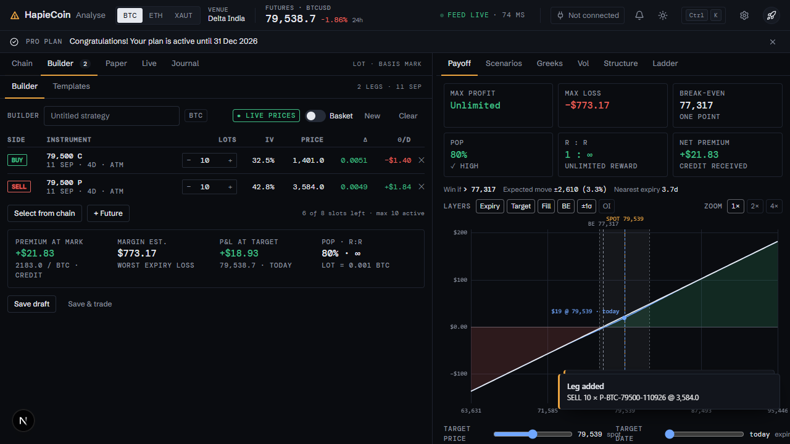
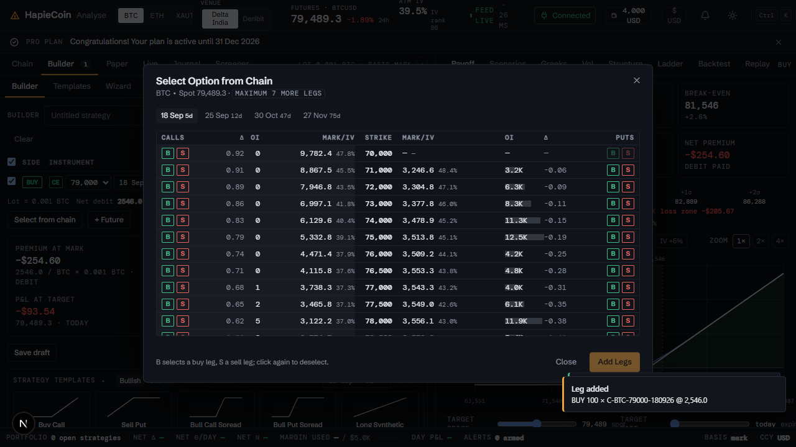
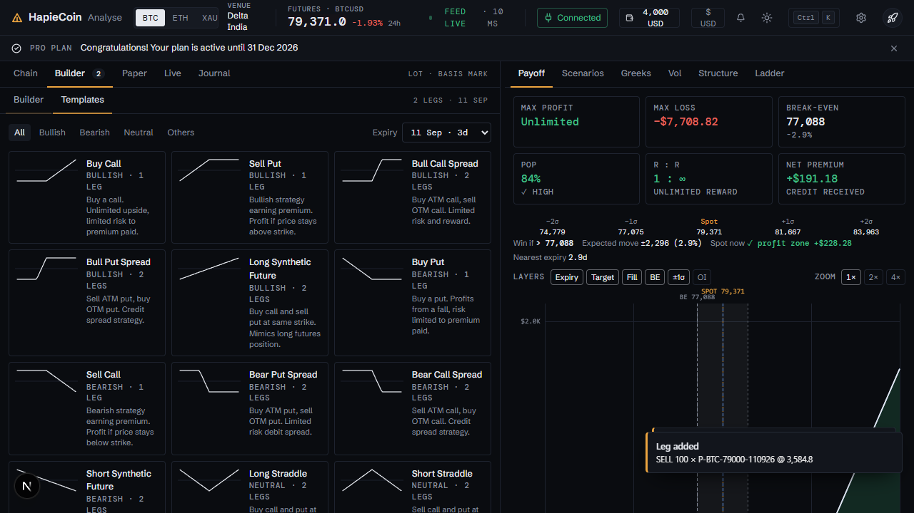
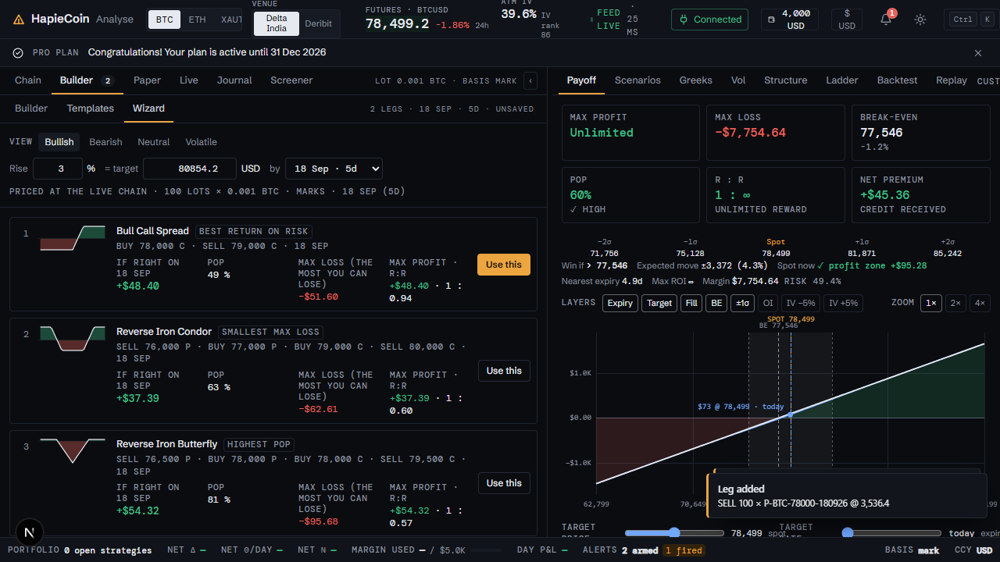

# Strategy Builder, templates and the wizard

Part of the [HapieCoin feature guide](README.md). 73 traced features on 7 screens; 73 built and tested, 0 still mock-only (listed in the backlog).

## What it does

The Builder holds up to ten legs per asset, added from the chain, from the Select-from-Chain picker, from a template, or from the wizard. Each leg shows side, kind, strike, expiry, lots and price; the ticket prices the whole position (net premium, max profit and loss, breakevens, margin estimate) and the analysis pane follows it live.

Templates are a catalogue of 48 named strategies, including ones with a perpetual future leg, each with a textbook shape proven by tests. The wizard takes a view (up, down, sideways, volatile), a move and a date, and ranks defined-risk strategies for it. Drafts are saved on the server, so a strategy survives a reload and follows you across devices.

## Try it

1. Chain → add two legs. Open **Builder**: change lots, flip a side, remove a leg; watch the ticket and payoff update.
2. **Select from chain** in the Builder: pick several legs in the picker, **Add N legs**.
3. **Templates**: pick Iron Condor; the legs fill from the live chain around ATM. Try one with a future leg.
4. **Wizard**: choose a view, a move and a date; open one of the ranked cards into the Builder.
5. **Save** with a name; reload the page; the draft is still there.

## Screens

*Builder with two legs and the ticket*

*Select from chain*

*Templates*

*Strategy wizard*

## Every feature, in detail

Each row is one traced feature from the build spec: the id, what it is, how it behaves (the acceptance rule the tests check), and how it is tested. Status "mock-only" means the screen exists but the data feed behind it is not connected yet.

### Analyse · Strategy panel (Builder) · `/analyse`

| ID | Feature | How it behaves | Status | Tested by |
|---|---|---|---|---|
| HC-TR-001 | Strategy panel sub-tabs: Builder \| Templates | Two line-tabs at the top of the Strategy left-pane panel; switch the visible sub-view (data-tour builder-tab / templates-tab) | built | e2e (Playwright) |
| HC-TR-002 | Strategy Legs card header with asset chip and leg count | Card title 'Strategy Legs' + current asset badge + 'N legs' counter, wrapped in data-tour="strategy-legs" | built | e2e (Playwright) |
| HC-TR-003 | Price-mode toggle 'Live price' ↔ 'Custom price' | Pill button toggles CG.analyse.mode; live mode re-quotes every leg from CG.quote on each tick (cells flash, title 'Price updated by live feed'); custom mode turns the Price column into editable inputs (title 'Click to edit custom price'). Tooltips: 'Live prices from Delta Exchange (auto-updated). Paper trade will use these prices.' / 'Static/custom prices (editable). Paper trade will use your entered prices.'; shows 'Connecting...' when the live feed is off | built | unit (pricing) · e2e (Playwright) · security |
| HC-TR-004 | Basket switch | Switch with tooltip 'Basket on: quantity and custom-price changes apply to every leg' / 'Basket off: each leg keeps its own quantity and price'; when on, a qty or custom-price edit on one leg is applied to all legs | built | e2e (Playwright) |
| HC-TR-005 | New button | Resets the builder (legs, name, edited strategy, price mode) and toasts 'New strategy' | built | e2e (Playwright) |
| HC-TR-006 | Clear button | Removes all legs (toast 'Cleared'); toasts 'No legs · Nothing to clear' when empty | built | e2e (Playwright) |
| HC-TR-007 | Strategy name input 'Strategy name...' | Bound to CG.analyse.name; typing marks the strategy dirty; shows the status badge + id of the strategy being edited | built | e2e (Playwright) |
| HC-TR-008 | Legs table columns Side / Type / Strike / Expiry / Qty / Unit / Price / Action | Rendered from CG.analyse.legs; Strike carries an (ATM)/(ITM)/(OTM) tag computed against the live spot; Expiry shows the contract code or 'Perpetual' for futures; Unit is LOTS | built | unit (pricing) · e2e (Playwright) · security |
| HC-TR-009 | Side badge click toggles BUY ↔ SELL | Clicking the BUY/SELL badge flips the leg side and emits analyse:legs-changed; disabled (with tooltip) on legs of an already-active strategy | built | unit (pricing) · e2e (Playwright) |
| HC-TR-010 | Type badge CALL / PUT / FUTURE + ADJUSTMENT badge + Closed badge | Coloured type badge; adjustment legs show a purple ADJUSTMENT badge; squared-off legs show 'Closed' and a dimmed row | built | e2e (Playwright) |
| HC-TR-011 | Qty input (lots) | Number input per leg; change updates leg.lots (or every leg when Basket is on), recomputes Net Premium / Margin and emits analyse:legs-changed | built | unit (pricing) · e2e (Playwright) |
| HC-TR-012 | Live price cell (mono) with tick flash | On every CG 'tick' the mark price from CG.quote is written into the cell with a green/red flash animation | built | unit (pricing) · e2e (Playwright) · security |
| HC-TR-013 | Delete this leg action | Trash icon (title 'Delete this leg') removes the leg from the builder | built | e2e (Playwright) |
| HC-TR-014 | Square off this leg action (active strategies) | When the builder holds an active PAPER/LIVE strategy the action column shows a square-off icon (title 'Square off this leg') that opens the Square Off Position dialog | built | unit (pricing) · e2e (Playwright) · security |
| HC-TR-015 | Select from Chain button | Opens the 'Select Option from Chain' modal (title 'Select option from live options chain', data-tour="add-leg-button"); disabled with title 'Maximum 8 fresh legs reached' / 'Maximum 10 active legs reached' when the limit is hit | built | unit (pricing) · e2e (Playwright) · security |
| HC-TR-016 | + Future button (Add Futures Contract) | Opens the Add Futures Contract dialog; same leg-limit disabling as Select from Chain; 'Leg limit reached' hint appears when full | built | e2e (Playwright) |
| HC-TR-017 | Leg limits: 8 legs for a new strategy, 10 active legs when editing an active one | T.addLeg / analyse:addLeg enforce the limits and toast 'Limit Reached · Maximum 8 legs allowed for new strategy' or 'Limit Reached · Maximum 10 active legs allowed per strategy' | built | unit (pricing) · e2e (Playwright) |
| HC-TR-018 | Legs added from the options chain (CG event analyse:addLeg) | Chain B/S clicks emit analyse:addLeg; the builder normalises the leg (price from CG.quote, symbol, lots), appends it, toasts 'Leg Added' and emits analyse:legs-changed + cg-tour:leg-added | built | e2e (Playwright) |
| HC-TR-019 | Footer stats 'Net Premium: +$x Credit / −$x Debit' and 'Margin: $x' | Computed with CG.analyze on the open legs; refreshed on every tick and every legs change; formatted with CG.fmt.money (INR toggle aware) | built | unit (pricing) · e2e (Playwright) |
| HC-TR-020 | Save Draft / Update button | Save Draft opens the Save-as-Draft dialog; when a saved strategy is loaded the button reads 'Update' and saves directly (toast 'Saved'), guarded by 'No changes · No new or modified legs to save' and 'No legs · Add at least one leg' | built | e2e (Playwright) |
| HC-TR-021 | Save & trade button | Opens the name dialog ('Enter Strategy Name' / Save & Continue), saves the draft, then opens Select Trading Mode for it | built | e2e (Playwright) |
| HC-TR-022 | Paper Trade button (primary, data-tour="paper-trade-button") | Guard 'No legs · Add at least one leg to trade'; if the strategy is unnamed opens 'Enter Strategy Name' first (emits cg-tour:save-dialog-open), then Select Trading Mode (paper preselected) → Trade Preview → start | built | e2e (Playwright) |
| HC-TR-023 | Live Trade button | Same flow as Paper Trade with the Live card preselected; live confirm is blocked until the exchange is connected | built | unit (pricing) · e2e (Playwright) · security |
| HC-TR-024 | Empty state 'No legs added' | Icon + 'No legs added' + 'Start building your strategy by adding option or futures legs' + buttons 'Select from Options Chain' and 'USD Future' + 'Or use strategy templates below' (link to the Templates sub-tab) | built | e2e (Playwright) |
| HC-TR-025 | Asset switch clears legs after confirmation | Builder state is kept per asset. Switching BTC ↔ ETH ↔ XAUT never clears legs: the header shows a count badge per asset and the builder shows that asset's legs (empty if none). No confirmation dialog is needed because nothing is lost. | built | visual (screenshot diff) |
| HC-TR-026 | Expiry follows the workspace expiry strip | CG 'expiry' event updates CG.analyse.expiry and the template expiry select | built | e2e (Playwright) |
| HC-TR-093 | Legs table v2: Side pill, instrument in mono with sub-line, lots stepper, IV, price, per-leg Δ / Θ, ✕ | Side = green BUY / red SELL pill (click toggles); instrument = mono symbol with a second line "call · 19d · ATM · adj/closed"; lots = − / input / + stepper (basket-aware); IV 1dp; price 1dp (flashes green/red on live ticks, editable in custom mode); Δ per contract and Θ per asset-unit per day signed by side (BUY theta red, SELL theta green); ✕ removes (square-off icon on active legs) | built | unit (pricing) · e2e (Playwright) · security |
| HC-TR-094 | Density-aware rows | Rows are 36px comfortable and 28px compact (sub-line hidden); reacts to CG.on("density") and CG.state.density; the class trd-compact is applied to the panels, open dialogs and body | built | e2e (Playwright) |
| HC-TR-095 | Ticket block · Premium at mark | Net premium in currency for the lot size plus the per-asset-unit figure: "465.5 / BTC × 0.010 BTC" (credit shown green with +) | built | unit (pricing) · e2e (Playwright) |
| HC-TR-096 | Ticket block · Fees · est. | Per leg: notional × broker fee %, capped at cap % of premium (options), + GST; summed and shown with "taker · N legs · Delta India 0.05% + GST"; uses the broker selected in Select Trading Mode (default broker otherwise) | built | unit (pricing) · e2e (Playwright) |
| HC-TR-097 | Ticket block · Total debit / credit | \|net premium\| + fees for debits ("= max loss · fees incl." when the debit equals the max loss) or net premium − fees for credits | built | unit (pricing) · e2e (Playwright) |
| HC-TR-098 | Ticket block · P&L at target | CG.analyze(legs, asset, {targetDays, min: target, max: target}) at CG.analyse.targetPrice / targetDays; sub-line shows the target price and date; recomputed on tick, legs-changed and analyse:target | built | unit (pricing) · e2e (Playwright) |
| HC-TR-099 | Ticket block · Margin est. with POP and R:R | CG.analyze margin, plus POP % and reward:risk (∞ when unlimited) as the sub-line | built | unit (pricing) · e2e (Playwright) |
| HC-TR-100 | Ticket block · Width | Max − min strike across option legs with "N strikes · x% of spot" (— for single-strike / futures-only) | built | e2e (Playwright) |
| HC-TR-101 | Net line under the legs | "Lot = 0.001 BTC · Net debit 465.5 / BTC → $4.65 · Net Δ · Net Θ/day · Net ν/1%" in mono, updated every tick | built | e2e (Playwright) |
| HC-TR-102 | Inline strategy name in the builder header | Name is an inline editable field next to the BUILDER label (Enter saves via saveCurrent); template / detected structure shown as a tag; asset · expiry · DTE on the right | built | e2e (Playwright) |
| HC-TR-103 | Builder toolbar restyle | Live price / Custom price pill (dot / square marker, no glyph emoji), Basket switch, New and Clear as ghost buttons; Save draft / Save & trade on the left, amber Paper trade (primary, kbd P) and outline Live trade on the right, margin est. footnote | built | unit (pricing) · e2e (Playwright) · security |
| HC-TR-104 | Keyboard: P = Paper trade | Pressing P on /analyse with the builder visible and legs present (focus outside inputs, no dialog open) starts the paper-trade flow | built | e2e (Playwright) |
| HC-TR-105 | Sub-tab info line | Builder \| Templates tabs show "N legs · 25 Sep 26 · 19d · status" on the right (no duplicate lot/basis info) | built | e2e (Playwright) |

### Analyse · Select Option from Chain (modal) · `/analyse`

| ID | Feature | How it behaves | Status | Tested by |
|---|---|---|---|---|
| HC-TR-027 | Modal header 'Select Option from Chain' · 'BTC • Spot: $79,521.000' + 'Maximum N legs' badge | XL modal; spot from CG.ASSETS, refreshed on tick; the max badge shows the remaining leg slots (8 − legs, or 10 − active legs for adjustments) | built | unit (pricing) · e2e (Playwright) |
| HC-TR-028 | Expiry chips row with ‹ › scroll buttons | All CG.EXPIRIES as chips; the active chip is blue; clicking re-renders the chain for that expiry; arrows scroll the strip | built | unit (pricing) · e2e (Playwright) |
| HC-TR-029 | Live / Static toggle | Toggles live refresh of the modal chain on tick; title 'Click to enable live prices' when off | built | unit (pricing) · e2e (Playwright) · security |
| HC-TR-030 | Column settings gear | Opens a dropdown (menu-label 'Column settings') with checkboxes for Mark (Price/IV), Bid (Price/IV) and OI columns on both sides | built | unit (pricing) · e2e (Playwright) |
| HC-TR-031 | Calls \| STRIKE \| Puts table (Mark, Bid, OI per side) | 41 strikes from CG.chain: Mark and Bid show price + IV, OI shows compact numbers with proportional background bars (green calls / red puts); ITM cells are tinted; the ATM row is highlighted with an 'ATM' tag; sticky headers; auto-scrolls to ATM | built | unit (pricing) · e2e (Playwright) |
| HC-TR-032 | B / S buttons per row and side (multi-select) | B selects a BUY leg, S a SELL leg; clicking the same button again deselects, clicking the other side switches side; selection is capped at 'Maximum N leg(s)' with toast 'Maximum legs reached' | built | e2e (Playwright) |
| HC-TR-033 | Selected legs list with Qty input and Unit select (LOTS), remove ✕, Clear | Each selected leg shows side/type badges, strike, expiry, mark price, 'Qty:' number input and 'Unit' select; Clear empties the selection | built | e2e (Playwright) |
| HC-TR-034 | 'Add N Leg(s)' and 'Close' buttons; footer hint | Add pushes the selected legs into the builder (or into the adjustment flow) with limit checks and closes the modal; hint 'Click B to Buy or S to Sell • Select multiple legs' | built | e2e (Playwright) |
| HC-TR-127 | Mirrored chain layout | Calls \| Strike \| Puts with Δ and OI outboard and Bid / Mark inboard (IV under each price), ITM 4.5% tint, OI bars growing toward the strike, amber ATM band, expiry strip with DTE, B/S buttons filled when selected, lot stepper in the selection list, column settings incl. Δ | built | unit (pricing) · e2e (Playwright) |

### Analyse · Add Futures Contract (dialog) · `/analyse`

| ID | Feature | How it behaves | Status | Tested by |
|---|---|---|---|---|
| HC-TR-035 | Add Futures Contract dialog | Shows 'USD Future' with the asset future symbol and live spot (updates on tick), Side buttons 'Buy Future' / 'Sell Future', Expiry select (Perpetual + all expiries), Quantity (lots) with lot-size hint, Price and Notional rows, Cancel / Add | built | unit (pricing) · e2e (Playwright) · security |

### Analyse · Save dialog · `/analyse`

| ID | Feature | How it behaves | Status | Tested by |
|---|---|---|---|---|
| HC-TR-036 | Save as Draft / Enter Strategy Name dialog (data-tour="save-dialog") | Input 'Strategy name...' (Enter saves, Escape cancels); validation 'Strategy name is required'; buttons Cancel / 'Save Draft' (data-tour="save-button") or 'Save & Continue' in the trade flow; creates or updates the entry in CG.mock.strategies with status DRAFT and toasts 'Saved' | built | e2e (Playwright) |

### Analyse · Strategy panel (Templates) · `/analyse`

| ID | Feature | How it behaves | Status | Tested by |
|---|---|---|---|---|
| HC-TR-037 | Category chips All / Bullish / Bearish / Neutral / Others | Filters the template cards (48 since ADR-060) by category | built | e2e (Playwright) |
| HC-TR-038 | Template expiry select | Chooses which expiry the template legs are materialised on (defaults to the workspace expiry) | built | e2e (Playwright) |
| HC-TR-039 | Template cards (48 since ADR-060) with payoff sketch | Each card draws a small SVG payoff (CG.analyze at expiry, or the target-date curve for calendars) coloured by category, plus name and category label; title tooltip shows the description | built | unit (pricing) · e2e (Playwright) |
| HC-TR-040 | Template click loads legs into the Builder | CG.analyse.legs = CG.templateLegs(tpl, asset, expiry), name = template name, switches to Builder and toasts 'Strategy · Loaded strategy: <name>' | built | e2e (Playwright) |
| HC-TR-041 | My Templates: Draft Strategies \| Archived Strategies toggle | Line-tabs switch the list between CG.mock.strategies with status DRAFT and ARCHIVED | built | unit (pricing) · e2e (Playwright) |
| HC-TR-042 | Search 'Search draft strategies...' / 'Search archived strategies...' with clear ✕ | Filters by name, asset or template name; ✕ clears | built | unit (pricing) · e2e (Playwright) |
| HC-TR-043 | Strategies list refreshes itself (no Refresh strategies button) | The strategies list is a TanStack query: it is refetched after every mutation on this device (save, activate, archive, delete, trade) and when the My templates list mounts after its 15 s stale time; the app does not refetch on window focus, so a draft saved on another device appears on the next mutation or mount here. The Paper and Live panels keep their own Refresh for the exchange-side read. The original's 'Refresh strategies' button and its toast are not reproduced | built | unit (web) |
| HC-TR-044 | Saved strategy card (name, 'Draft' / 'Archived' badge, asset, N legs, template, created/closed date, realized P&L for archived) | Rendered from CG.mock.strategies; archived cards also show whether they were Paper or Live | built | unit (pricing) · e2e (Playwright) · security |
| HC-TR-045 | Load action | Loads the strategy legs into the Builder (edit mode → button reads Update) and toasts 'Loaded strategy: <name>'; 'No legs' toast if the strategy has none | built | e2e (Playwright) |
| HC-TR-046 | Activate action (drafts) | Opens Select Trading Mode for the draft; on confirm the strategy becomes PAPER or LIVE with toast 'Paper/Live Trading Started · Trading <name> on Delta Exchange India' | built | unit (pricing) · e2e (Playwright) · security |
| HC-TR-047 | Archive action (drafts) | Drafts can be archived from the list; the toast offers Undo for 8 seconds; archived strategies list a Restore action. Archive is a soft state, never a delete. | built | unit (pricing) · visual (screenshot diff) |
| HC-TR-048 | Delete action with confirm | Confirm 'Delete Strategy · Are you sure you want to delete <name>? This action cannot be undone.' → removes from CG.mock.strategies, toast 'Deleted' | built | e2e (Playwright) |
| HC-TR-049 | Empty states | 'No draft strategies · Create a strategy to see it here' and 'No archived strategies · Archived strategies will appear here'; 'No matching strategies' when a search has no hits | built | unit (pricing) · e2e (Playwright) |
| HC-TR-106 | Recommended for outlook filter (Bullish / Bearish / Neutral / Volatile) | Each template is materialised at the current chain (CG.templateLegs + CG.analyze); Bullish = profits at +6% and not at −6%, Bearish mirrored, Neutral = profits at spot and less on both sides, Volatile = profits at ±14%; matches are ranked by POP × 0.6 + reward:risk × 0.4 and numbered #1…; note line "6 of 28 templates profit in a bullish market…"; Clear resets | built | unit (pricing) · e2e (Playwright) |
| HC-TR-107 | POP and R:R on every template card | Computed with CG.analyze at the current asset / expiry (R:R ∞ when profit is unlimited, — when undefined); the card tooltip repeats them | built | unit (pricing) · e2e (Playwright) |
| HC-TR-108 | Template sketch with green / red fills | Expiry payoff line in the foreground colour with the area above zero filled green and below zero red (clip paths), dashed zero line | built | unit (pricing) · e2e (Playwright) |
| HC-TR-109 | Expiry selector with DTE | Template expiry select lists "25 Sep 26 · 19d" for each expiry | built | e2e (Playwright) |
| HC-TR-110 | My Templates cards restyled | Hairline cards with mode pill, asset tag, mono meta line, Load / Activate / Archive / View Details / Delete | built | unit (pricing) · e2e (Playwright) |

### Analyse · Strategy panel (Wizard)

| ID | Feature | How it behaves | Status | Tested by |
|---|---|---|---|---|
| HC-TR-176 | Strategy Wizard sub-tab: view, move and date | Third Builder sub-tab Builder \| Templates \| Wizard (also the Builder empty state's 'Ask the wizard'): view chips Bullish / Bearish / Neutral / Volatile, an unsigned move in percent with the derived target price beside it (typing the price sets the move; neutral and volatile show the ±band), the target expiry from the venue's listed expiries; a basis line names lots × lot size, marks and the expiry; inputs are disabled until the spot exists | built | unit (pricing) · e2e (Playwright) |
| HC-TR-177 | Three defined-risk strategies ranked at the thesis, priced at the live chain | Templates with a finite worst case on one expiry (StrategyTemplate.risk, proven by the invariants test) are placed on the venue ladder and priced once per chain snapshot; each card shows the sketch, the legs, P&L if right (expiry payoff at the target price; the least inside the band for Neutral; the smaller band edge for Volatile), POP, max loss (the most you can lose), max profit and R:R, ranked by return on risk then POP then name, at most three, one earned tag each (best return on risk, highest POP, smallest max loss); fewer fits say '2 of 3 fit this ladder'; no fit shows the reason and a link to Templates | built | unit (pricing) · e2e (Playwright) · security |
| HC-TR-178 | Use this loads the Builder on the thesis; palette and W open the wizard | Use this (amber on card 1, outline on 2 and 3) loads the template exactly as the Templates tab does (legs on listed strikes, the name, the Builder sub-tab) and sets the payoff target to the thesis price and the days to the expiry, so the chart opens on it; the palette command 'Strategy wizard' (hint W) and the W shortcut (Analyse workspace, listed in the ? help) open the tab; the assistant points 'which strategy' questions at it | built | unit (pricing) · e2e (Playwright) |

### Analyse · Builder · `/analyse`

| ID | Feature | How it behaves | Status | Tested by |
|---|---|---|---|---|
| HC-TR-146 | Leg checkbox: include / exclude a leg from the analysis | Per-leg checkbox and a master checkbox in the legs table; an unticked leg stays in the table (dimmed) but leaves the payoff, Greeks, ticket, drafts and trades; the sub-header shows '(N on)' | built | unit (pricing) · e2e (Playwright) |
| HC-TR-147 | Per-leg type, strike and expiry editable in place | CE / PE toggle, strike select from that expiry's venue ladder, expiry select from the listed expiries; the symbol follows and the ladder's mark / IV replace the stored quote when available | built | unit (pricing) · e2e (Playwright) |

