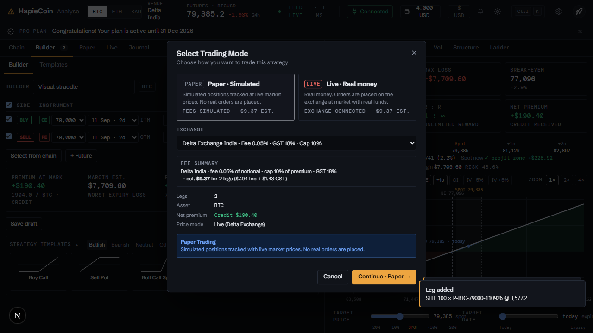
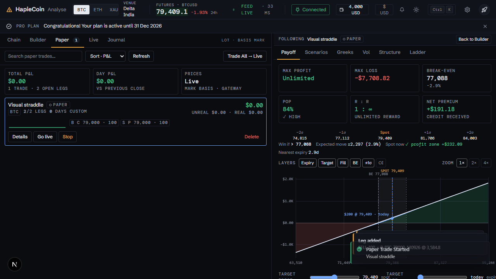
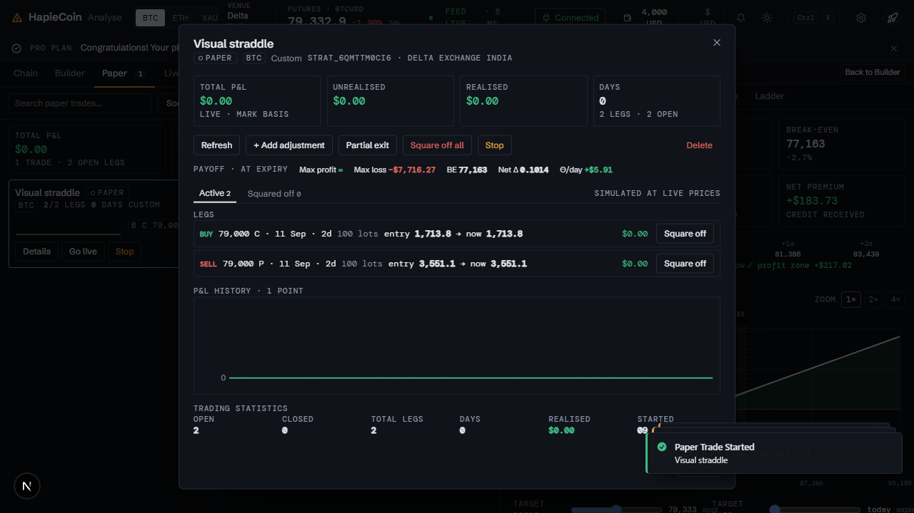
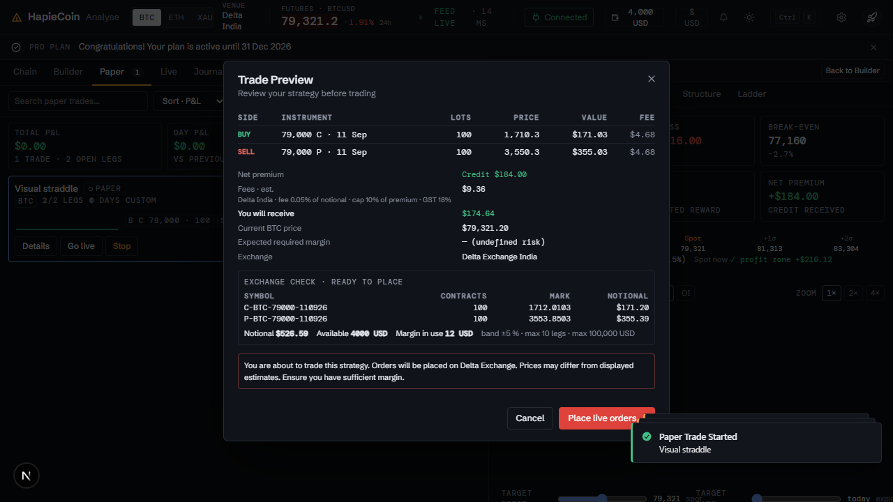
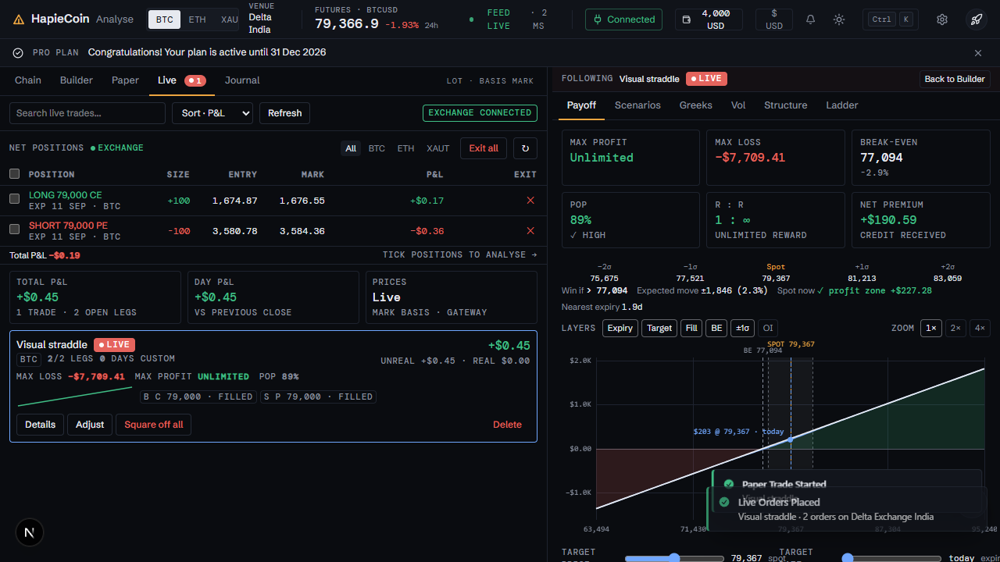

# Paper trading, live trading, rules and accounts

Part of the [HapieCoin feature guide](README.md). 94 traced features on 30 screens; 94 built and tested, 0 still mock-only (listed in the backlog).

## What it does

A strategy is traded from the Builder in one flow: choose Paper or Live, review the preview (legs, prices, capital block, overlap with other open strategies, the exchange's own check for live), optionally add a Protect rule, and place. Paper trades fill at mark and track P&L from the live feed. Live trades go to Delta Exchange through the stored API key: the preview shows the venue check and wallet, the typed word **LIVE** is required, and a Mindful pause applies when you are down on the day.

Cards on the Paper and Live tabs show P&L, greeks, days to expiry, lifecycle chips, order chips (filled, resting, cancelled) and actions: Details, Adjust, Square off, Partial exit, Set alert, Rules, Go live, Re-enter. Rules (strategy stop / target in money or %, leg stop, spot level, time) run on the server against the feed and exit for you. Expiry settlement closes legs at settlement with a reason. Positions are reconciled against the exchange with a drift check. Several labelled keys per exchange map to accounts; each strategy belongs to one.

## Try it

1. Builder → **Paper trade** → Continue → Trade now → confirm the name → skip or set a Protect rule. The card appears on **Paper** with live P&L.
2. Card → **Details**: legs, orders, P&L history. Card → **Square off** or **Partial exit**.
3. Card → **Rules**: a strategy stop at −$50 and a target at +$100; watch the badges.
4. Card → **Go live** (needs a Delta key in Settings): the preview shows the venue check and the wallet; type LIVE; place. On the **Live** tab the order chips show the fill.
5. Paper tab → **Trade All → Live** previews the batch as one: every strategy's check and the wallet against the total.
6. A resting limit entry shows a **Resting** chip: cancel it or re-price it from the card.

## Screens

*Select trading mode*

*Paper trades*

*Strategy details*

*Live preview with the exchange check*

*Live trades with order chips*

## Every feature, in detail

Each row is one traced feature from the build spec: the id, what it is, how it behaves (the acceptance rule the tests check), and how it is tested. Status "mock-only" means the screen exists but the data feed behind it is not connected yet.

### Analyse · Select Trading Mode (dialog) · `/analyse`

| ID | Feature | How it behaves | Status | Tested by |
|---|---|---|---|---|
| HC-TR-050 | Mode cards 'Paper · Simulated' and 'Live · Real Money' (data-tour="trade-modal") | Click selects the mode; Paper is disabled for 'Trade All → Live' and 'Go Live' flows | built | unit (pricing) · e2e (Playwright) · security |
| HC-TR-051 | Exchange select 'Select exchange...' | Lists CG.mock.brokers as 'Delta Exchange India · Fee 0.05% · GST 18% · Cap 10%'; default broker preselected; validation 'Please select an exchange' | built | unit (pricing) · e2e (Playwright) |
| HC-TR-052 | Not Connected warning + Open API Settings | When Live is selected and CG.state.exchangeConnected is false: 'Not Connected · Connect your exchange in Settings → API Settings to enable live trading' with a button calling CG.chrome.openSettings('api') (toast fallback); the confirm button is disabled | built | unit (pricing) · e2e (Playwright) · api contract · security |
| HC-TR-053 | Real Money Trading warning | Red alert 'Real Money Trading · Orders will be placed on Delta Exchange with real funds. Prices may differ from estimates. You may lose money.' shown when Live is selected | built | unit (pricing) · e2e (Playwright) · api contract · security |
| HC-TR-054 | Confirm button 'Continue · Paper' / 'Continue · Live' (data-tour="trade-confirm-button") | Runs the plan quota check then opens Trade Preview; emits cg-tour:trade-modal-open when the dialog opens | built | unit (pricing) · e2e (Playwright) · security |
| HC-TR-055 | Plan quota check (Upgrade Required) | Compares CG.mock.subscription.usage.paper_trading / live_trading with featureLimits (0 = unlimited); when exceeded calls CG.chrome.upgradeRequired('Paper Trading Limit reached for your plan') or toasts 'Upgrade Required … Subscribe Here → /subscription'; usage counters are incremented on every started trade | built | unit (pricing) · e2e (Playwright) · security |
| HC-TR-122 | Two selectable mode cards | Paper (hollow pill, "Simulated positions tracked at live market prices") and Live (filled pill, "Real money…") cards with a check marker; each shows the fee estimate; Paper is disabled for Go live / Trade All | built | unit (pricing) · e2e (Playwright) · security |
| HC-TR-123 | Exchange fee summary | "Delta India · fee 0.05% of notional · cap 10% of premium · GST 18% → est. $0.94 for 2 legs ($0.80 fee + $0.14 GST)" recomputed when the exchange select changes; the chosen exchange feeds the builder ticket | built | unit (pricing) · e2e (Playwright) |
| HC-TR-124 | Net premium in the summary | Credit / Debit shown next to legs, asset and price mode | built | unit (pricing) · e2e (Playwright) |

### Analyse · Trade Preview (dialog) · `/analyse`

| ID | Feature | How it behaves | Status | Tested by |
|---|---|---|---|---|
| HC-TR-056 | Trade Preview · Review your strategy before trading | Legs table (Side, Type, Strike, Expiry, Qty, Price), 'Net Premium: Credit/Debit $x', 'Current BTC Price', 'Expected Required Margin', exchange name, red warning for live ('You are about to trade this strategy. Orders will be placed on Delta Exchange. Prices may differ from displayed estimates. Ensure you have sufficient margin.'), Cancel / 'Trade Now →' | built | unit (pricing) · e2e (Playwright) · api contract · security |
| HC-TR-057 | Trade Now → starts the trade | Unnamed strategies get the 'Enter Strategy Name' dialog first; then the strategy is created/updated in CG.mock.strategies with status PAPER or LIVE (entry = current mark or custom prices, startedAt now, P&L 0, live orders filled), toast 'Paper Trade Started · <name>' or 'Live Orders Placed', builder cleared, left tab switched to Paper/Live Trades and cg-tour:paper-started emitted | built | unit (pricing) · e2e (Playwright) · api contract · security |
| HC-TR-125 | Per-leg Value and Fee columns | Value = price × lots × lot size; Fee = per-leg fee + GST | built | unit (pricing) · e2e (Playwright) |
| HC-TR-126 | Fee estimate line and You will pay / receive | Fees · est. with the fee formula and a bold "You will pay" (debit + fees) or "You will receive" (credit − fees) summary; Max loss shown when finite; mode pill | built | unit (pricing) · e2e (Playwright) |

### Trading · Trade Preview / Adjustment review

| ID | Feature | How it behaves | Status | Tested by |
|---|---|---|---|---|
| HC-TR-192 | Short-leg margin estimate: a sold option's initial margin is estimated before placement and the whole order set is refused when the wallet cannot cover the shorts plus the premium; buys go out before sells | packages/venues: VenueProduct keeps Delta's initial_margin and initial_margin_scaling_factor, getTicker returns mark + spot_price, shortOptionMarginUsd = (((pct + factor × contracts) / 100) × spot + mark) × contractValue × contracts (conservative: scaling from the first contract, no spread relief; the factor's unit is GAPS #109); apps/api planLegs fills LivePreviewLeg.marginEstimate for sells, the preview sums LivePreview.marginRequired = Σ estimates + premium paid and pushes 'Available … is below the margin the exchange will hold for the short legs plus the premium paid (estimate …); nothing was sent' when above the wallet, so place / Trade All batch (which also sums the estimates against the one wallet, LiveBatchPreview.marginRequired) / adjustment batch / add-legs refuse before any order, and a short the venue could not price next to one it did is refused by name; placeEntries and retryFailed sort buys before sells; the dialogs show 'Needed for shorts · est.' in red when above the wallet | built | unit (venues + api + web) |
| HC-TR-196 | A futures leg is priced from its entry, and is margined (never counted as premium) in the live preview | toPricingLegs gives a future the spot only in live price mode (a mark source is given); a held future keeps its entry like an option, so the payoff agrees with the leg table. planLegs estimates a future's initial margin with futuresMarginUsd ((pct + factor × contracts) / 100 × price × contract value × contracts, the mark or else the spot as the price), leaves its notional out of the premium total, and refuses an ENTRY into a future the venue gave no margin parameters or price for; an exit is never refused for margin; the same premium rule holds in the Trade All batch; the refusal is decided in preview(), never in the planner an adjustment re-runs after its exits have filled. In the workbench a future's mark is the spot index: added lots and exits are priced and sent there, a closed future carries the result it locks in, and a future never counts in 'cash now' | built | unit (venues + api + web) |

### Analyse · Paper Trades panel · `/analyse`

| ID | Feature | How it behaves | Status | Tested by |
|---|---|---|---|---|
| HC-TR-058 | Toolbar: search 'Search paper trades...', Refresh, 'Trade All → Live' | Search filters by name/asset/template; Refresh toasts 'Refreshed · Strategy data has been updated'; Trade All opens Select Trading Mode locked to Live with all paper strategies as a batch (guard 'No legs · Add at least one leg to trade') | built | unit (pricing) · e2e (Playwright) · security |
| HC-TR-059 | Total P&L summary | Sum of live totalPnl over paper strategies, green/red, with counts of trades and active legs; updated on every tick | built | unit (pricing) · e2e (Playwright) · security |
| HC-TR-060 | Paper strategy card | Name, 'Paper (hollow pill)' badge, asset chip, N legs, N active, N days (from startedAt), Total P&L (data-tour="paper-pnl" on the first card) with Unrealized / Realized small values; live-updated on tick | built | unit (pricing) · e2e (Playwright) · security |
| HC-TR-061 | Live P&L computation | On each tick every open leg is re-priced with CG.quote (mark, or bid/ask when CG.state.pnlBasis ≠ 'mark'); P&L = (current − entry) × lots × lotSize × (BUY ? 1 : −1); squared-off legs contribute realized P&L | built | unit (pricing) · e2e (Playwright) · security |
| HC-TR-062 | View Details button | Opens the Strategy Details modal | built | e2e (Playwright) |
| HC-TR-063 | Go live button | Opens Select Trading Mode locked to Live for that strategy; on confirm the paper strategy is converted to LIVE with filled orders | built | unit (pricing) · e2e (Playwright) · api contract · security |
| HC-TR-064 | Stop button (data-tour="paper-stop") | Opens the Stop Paper Trading dialog | built | e2e (Playwright) |
| HC-TR-065 | Delete button with confirm | 'Delete Strategy · Are you sure you want to delete <name>? This action cannot be undone.' → removed from CG.mock.strategies | built | e2e (Playwright) |
| HC-TR-066 | Pagination 'Page 1 of 1' with Previous / Next | 5 strategies per page | built | e2e (Playwright) |
| HC-TR-067 | Empty state | 'No paper trades yet · Click Paper Trade to begin' (or 'No matching paper trades' while searching) | built | e2e (Playwright) |
| HC-TR-111 | Paper card redesign | Name + hollow PAPER pill + asset tag; meta: open/total legs, days, template, since date; P&L big mono with unrealised / realised small; sparkline of pnlHistory; leg chips (closed legs marked); actions Details · Set alert · Go live · Stop · Delete | built | unit (pricing) · e2e (Playwright) · api contract · security |
| HC-TR-112 | Sort control (P&L / Date / Name) | Select in the toolbar re-sorts the list (P&L desc, startedAt desc, name asc) and resets the page | built | unit (pricing) · e2e (Playwright) |
| HC-TR-113 | Summary strip: Total P&L · Day P&L · Net Δ · Margin used | Computed from CG.portfolio.compute() for PAPER strategies; margin shown against marginTotal with %; values update on every tick | built | unit (pricing) · e2e (Playwright) |
| HC-TR-114 | Set alert on every paper card | Opens CG.alerts.openNew({type:"pnl", kind:"pnl", strategyId, name, asset}) when the chrome alerts engine exists, else the local mini-dialog | built | e2e (Playwright) · api contract |

### Analyse · Strategy Details (modal) · `/analyse`

| ID | Feature | How it behaves | Status | Tested by |
|---|---|---|---|---|
| HC-TR-068 | Header 'Strategy Details' + 'Paper (hollow pill)' / 'Live (filled pill, pulsing dot)' badge + asset + template | Hairline header with close ✕; LG modal | built | unit (pricing) · e2e (Playwright) · security |
| HC-TR-069 | Name card with ASSET / LEGS / DAYS tiles | Days computed from startedAt (closedAt for archived) | built | unit (pricing) · e2e (Playwright) |
| HC-TR-070 | 'Paper / Live' row with Refresh and Stop (warning outline) / 'Live Trading' row with Square Off All | Refresh recalculates + toasts 'Refreshed'; Stop opens the Stop Paper Trading dialog; live strategies get a destructive Square Off All instead | built | unit (pricing) · e2e (Playwright) · security |
| HC-TR-071 | + Add Adjustment wide button | Opens Select Option from Chain with max = 10 − active legs (toast 'Limit Reached' at 10); selected legs are appended flagged isAdjustment (for LIVE strategies the Confirm Adjustment Order dialog is shown first); toast '<n> adjustment leg(s) added successfully'; the builder is synced to the strategy | built | unit (pricing) · e2e (Playwright) · api contract · security |
| HC-TR-072 | Partial Exit and Square Off All buttons | Partial Exit opens the Partial Exit dialog; Square Off All confirms and squares off every open leg at current prices (live strategies are archived afterwards, button shows 'Exiting...') | built | unit (pricing) · e2e (Playwright) · security |
| HC-TR-073 | Performance · Live with TOTAL / UNREALIZED / REALIZED | Tiles recomputed on every tick | built | unit (pricing) · e2e (Playwright) · security |
| HC-TR-074 | Tabs 'Active (n)' / 'Squared Off (n)' | Switch the leg list between open and squared-off legs with counts | built | unit (pricing) · e2e (Playwright) |
| HC-TR-075 | ADJUSTMENTS and ORIGINAL LEGS groups with leg cards | Cards show Adj badge, CALL/PUT, BUY/SELL, order status badge (live), Strike (4 decimals), Qty, Expiry ('25 Sep 26'), 'Entry $x Now y (live dot)' (live), P&L pill (↑/↓), 'Square Off' button; squared-off cards show Exit price and realized P&L | built | unit (pricing) · e2e (Playwright) · api contract · security |
| HC-TR-076 | P&L History mini chart | Inline SVG line/area from strategy.pnlHistory plus the current total, theme-aware colours | built | unit (pricing) · e2e (Playwright) |
| HC-TR-077 | Trading Statistics | Open Positions, Closed Positions, Total Legs, Days, Realized, Unrealized, Asset, Started | built | e2e (Playwright) |
| HC-TR-078 | Draft / Archived variant | Details of a draft show 'Load in Builder', 'Activate' and 'Duplicate'; details of an archived strategy show 'Load in Builder', 'Restore' and 'Duplicate'; performance is labelled 'Final' only for archived strategies and shows realised P&L, days tracked and the equity curve. | built | unit (pricing) · visual (screenshot diff) |
| HC-TR-118 | Strategy Details restyle | Hairline header (micro label, name, pills, id, exchange), 6 tiles (Total P&L big, Unrealised, Realised, Days, Legs open/total, Margin est. + POP), actions row, leg rows (side pill, instrument + sub-line, lots, entry → now / exit, P&L pill, Square off), P&L history with axis labels, statistics grid, Close | built | unit (pricing) · e2e (Playwright) |
| HC-TR-119 | Payoff mini chart | CG.analyze on the open legs at their entry premiums: expiry curve, green / red fills, faint grid, amber spot marker, breakeven lines, max profit / loss end labels, x-axis prices; header line with max profit / max loss / BE / net Δ / Θ per day | built | unit (pricing) · e2e (Playwright) |
| HC-TR-120 | Set alert button | Opens the alerts hook for the strategy (active strategies) | built | unit (pricing) · e2e (Playwright) · api contract |
| HC-TR-121 | Journal section for archived strategies | Shows tags and notes; "Open in Journal" jumps to the Journal tab | built | unit (pricing) · e2e (Playwright) |

### Analyse · Square Off Position (dialog) · `/analyse`

| ID | Feature | How it behaves | Status | Tested by |
|---|---|---|---|---|
| HC-TR-079 | Square Off Position · Close this option leg | Position Details (Type + side, Strike Price, Quantity with lot size, Entry Premium); 'Exit Premium' input (placeholder 'Enter exit premium', or 'Leave empty for market' for live; hint 'Current market price or your desired exit price'); 'Exit Qty (max N)' input for partial square-off; Realized P&L preview (Entry Value, Exit Value, Net P&L) recomputed on input; warning 'This action cannot be undone. The position will be closed and P&L will be realized.'; Cancel / 'Confirm Square Off' ('Closing...') → leg (or a split portion) becomes SQUARED_OFF with exitPremium, toast 'Leg squared off successfully · Leg squared off at $x' | built | unit (pricing) · e2e (Playwright) · security |

### Analyse · Partial Exit (dialog) · `/analyse`

| ID | Feature | How it behaves | Status | Tested by |
|---|---|---|---|---|
| HC-TR-080 | Partial Exit · Select legs and choose exit percentage | Checkbox list of active legs with qty → exit qty preview and per-leg 'Exit$' price input (defaults to current); Exit % chips 25/50/75/100 + Custom input; 'Select All' / 'Deselect All'; 'Exit N legs' ('Exiting...') squares off round(qty × %) lots per selected leg (splitting the leg) and toasts 'Partial exit complete' | built | unit (pricing) · e2e (Playwright) |

### Analyse · Stop Paper Trading (dialog) · `/analyse`

| ID | Feature | How it behaves | Status | Tested by |
|---|---|---|---|---|
| HC-TR-081 | Stop Paper Trading · Choose what to do with this strategy | 'Stop paper trading for this strategy:' summary card (name, Paper (hollow pill), Live Prices, Asset / Legs / P&L), 'Active Legs' list with live prices and Qty, green '✓ Using Live WebSocket Prices · Current market prices will be used for all legs when stopping' (or 'Connecting to Live Prices · Please wait while we fetch current market prices...' with the confirm disabled as 'Connecting...'), checkbox 'Archive this strategy · Move to archived strategies. Uncheck to keep it active for future use.' with hint texts, Cancel / 'Stop Trading' ('Stopping...') → legs squared off at current prices and status ARCHIVED, or status DRAFT when unchecked; toast 'Paper trading stopped' | built | unit (pricing) · e2e (Playwright) · security |

### Analyse · Live Trades panel · `/analyse`

| ID | Feature | How it behaves | Status | Tested by |
|---|---|---|---|---|
| HC-TR-082 | Toolbar: search 'Search live trades...', Refresh, exchange connection chip | Search filters live strategies; Refresh toasts 'Refreshed'; chip shows 'exchange connected' / 'exchange not connected' from CG.state.exchangeConnected | built | unit (pricing) · e2e (Playwright) · security |
| HC-TR-083 | Total P&L summary (live) | Sum of LIVE strategies' total P&L with counts of trades and open positions, updated on tick | built | unit (pricing) · e2e (Playwright) · security |
| HC-TR-084 | Live strategy card with 'Live (filled pill, pulsing dot)' badge, batch id and per-leg order status chips | Chips 'S C 90,000 · filled' / pending / failed / closed per leg from strategy.orders | built | unit (pricing) · e2e (Playwright) · api contract · security |
| HC-TR-085 | Failed order banner + 'Retry Failed Orders' | 'Order placement failed · Retried n time(s)'; Retry shows 'Retrying...' and after 1s flips the failed orders to filled with new order ids and toasts 'Orders placed · Failed legs were submitted successfully.' (seeded on strategy s_310 added to CG.mock.strategies at init) | built | e2e (Playwright) · api contract · security |
| HC-TR-086 | View Details / Square Off All / Delete | Details opens the modal; Square Off All confirms 'Market orders will be placed on Delta Exchange to close all positions with full quantity.' → 'Exiting...' → all legs squared off at market and the strategy archived (toast 'Positions closed'); Delete confirms 'Delete <name>? This cannot be undone.' | built | unit (pricing) · e2e (Playwright) · api contract · security |
| HC-TR-087 | Pagination and empty state | 'Page 1 of 1' with Previous / Next (5 per page); empty 'No live trades · Use Trade All → Live to place real orders on Delta Exchange.' | built | unit (pricing) · e2e (Playwright) · api contract · security |
| HC-TR-115 | Live card redesign | Filled LIVE pill with pulsing dot, batch id tag, order-status chips (filled / pending / failed / closed), failed-order alert with Retry, sparkline, Square off all, Delete; toolbar with sort and exchange-connection tag | built | unit (pricing) · e2e (Playwright) · api contract · security |
| HC-TR-116 | Summary strip for live trades | Total P&L · Day P&L · Net Δ · Margin used from CG.portfolio (LIVE strategies), live on tick | built | unit (pricing) · e2e (Playwright) · security |
| HC-TR-117 | Set alert on every live card | Same hook as the paper cards | built | unit (pricing) · e2e (Playwright) · api contract · security |

### Analyse · Confirm Adjustment Order (dialog) · `/analyse`

| ID | Feature | How it behaves | Status | Tested by |
|---|---|---|---|---|
| HC-TR-088 | Confirm Adjustment Order · Live | Title with 'Live (filled pill, pulsing dot)' badge, legs table with Est. Price, 'Net Premium Credit/Debit', 'Est. premium received' / 'Est. cost', Expected Required Margin, warning 'These order(s) will be placed on the exchange with real funds at market. Fill prices may differ from the estimate above.', Cancel / 'Place Order' ('Placing...') → adjustment legs appended with filled orders | built | unit (pricing) · e2e (Playwright) · api contract · security |

### Analyse · Trade All → Live · `/analyse`

| ID | Feature | How it behaves | Status | Tested by |
|---|---|---|---|---|
| HC-TR-089 | Batch live conversion of all paper strategies | 'Trade All → Live' opens a batch selector listing every open paper strategy with a checkbox (all ticked by default), a per-strategy margin check and a single Trade Preview of all selected legs. Nothing converts without an explicit tick and a final confirmation; strategies failing the margin check are shown blocked, not skipped silently. Result toast lists converted and blocked counts. | built | unit (pricing) · e2e (Playwright) · api contract · security |

### Analyse · trading integration · `/analyse`

| ID | Feature | How it behaves | Status | Tested by |
|---|---|---|---|---|
| HC-TR-090 | Shared state and events for the workspace / payoff parts | CG.analyse {legs, name, strategyId, asset, expiry, mode}; emits analyse:legs-changed (on structural and live price changes), analyse:set-tab, analyse:strategies-changed, cg-tour:leg-added / save-dialog-open / trade-modal-open / paper-started; listens to analyse:addLeg, analyse:tab, asset, expiry, tick, currency | built | unit (pricing) · e2e (Playwright) · security |
| HC-TR-091 | Currency toggle (USD / INR) | All prices and P&L use CG.fmt.money; re-rendered on the 'currency' event | built | unit (pricing) · e2e (Playwright) |
| HC-TR-092 | Fallback /analyse shell | When the workspace part is absent a minimal section with Options Chain / Strategy / Paper Trades / Live Trades tabs hosts the three panels so the trading area stays testable; it removes itself if a real /analyse section is present at DOMContentLoaded | built | unit (pricing) · e2e (Playwright) · security |
| HC-TR-138 | CG.portfolio aggregation | CG.portfolio = { compute(), strategyPnl(id), strategy(id), refresh(), cache }; compute() → { open, netDelta, netGamma, netTheta, netVega, marginUsed, marginTotal (wallet.available + marginUsed), dayPnl, unrealized, realized, openPnl, byStrategy:[{id,name,status,asset,pnl,unrealized,realized,dayPnl,delta,theta,gamma,vega,margin,openLegs,legs}], at } using CG.analyze(open legs at entry, asset) per PAPER/LIVE strategy (Greeks in asset units × lot); CG.emit("portfolio-changed", data) after every mutation (renderAll) and once per tick | built | unit (pricing) · e2e (Playwright) · security |
| HC-TR-139 | Alerts hook | openAlert(id) → CG.alerts.openNew({type:"pnl", kind:"pnl", strategyId, name, asset}) when the chrome engine exists; otherwise a local mini-dialog (condition ≥ / ≤, value) stores {id,type:"pnl",kind:"pnl",strategyId,name,op,value,armed,state,channels,createdAt} into CG.mock.alerts and a tick evaluator toasts and disarms when crossed; CG.portfolio.strategyPnl(id) returns the strategy total P&L for the engine | built | unit (pricing) · e2e (Playwright) · api contract |
| HC-TR-140 | Palette commands | If CG.palette.register exists: New strategy, Save draft, Paper trade current strategy, Open Paper trades, Open Live trades, Open Journal and Load template → … (28) are registered (group Trading / Templates); CG.trading.commands() exposes the same list | built | unit (pricing) · e2e (Playwright) · security |
| HC-TR-141 | Design-system restyle | No hard-coded blues/purples/oranges, no card shadows, 4–6px radii, mono numbers, .micro labels, amber only on the primary action (Paper trade, Add legs, Continue, Trade now); SVG icons instead of emoji; hollow / filled mode pills | built | e2e (Playwright) |
| HC-TR-142 | Broker selection shared with the ticket | CG.trading.setBroker(id) / the Select Trading Mode exchange select update the fee estimate in the builder ticket | built | unit (pricing) · e2e (Playwright) |

### Analyse · Paper / Live tabs · `/analyse`

| ID | Feature | How it behaves | Status | Tested by |
|---|---|---|---|---|
| HC-TR-143 | Analysis pane follows the selected strategy card | Clicking a paper or live card (Enter on focus) makes Payoff / Greeks / Ladder analyse its open legs at entry premiums; the first card of the tab is followed by default and a new trade is followed after Paper trade / Go live; a source bar names the followed strategy with Back to Builder | built | unit (pricing) · e2e (Playwright) · security |

### Analyse · Live tab · `/analyse`

| ID | Feature | How it behaves | Status | Tested by |
|---|---|---|---|---|
| HC-TR-144 | Net positions table from the exchange with tick-to-analyse | Position (side, strike, CE/PE, expiry), size in contracts, entry, mark, P&L at mark, asset filter BTC / ETH / XAUT, refresh; ticked rows are parsed from their Delta symbols and analysed in the pane | built | unit (pricing) · e2e (Playwright) |
| HC-TR-145 | Exit / Exit all on exchange positions | Per-row X and Exit all open a confirm listing the positions; reduce-only market orders through the executor; HapieCoin legs matching the symbol are squared off at the fill and an emptied strategy is archived; refused exits are reported per product | built | unit (pricing) · e2e (Playwright) · api contract · security |

### Trading · Enter Strategy Name

| ID | Feature | How it behaves | Status | Tested by |
|---|---|---|---|---|
| HC-TR-155 | Pre-filled strategy name | The name box arrives filled as ASSET-CODE-DDMMMYY-HHMM (template code, or the legs as 2C1P, and the trader's clock), selected; typing replaces it, Enter keeps it; a clash gets -2; the same default for Save as Draft | built | unit (pricing) · e2e (Playwright) |

### Trading · Paper / Live tabs

| ID | Feature | How it behaves | Status | Tested by |
|---|---|---|---|---|
| HC-TR-156 | Start and expiry on every card, sort by expiry | Each card reads started <date> · <n>d and expires <nearest> (or nearest → latest) with days left to the settlement instant, amber within a day; closed cards read closed <date> · reason; Sort · Expiry orders by the nearest open expiry | built | e2e (Playwright) · api contract · security |
| HC-TR-157 | Lifecycle chips: Open · Expiring ≤ 1d · Closed | Chips with counts filter the same tab; Closed lists the archived strategies traded in that mode with Details and Journal only (no Adjust, alert, Go live, Stop or Square off); the empty state names the chip | built | unit (pricing) · e2e (Playwright) · api contract · security |

### Trading · Trade Preview

| ID | Feature | How it behaves | Status | Tested by |
|---|---|---|---|---|
| HC-TR-158 | Capital block: at risk, available, fees, worst case leaves | Capital at risk (the worst loss at expiry net of the premium, never less than a debit paid; undefined risk says the exchange sets the margin at placement; Go live from a card says not computed), the wallet's available balance in USD terms when connected (paper too; live reads the exchange check's figure) with the % this trade uses, the fee estimate with the premium, and what the worst case leaves; amber over 50 %, red when short | built | unit (pricing) · e2e (Playwright) · api contract · security |

### Trading · Trade Preview / Adjustment Review

| ID | Feature | How it behaves | Status | Tested by |
|---|---|---|---|---|
| HC-TR-159 | Overlap line: a contract another open strategy already holds | The paper and live previews and the workbench Review list every contract in the order that another open strategy of the same mode holds, with who holds how much and what the exchange holds after the order as one position; live adds the warning that an exchange-level stop or close acts on all of it; never blocks | built | unit (pricing) · e2e (Playwright) · api contract · security |

### Trading · Live tab

| ID | Feature | How it behaves | Status | Tested by |
|---|---|---|---|---|
| HC-TR-160 | Out of sync with the exchange: drift badge and banner | On every positions refresh the exchange's net position per contract is compared with the open live legs across strategies; a strategy on a contract that differs gets an out-of-sync badge (title: exchange holds X · Y expected across N strategies) and the tab a banner; contracts the app does not track are ignored | built | unit (pricing) · e2e (Playwright) · security |
| HC-TR-161 | Reconcile: book lots closed outside the app, no orders | Reconcile on an out-of-sync card lists the legs whose lots the exchange no longer holds with their share of the shortfall, a price (the exchange mark, else the entry) and a reason; confirming books them closed through POST /v1/strategies/{id}/reconcile, which sends nothing to the exchange, records the batch as 'closed outside the app: <reason>' in the history and archives the strategy when nothing is open | built | unit (pricing) · e2e (Playwright) · api contract · security |
| HC-TR-163 | Expiry bookkeeping of live legs from the exchange | The same job settles a live leg past its instant only after a successful exchange positions read shows the contract gone; a contract the exchange still holds waits, an unreadable exchange skips the strategy, no order is ever sent; the Live tab's out-of-sync check leaves legs past their settlement instant to the settler and the card says 'expired, settling' | built | unit (pricing) · e2e (Playwright) · api contract · security |

### Trading · Paper and Live tabs

| ID | Feature | How it behaves | Status | Tested by |
|---|---|---|---|---|
| HC-TR-162 | Expiry settlement of paper legs | An API job (settlement.ts, every SETTLEMENT_MS) books every open paper leg two minutes past its settlement instant (12:00 UTC BTC / ETH, 16:00 UTC XAUT) closed at intrinsic value from the IV-snapshot spot nearest the instant (else the venue's live spot while fresh, else it waits), records a 'settle:' batch in the history, archives the strategy with closeReason expired when nothing stays open, audits strategy.settle; a perpetual never settles | built | unit (pricing) · e2e (Playwright) · api contract · security |
| HC-TR-165 | Stop and target rules on a strategy (API and schema) | PUT /v1/strategies/{id}/rules arms at most one stop and one target on a paper or live strategy, typed in money (USD internally) or as a percentage of the credit received, the debit paid or the max loss (the basis amount stored with the rule); the set is replaced, fired rules stay as history; DELETE disarms; Reconcile disarms armed rules; rules ride on the strategy | built | unit (pricing) · e2e (Playwright) · api contract · security |
| HC-TR-169 | Leg stop, spot level and time exit rules (API and schema) | PUT /v1/strategies/{id}/rules also takes a leg stop per open leg (a multiple of the leg's entry, priced on the server, or a price; exits that leg alone or the whole strategy), one spot level (above / below the underlying) and one time exit (an ISO instant, or days to the nearest expiry); the level is stored in the kind's own unit; a leg stop on a leg that is not open is refused; the rules come back in judging order (stop, leg stop, spot, time, target) | built | e2e (Playwright) · api contract · security |

### Trading · server

| ID | Feature | How it behaves | Status | Tested by |
|---|---|---|---|---|
| HC-TR-166 | Rules engine: exits every leg when a level is crossed | A leader-only job every RULES_TICK_MS reads the venue's public tickers per underlying, values each strategy with armed rules from its filled open legs, fires the stop at P&L ≤ level or the target at ≥ level (stop first), claims the rule once, exits short legs first then longs at market through the exit path with three attempts, books the close reason stopped / target, disarms the other rule, writes the history batch and the audit, mails / Telegrams the trader; paper fires without orders; the kill switch holds a live fire; a refused leg is named as still open | built | unit (pricing) · e2e (Playwright) · api contract · security |
| HC-TR-170 | Rules engine judges every kind from the marks and the spot | The tick carries the marks and the spot; a leg stop fires when a short leg's mark rises (a long leg's falls) to the level and exits that leg only under leg scope, leaving the other rules armed; a spot rule waits while the tick has no spot; a time exit fires at the instant or when the nearest settlement is within the days, booking squared off; a leg stop whose leg closed and a days rule with only a perpetual open are disarmed as void; the note names the mark, spot or days; the audit carries the spot, leg and scope | built | e2e (Playwright) |
| HC-TR-174 | The key is resolved once and never guessed | openCredential takes the strategy's account: the named key, else the exchange's only key; several keys with none named is a 409 (never an order or an exit through the wrong sub-account); when a second key arrives for an exchange the running strategies with no account named are stamped with the first key they were placed through | built | unit (pricing) · e2e (Playwright) · api contract · security |
| HC-TR-179 | Fills read from the exchange per key | The trading client reads the account's fills (read-only, newest first, cursor-paged); a leader-only job every FILLS_INGEST_MS and the Journal's Refresh keep venue_fills per key, deduped on the venue's fill id, the venue's row kept raw; a pass stops at the first fill already held or after its page cap; a failed read is recorded on the account's watermark and shown, never thrown | built | unit (api) |

### Trading · cards · Details · trade flow

| ID | Feature | How it behaves | Status | Tested by |
|---|---|---|---|---|
| HC-TR-167 | Protect: arming from the card, Details and after a trade | Protect on an active card or in Details opens the Protect dialog: stop and target each on / off, money or %, the basis picked from the strategy (credit / debit / max loss with the amount), the level shown in both units, email / Telegram delivery, a plain sentence of what will be sent; the card line reads 'stop at −₹5,000 · target at +₹4,200' or 'no stop'; a trade from the Builder is followed by the Protect step (Skip, or 'do not ask after trades') | built | unit (pricing) · e2e (Playwright) · security |

### Trading · Paper and Live tabs · Closed

| ID | Feature | How it behaves | Status | Tested by |
|---|---|---|---|---|
| HC-TR-172 | Re-enter from a closed card | Re-enter on a closed card (while its expiry has not passed) creates a fresh draft of the legs the strategy held, at today's marks, named '<name> re-entry', and opens the trade dialog of that tab on it; the entry prices, the capital check and the Protect step happen in the dialog, nothing is placed by the button; a card whose expiry passed says to build afresh | built | e2e (Playwright) · api contract |

### Trading · trade dialog · cards · Details

| ID | Feature | How it behaves | Status | Tested by |
|---|---|---|---|---|
| HC-TR-173 | A strategy trades through one account | The trade-mode dialog shows an Account select when the chosen exchange has more than one key (the strategy's own account preselected on Go live; the choice is remembered for the chrome); paper start and live place record the account on the strategy (the exchange's only key when none is named); every later call for that strategy (retry, sync, exits, adjustments, close, the reconciler, the settler, the rules engine) opens that same key; the card chip and Details name the account once an exchange has several keys; with several keys the Paper and Live tabs gain Account chips (All accounts, one per key, with counts) and the Journal an Account select, a chip on each trade and an account column in the CSV | built | unit (pricing) · e2e (Playwright) · security |

### Trading · Live tab · net positions

| ID | Feature | How it behaves | Status | Tested by |
|---|---|---|---|---|
| HC-TR-175 | Positions and the out-of-sync check per account | GET /v1/strategies/live/positions takes accountId; the Live tab makes one positions read per distinct account and compares each live strategy with its own account's positions, so a stop on one sub-account flags only the strategies there; Reconcile re-reads that account; a strategy from before accounts on an exchange with several keys shows 'no account named' and is left out of the check; the net-positions panel and the portfolio bar read the account chosen last, with a select in the panel | built | unit (pricing) · e2e (Playwright) · security |

### Trading · live entry

| ID | Feature | How it behaves | Status | Tested by |
|---|---|---|---|---|
| HC-TR-182 | Mindful pause before a live order when down on the day | When today's live P&L (live strategies at their day move, live trades closed today included; the UTC day, shown as since 05:30 IST) is below the trader's threshold, the live Trade Preview and the Trade All → Live dialog show a block with today's live P&L, this order's worst case (the preview's capital at risk) and the exchange's margin in use, the basis line naming what is counted, and 'Nothing is blocked: the button returns when the pause ends'; the Place / batch button is replaced in place by a disabled countdown for the chosen seconds, then returns; decided once per flow when the preview opens; never on paper trades, adjustments, exits or square-offs; browser-side (GAPS #90) | built | unit (pricing) · e2e (Playwright) · api contract · security |

### Trading · Trade Preview · Trade All · Adjust confirm · Retry

| ID | Feature | How it behaves | Status | Tested by |
|---|---|---|---|---|
| HC-TR-186 | Typed LIVE confirmation on every live entry; the API refuses a live entry without it | A field 'Type LIVE to place / retry / adjust' under the red block of the live Trade Preview, the Trade All → Live dialog, the Adjust confirm (only when the change adds entry orders) and a Retry dialog that names the refused legs; the destructive button is disabled, not hidden, until the word is in (case-insensitive, trimmed, Enter submits); during the Mindful pause the countdown still replaces the button. The word travels in the order body and routes/live-exec.ts requireLiveConfirm answers 400 'Type LIVE to confirm a real order' on place, batch, retry, a live adjustment with adds and add-legs on a live strategy; exits, square-offs and paper never ask | built | unit (pricing) · e2e (Playwright) · api contract · security |

### Trading · Live tab · resting order

| ID | Feature | How it behaves | Status | Tested by |
|---|---|---|---|---|
| HC-TR-187 | Cancel a resting limit entry from the card | A resting limit's chip reads 'resting @ price'; a row under the chips carries Cancel order per resting order. One plain click (no typed word: it reduces exposure) pulls the order from the exchange; the API reads the order back and books the exchange's truth, so a fill that beat the click is booked as a fill with the leg's entry, and a cancel is booked as 'cancelled from HapieCoin'. The leg stays on the card with no entry; the banner reads 'Order cancelled' and Retry re-sends it | built | unit (api + venues + web) |
| HC-TR-188 | Re-price a resting limit entry in place | Re-price on the resting row opens the dialog with the leg, the resting price, the mark and a New limit price field; the word LIVE is typed (the order stays a live entry that can fill); the exchange edits the same order (PUT /v2/orders), the price snapped to the product tick; a price across the market fills at once and the leg gets its entry ('Filled at the new price'), else the chip reads the new resting price ('Price moved'). A refused edit re-reads the exchange first, so a fill or cancel that beat the edit is booked before the refusal is shown | built | unit (api + venues + web) |

### Trading · Trade Preview · Trade All

| ID | Feature | How it behaves | Status | Tested by |
|---|---|---|---|---|
| HC-TR-189 | The Mindful pause decided on the server: the server's live day P&L in the preview, the entry delayed until the pause has elapsed | The live preview and GET /v1/me/day-pnl carry the server's figure (open live strategies at the recorded marks against the day's baseline, live trades closed today at their realised figure; unknown without a fresh mark) and the pause it decides from the trader's Mindful settings. The trade preview and the batch dialog show the server's figure ('the server's figure' on the basis line) and fall back to this tab's book only while the server has none. Place and Trade All → Live answer 409 MINDFUL_PAUSE with the seconds left until the pause shown at preview time has elapsed; a script that skips the preview is refused once and waits the same pause (the refusal starts the clock). A refusal the preview did not foresee (the day moved after it) shows the block and the countdown in the dialog. Going live from paper resets the paper run's realised P&L and points. A leader job writes today's P&L point for every live strategy | built | unit (api + web) |

### Trading · Trade All → Live

| ID | Feature | How it behaves | Status | Tested by |
|---|---|---|---|---|
| HC-TR-191 | The batch previewed as one: every strategy's exchange check and the wallet against the premiums together, nothing placed until all pass | POST /v1/strategies/live/batch/preview answers per-strategy items (check passed or the reasons, legs with marks, notional, premium paid or received) and the whole (Σ notional, Σ premium, available, margin in use, the batch's own reasons); the batch route runs the same preview first and refuses the whole batch by name before any order goes out; the dialog shows each ticked row's check, a batch line and the Mindful at-risk line as the batch's premium, and keeps the button off until the batch is ok (untick a refused strategy to go on) | built | unit (schema + api + web) |

