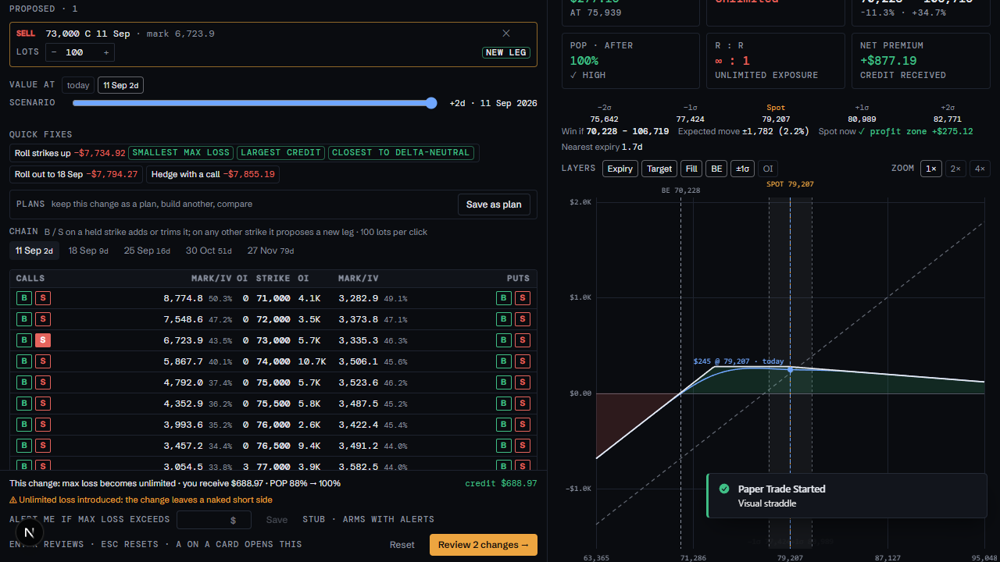
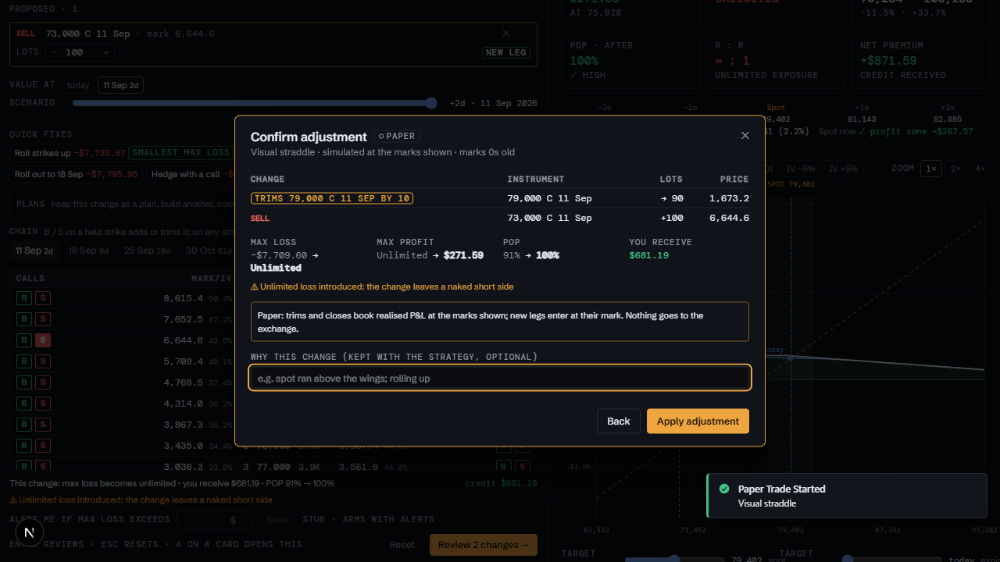
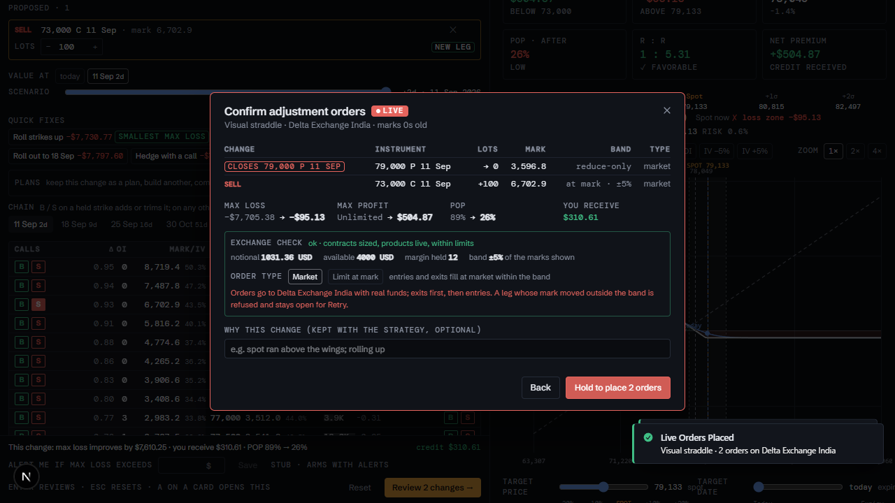

# Adjustment workbench

Part of the [HapieCoin feature guide](README.md). 10 traced features on 4 screens; 10 built and tested, 0 still mock-only (listed in the backlog).

## What it does

Adjust an open strategy without leaving the card: the workbench shows the position and its ticket, a live chain to add or close legs, and the analysis pane after the change, with before → after tiles (net premium, max loss, margin, open legs) and a change box that describes the change in words. Plans can be saved and compared against the position before it. Review shows the orders the change needs; for live strategies the venue check, the mark band, the order type and a hold-to-place confirmation.

## Try it

1. Paper card → **Adjust**. Reduce a leg's lots, sell a call above ATM on the workbench chain; read the change box and the before → after tiles.
2. **Review** → **Confirm**: the paper orders apply. Try **Exit** with an unsaved change: it asks first.
3. Live card → **Adjust** → Review: the venue check, band and order type appear; hold to place.

## Screens

*Workbench with a change*

*Paper confirm*

*Live confirm with venue check*

## Every feature, in detail

Each row is one traced feature from the build spec: the id, what it is, how it behaves (the acceptance rule the tests check), and how it is tested. Status "mock-only" means the screen exists but the data feed behind it is not connected yet.

### Analyse · Adjustment workbench · `/analyse`

| ID | Feature | How it behaves | Status | Tested by |
|---|---|---|---|---|
| HC-TR-148 | Adjustment workbench (H2): position + ticket, live chain and the analysis pane after the change | Adjust on a paper / live card, Details → Adjust… or A on a focused card opens the workbench in the left pane; the pane follows the strategy and shows the position after the change; Exit discards the draft; under 720 px the columns stack with the footer in view | built | unit (pricing) · e2e (Playwright) · security |
| HC-TR-149 | Before → after strip, ghost curve and value at a chosen expiry | Max loss, max profit, POP and break-evens shown before → after over the payoff tiles; the previous payoff drawn dashed behind the new one; "Value at" chips per expiry of the combined position (default the nearest expiry, later legs keep time value; ADR-059): settled legs at intrinsic, later legs keep time value; a scenario slider values the position on any day up to the latest expiry | built | unit (pricing) · e2e (Playwright) |
| HC-TR-150 | Lots after editing in both places with netting: ADDS / TRIMS / CLOSES / FLIPS / NEW LEG | A lots now → after stepper on every open leg (fewer trims, 0 closes, more adds at the mark) and on every proposed row; B / S on a held strike adds to or trims it, on any other strike proposes a new leg; each row says its effect; ↑ ↓ b s B S Enter Esc on the chain | built | e2e (Playwright) |
| HC-TR-151 | Change summary, cash and guard rails; Review → paper confirm with a reason; history, ADJUSTED badge and card figures | One line: max loss worsens / improves by X · you pay / receive Y · POP a% → b%; warnings for unlimited loss introduced, the 10-leg cap, 0-DTE legs and stale marks; the paper confirm lists the changes with before → after figures and an optional reason; Details shows the adjustment history, cards wear ADJUSTED and show combined max loss / profit / POP; "Alert me if max loss exceeds X" saved per strategy (stub, arms with Alerts) | built | unit (pricing) · e2e (Playwright) · api contract |
| HC-TR-152 | Live confirm: venue check, per-leg band, order type, hold-to-place, fill states | A red frame; the exchange check of adds as entries and trims / closes as reduce-only exits (contracts, notional, wallet, band); each add shows how far the mark moved from the reviewed one against the band; Market or Limit at mark (entries rest until filled, exits stay market); the button must be held 1.2 s; after placing, every order shows filled @ price / resting / failed until Done → Details; a notional above the available balance warns | built | unit (pricing) · e2e (Playwright) · api contract · security |
| HC-TR-153 | Compare plans (Plan A / Plan B) side by side | Save the current change as Plan A / B / C, build another, compare max loss / max profit / POP / cash per plan next to the current change, Use one to load it back, remove one | built | unit (pricing) · e2e (Playwright) |
| HC-TR-154 | Quick fixes: roll wings up, roll out, hedge with a call, ranked | Roll strikes up, Roll out to the next expiry, Hedge with a call: each built from the open legs and the listed strikes, priced with the engine and tagged smallest max loss / largest credit / closest to delta-neutral; a click loads the draft for review; an unbuildable fix says why | built | unit (pricing) · e2e (Playwright) |

### Trading · cards · Details · workbench

| ID | Feature | How it behaves | Status | Tested by |
|---|---|---|---|---|
| HC-TR-171 | Protect dialog: leg stops, spot level, time exit; the workbench entry | The Protect dialog lists one Leg stop row per held leg (× entry or price, the level and the current mark, exit this leg only / the whole strategy), a Spot level row (at or below / at or above, the spot now) and a Time exit row (at a time on the trader's clock, or days before the nearest expiry with the days now); the card line and Details name every kind ('S P 78,000 25 Sep stop at 1,800.0 (2× entry) · spot ≥ 82,000 · exit at 1 day to expiry'); the adjustment workbench footer shows the armed rules with a Protect button beside the P&L alert line | built | unit (pricing) · e2e (Playwright) · api contract |

### Trading · Adjustment workbench · Review

| ID | Feature | How it behaves | Status | Tested by |
|---|---|---|---|---|
| HC-TR-190 | A live adjustment that adds a leg waits for the Mindful pause | An add is a new bet: the workbench's live preview carries the server's pause; the Review dialog shows the Mindful block with the day figure, this batch's worst case and the margin in use, and the countdown replaces the hold button until the pause ends; the adjust route answers 409 MINDFUL_PAUSE until the pause shown at preview time has elapsed. POST /strategies/{id}/legs on a live strategy waits the same way. Trims and closes never wait; a body mixing a trim with an add waits as a whole | built | unit (api + web) |

### Trading · Adjustment workbench · chain

| ID | Feature | How it behaves | Status | Tested by |
|---|---|---|---|---|
| HC-TR-193 | The workbench chain lists every strike of the expiry by default, with a ±12 / All control and a strike count; held strikes far from ATM are on the chain | usePickerChain takes a range (0 = every listed strike); AdjustWorkbench owns it, All by default; WorkbenchChain shows the ±12 / All control and 'n strikes' beside the cap line and re-centres on the ATM row when the expiry or the range changes; a held strike outside ±12 (a short put 30 rows below ATM) carries its pill and can be trimmed, closed or rolled from the chain; strikes come only from the venue list (ADR-006) | built | unit (web) · e2e (Playwright) |

