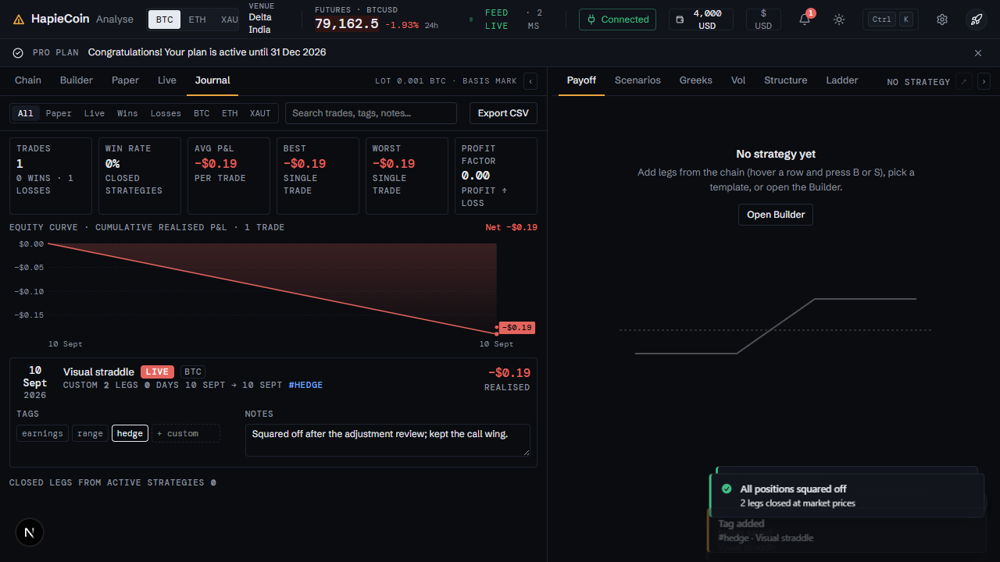
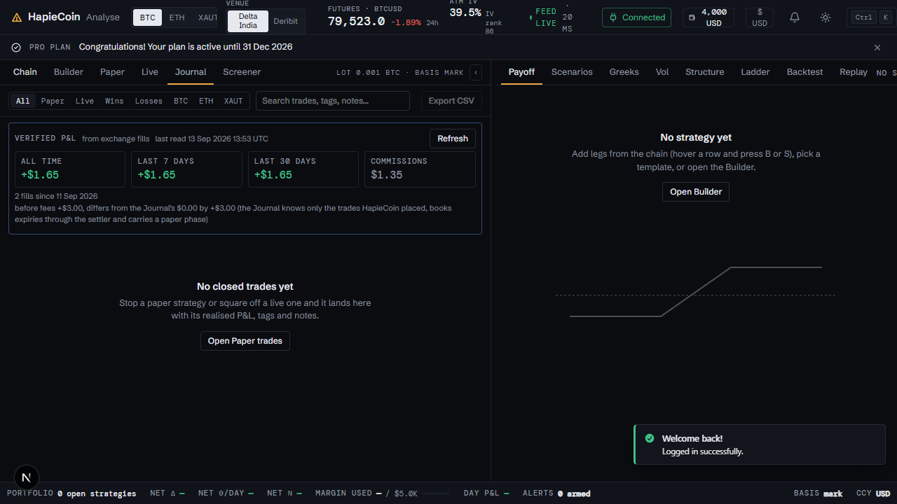

# Journal, verified P&L and the public page

Part of the [HapieCoin feature guide](README.md). 14 traced features on 4 screens; 14 built and tested, 0 still mock-only (listed in the backlog).

## What it does

The Journal lists every closed trade with its stats (win rate, average win / loss, profit factor), an equity curve, tags and notes, the close reason (expired, squared off, stopped, outside the app) and a CSV export. The verified block reads your actual fills from the exchange per key, computes realised P&L net of fees, and states whether it agrees with the Journal. That verified figure is what the public page shows.

## Try it

1. Square off a paper or live strategy → open the **Journal** from Details. Tag it, add a note, export CSV.
2. With a Delta key: **Refresh** in the verified block reads your fills and shows the agreement line.

## Screens

*Journal with a closed trade*

*Verified P&L from exchange fills*

## Every feature, in detail

Each row is one traced feature from the build spec: the id, what it is, how it behaves (the acceptance rule the tests check), and how it is tested. Status "mock-only" means the screen exists but the data feed behind it is not connected yet.

### Analyse · Journal panel · `/analyse`

| ID | Feature | How it behaves | Status | Tested by |
|---|---|---|---|---|
| HC-TR-128 | Journal tab panel | New .lp-panel[data-tab="journal"] listing ARCHIVED strategies (newest close first) plus squared-off legs of active strategies; rendered on analyse:tab and after every strategies-changed | built | unit (pricing) · e2e (Playwright) |
| HC-TR-129 | Stats strip | Trades (wins · losses), Win rate, Avg P&L, Best, Worst, Profit factor (gross profit ÷ gross loss, ∞ when no losses) for the filtered trades | built | unit (pricing) · e2e (Playwright) |
| HC-TR-130 | Equity curve | SVG of cumulative realised P&L over closedAt starting at the first trade open; faint grid with $ labels, dashed zero, filled area, one dot per trade (hover title: name · P&L · date), emphasised endpoint with the net value; first / last date on the axis | built | unit (pricing) · e2e (Playwright) |
| HC-TR-131 | Filter chips and search | All / Paper / Live / Wins / Losses / BTC / ETH / XAUT chips plus a search over name, template, asset, tags and notes | built | unit (pricing) · e2e (Playwright) · security |
| HC-TR-132 | Tag editor per trade | Chips earnings / range / hedge toggle on click; custom tags via the "+ custom" input (Enter); custom chips remove with ×; stored on the strategy as tags[]; toasts Tag added / removed | built | e2e (Playwright) |
| HC-TR-133 | Notes per trade | Textarea stored as strategy.notes while typing; "Notes saved" toast on change | built | e2e (Playwright) |
| HC-TR-134 | Export CSV | Builds id,name,mode,asset,template,legs,opened,closed,days,realized_pnl,tags,notes for the filtered trades, copies to the clipboard (execCommand fallback) and toasts "CSV copied · N rows"; CG.trading.journalCsv() / CG.trading.lastCsv | built | e2e (Playwright) |
| HC-TR-135 | Row opens Strategy Details | Clicking a trade row or a closed-leg row opens Strategy Details for that strategy | built | e2e (Playwright) |
| HC-TR-136 | Empty state | "No closed trades yet" with an Open Paper trades button; per-filter empty states | built | e2e (Playwright) |
| HC-TR-137 | Journal fed by stop / square off | Stop (archive) and live Square off all archive the strategy with closedAt so it appears in the Journal immediately | built | unit (pricing) · e2e (Playwright) · security |

### Trading · Closed chip · Journal

| ID | Feature | How it behaves | Status | Tested by |
|---|---|---|---|---|
| HC-TR-164 | Close reasons on cards and in the Journal | Every close path records why (expired · squared off · closed outside the app; stopped reserved for the strategy stop): closeReason on each squared-off leg and on the archived strategy; the Closed chip card shows it next to the close date, the Journal row shows it and the CSV carries a close_reason column | built | unit (pricing) · e2e (Playwright) |

### Trading · cards · Details · Journal

| ID | Feature | How it behaves | Status | Tested by |
|---|---|---|---|---|
| HC-TR-168 | Fired rules: the card chip, the history and the reason | A fired rule shows on the card as 'stop fired' / 'target hit', red with 'a leg still open' when an exit was refused; Details lists every rule with its state, level, time and note; the strategy closes with the reason stopped or target hit, shown on the Closed chip and in the Journal | built | e2e (Playwright) |

### Trading · Journal

| ID | Feature | How it behaves | Status | Tested by |
|---|---|---|---|---|
| HC-TR-180 | Verified P&L: realised from the fills, per account and in total | Average cost per contract over the fills in time order, shorts signed, a flipping fill split, commissions off on their day, unknown products skipped and counted; GET /v1/verified/pnl answers all-time, 7-day and 30-day totals, commissions, fills and since when, per account with its last read and error, and the Journal's own realised figure with the difference | built | unit (schema + api) |
| HC-TR-181 | The Verified P&L block on the Journal | Above the Journal stats once a key is connected: All time / Last 7 days / Last 30 days / Commissions tiles, fills and since, an agreement line against the Journal's own figure (matches, or differs by X with why), per-account rows when there is more than one key with their errors, and Refresh, which re-reads the accounts now and reports read / new; no fills yet says so | built | unit (web), e2e |

