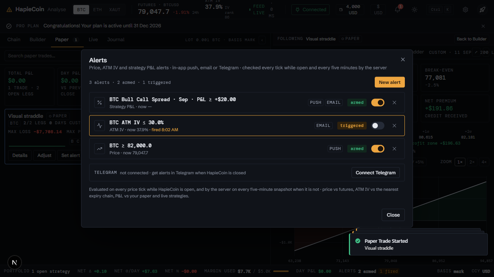
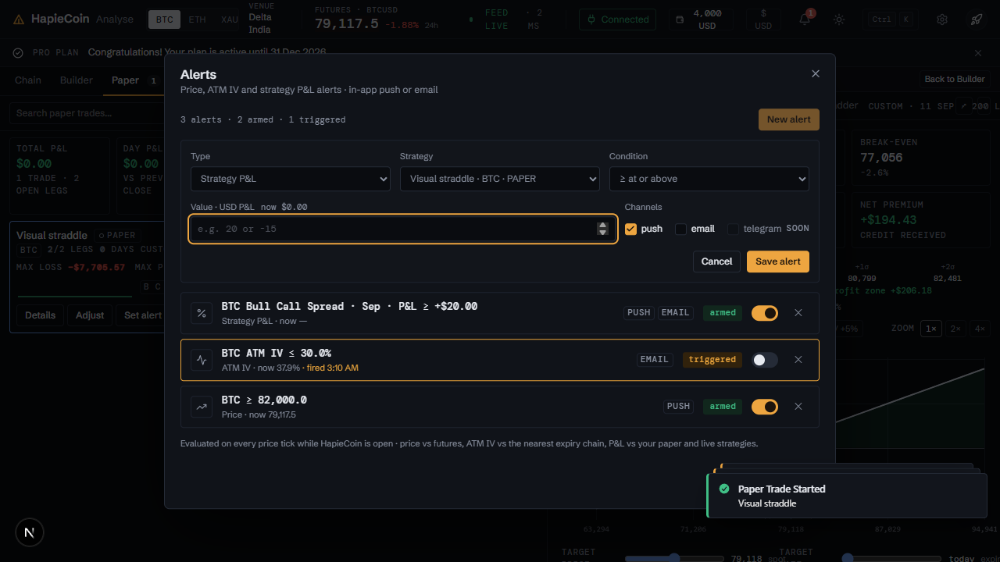

# Alerts

Part of the [HapieCoin feature guide](README.md). 7 traced features on 1 screens; 7 built and tested, 0 still mock-only (listed in the backlog).

## What it does

Alerts fire on price, ATM IV / IV rank, or a strategy's P&L, delivered by push (in the app), email and Telegram. Rules are evaluated on the server after every IV snapshot and in the browser while the workspace is open; a triggered alert turns the bell red. Telegram is linked from the alerts center with the bot.

## Try it

1. Bell → **New alert**: BTC price above the current spot + 1 %; save; watch the bell. Card → **Set alert** pre-fills a P&L alert.
2. Link Telegram from the alerts center and trigger an alert.

## Screens

*Alerts center*

*New alert from a card*

## Every feature, in detail

Each row is one traced feature from the build spec: the id, what it is, how it behaves (the acceptance rule the tests check), and how it is tested. Status "mock-only" means the screen exists but the data feed behind it is not connected yet.

### Shared chrome · Alerts center · `/analyse`

| ID | Feature | How it behaves | Status | Tested by |
|---|---|---|---|---|
| HC-SH-094 | Alert store CG.mock.alerts seeded with 3 alerts: BTC ≥ 82,000 (push), BTC IV rank ≤ 30 (telegram), s_301 “BTC Bull Call Spread · Sep” P&L ≥ +$20 (email) | Fields: id, kind price\|ivrank\|pnl, asset\|strategyId, op >=\|<=, value, channels[], state armed\|triggered\|paused, lastValue, triggeredAt | built | unit (pricing) · e2e (Playwright) · api contract |
| HC-SH-095 | API: CG.alerts.add(a), update(id, patch), remove(id), list(), get(id), arm(id, bool), counts(), conditionText(a), currentValue(a), evaluate(subset?), open(prefill?), openNew(prefill), close() | Every mutation emits 'alerts-changed' | built | e2e (Playwright) · api contract |
| HC-SH-096 | Evaluation on every 'tick' (and 'portfolio-changed'): price vs CG.ASSETS[sym].price, IV rank vs CG.analyse.stats.ivRank (fallback CG.chrome.marketStats), strategy P&L via CG.portfolio.strategyPnl(id) if present else CG.mock.strategies totalPnl | When met: state='triggered', toast “Alert triggered · BTC crossed 82,000 · Sent via push”, CG.emit('alert-triggered', alert) | built | unit (pricing) · e2e (Playwright) · api contract |
| HC-SH-097 | Alerts dialog (bell, portfolio bar, settings menu, palette): counts line, rows with kind icon, condition text (mono), current value, channel chips push/email/telegram, state badge armed/triggered/paused, arm switch, delete | Delete confirms via CG.modal.confirm; the switch re-arms triggered alerts or pauses armed ones | built | e2e (Playwright) · api contract |
| HC-SH-098 | New alert form: Type (Price / IV rank / Strategy P&L), Asset or Strategy select, Condition ≥ / ≤, Value (unit hint), Channels checkboxes, Save / Cancel with validation toasts | Saving arms the alert immediately and evaluates it once | built | unit (pricing) · e2e (Playwright) · api contract |
| HC-SH-099 | Empty state “No alerts yet” with a New alert button | Behaves as in the v2 mock. | built | e2e (Playwright) · api contract |
| HC-SH-100 | CG.alerts.openNew(prefill) for other parts (e.g. a “Set alert” button on a strategy) | prefill: {kind, asset, strategyId, op, value, channels} | built | e2e (Playwright) · api contract |

