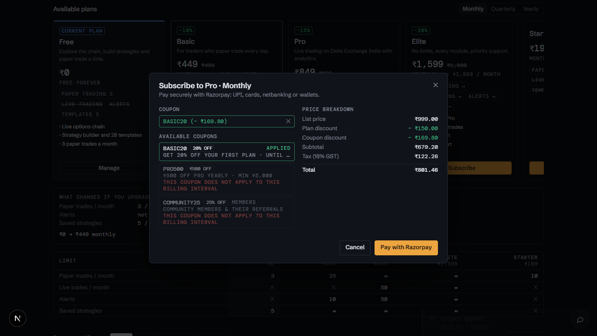
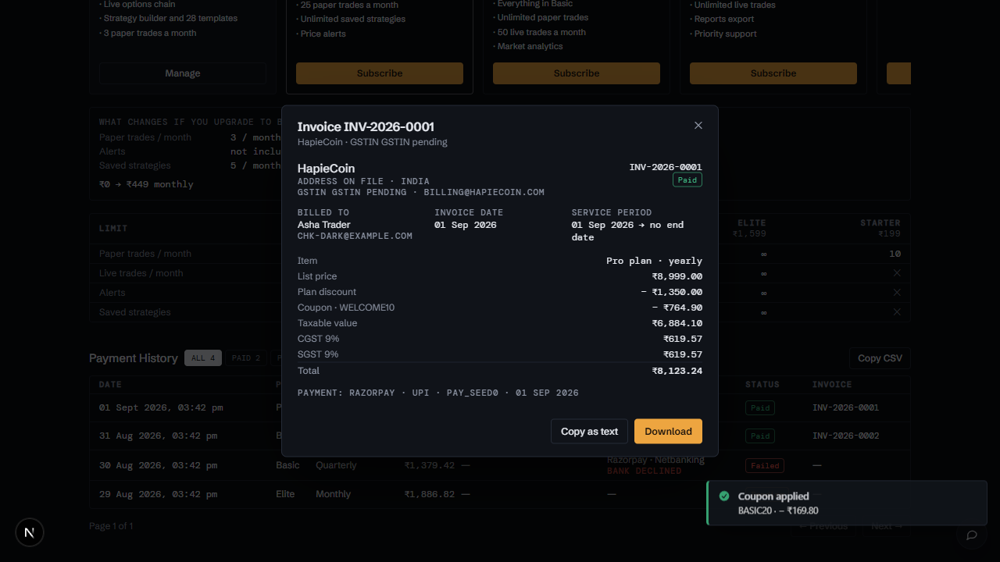
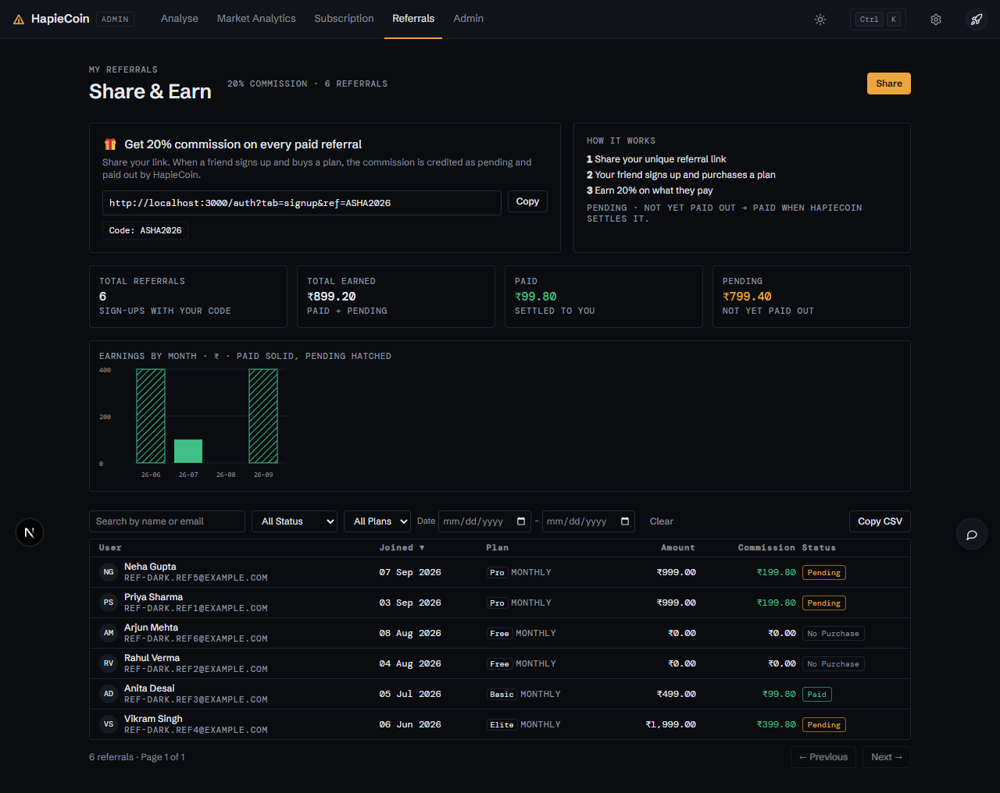
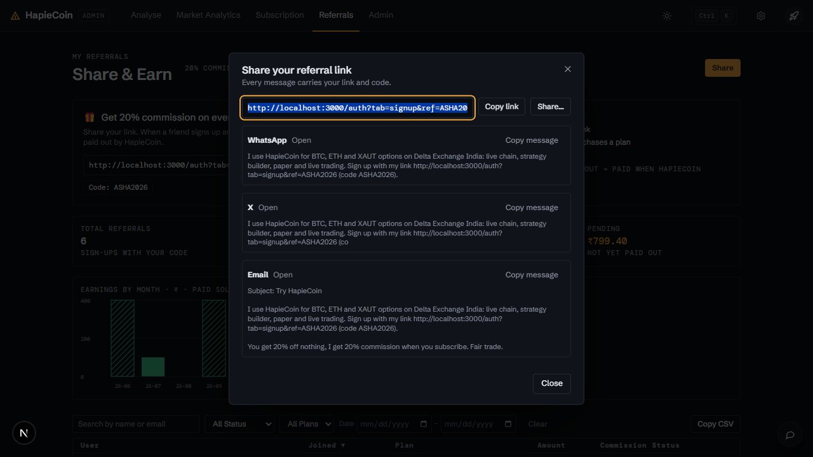

# Subscription, billing and referrals

Part of the [HapieCoin feature guide](README.md). 74 traced features on 2 screens; 71 built and tested, 3 still mock-only (listed in the backlog).

## What it does

Plans (free, Starter, Pro and more from the admin's catalogue) with monthly and yearly intervals, coupons, Razorpay checkout, invoices with GST, payment history, and entitlements that gate features with an Upgrade dialog. Referrals: a personal link and code, commissions per referred subscription, earnings by month, share via WhatsApp / X / email.

## Try it

1. `/subscription`: pick a plan, apply coupon `basic20` (on the mock), pay with the test checkout, open the invoice.
2. `/referrals`: copy your link, share, and watch the table as referred users subscribe.

## Screens

*Subscribe with a coupon*

*Invoice*

*My referrals*

*Share dialog*

## Every feature, in detail

Each row is one traced feature from the build spec: the id, what it is, how it behaves (the acceptance rule the tests check), and how it is tested. Status "mock-only" means the screen exists but the data feed behind it is not connected yet.

### My Subscription · `/subscription`

| ID | Feature | How it behaves | Status | Tested by |
|---|---|---|---|---|
| HC-AC-001 | Page header 'My Subscription · Choose a plan to unlock features' | Slim v2 title row: title + muted subtitle left, mono status meta (PRO · YEARLY · 116 DAYS LEFT) and the single amber primary action right; hairline underneath | built | e2e (Playwright) |
| HC-AC-002 | Auth guard | Section carries data-auth="user"; logged-out visitors are redirected to /auth?next=/subscription by the router | built | e2e (Playwright) |
| HC-AC-003 | Current plan card: plan name + status badge | Rendered from CG.mock.subscription; badge is Active (green), Expired (red, when expiresAt < mock clock or status expired) or Cancelled (grey) | built | unit (pricing) · e2e (Playwright) |
| HC-AC-004 | Current plan summary strip: Billing / Price / You Pay / Currency / Valid until | Five-cell mono stat strip under the plan header (micro labels, tabular numbers, struck list price with % off pill, days-left pill); Feature Limits and Plan Features sit side by side below it | mock-only | unit (pricing) · visual (screenshot diff) |
| HC-AC-005 | Valid-until date with days-left badge | 'Valid until 31 Dec 2026' + '116 days left' computed against the mock clock (06 Sep 2026); badge turns amber when 7 days or fewer remain; expired plans show 'Expired on' | built | e2e (Playwright) |
| HC-AC-006 | Feature Limits with usage progress bars | One row per key in subscription.featureLimits (paper_trading, live_trading): raw key in mono, limit as '∞ Unlimited' or '25 / month', progress bar and '14 used' / '3 of 25 used · 12%' caption; a 0 limit for a feature the plan does not include renders 'Not included · Upgrade to unlock' | built | unit (pricing) · e2e (Playwright) · security |
| HC-AC-007 | Features & Usage → Plan Features list | Check-marked two-column bullet list from plan.features of the subscribed plan | mock-only | visual (screenshot diff) |
| HC-AC-008 | Renew Plan button | Opens the Subscribe dialog pre-set to the current plan and interval (primary style when the plan is expired) | built | e2e (Playwright) |
| HC-AC-009 | Upgrade button | Header primary action reads Upgrade plan (Renew plan on Elite or when expired, Choose a plan with no subscription); it and the outline Upgrade in the current card smooth-scroll to Available Plans, pin the next tier in the diff panel and flash its card | built | e2e (Playwright) |
| HC-AC-010 | No Active Subscription state | When CG.mock.subscription is null the card shows an icon, 'No Active Subscription', 'Browse plans below and get started' and a 'Choose a Plan' button that smooth-scrolls to the plan grid | built | unit (pricing) · e2e (Playwright) |
| HC-AC-011 | Available Plans heading | Section heading with subtitle; anchor target for Choose a Plan / Upgrade | mock-only | visual (screenshot diff) |
| HC-AC-012 | Billing interval toggle (Monthly / Quarterly / Yearly) | Segmented tabs; re-renders every plan card's price, discount badge, per-month line and feature-limit chips for the chosen interval; defaults to the current subscription's interval; Semi-Annually label supported for history rows | built | e2e (Playwright) |
| HC-AC-013 | Plan comparison grid (Free / Basic / Pro / Elite) | Four hairline cards without shadows in a 4-up comparison grid: micro flag row, name, description, discount price large in mono, list price struck with % off pill, per-month line, mono limit chips, feature bullets and the action button | built | e2e (Playwright) |
| HC-AC-014 | Current plan highlight | The active plan's card gets a 2px amber top rule plus a small amber micro label 'CURRENT PLAN' (no big tag); the Pro card shows a muted 'MOST POPULAR' micro label otherwise | built | unit (pricing) · e2e (Playwright) |
| HC-AC-015 | Plan card action button | 'Current Plan' (disabled) on the active plan, 'Free Plan' (disabled) on the free card while a paid plan is active, 'Activate' on the free card with no subscription, 'Subscribe' elsewhere | built | unit (pricing) · e2e (Playwright) |
| HC-AC-016 | Subscribe dialog 'Subscribe to <Plan> · <Interval>' | CG.modal (lg) with plan summary strip, coupon column and price breakdown column; Cancel closes it | built | e2e (Playwright) · api contract |
| HC-AC-017 | Apply Coupon input + Apply button | Input 'Enter coupon code' (uppercased), Apply button or Enter key validates against CG.mock.coupons; errors appear inline and as toast 'Error · Invalid coupon' | built | e2e (Playwright) · api contract |
| HC-AC-018 | Coupon validation rules | Rejects unknown/inactive codes, expired or not-yet-started windows, exhausted maxUses, private community coupons not assigned to the user, plans/intervals outside the coupon scope, and orders below minOrderAmount; each with a specific reason | built | unit (pricing) · e2e (Playwright) · api contract · security |
| HC-AC-019 | Applied coupon chip with remove | Green chip 'BASIC20 (-₹720)' with an ✕ that removes the coupon and restores the breakdown; input locks while a coupon is applied | built | e2e (Playwright) · api contract |
| HC-AC-020 | Available Coupons list | Public coupons plus community coupons assigned to the user (COMMUNITY25), each with '20% OFF' / '₹500 OFF' tag, description, expiry and min order; click applies; inapplicable ones are dimmed with the reason; applied one is marked | built | e2e (Playwright) · api contract · security |
| HC-AC-021 | Price breakdown | List Price, Plan Discount, Coupon Discount, Subtotal, Tax (18% GST), Total — right-aligned mono ₹ values recalculated on every coupon change | built | e2e (Playwright) · api contract |
| HC-AC-022 | Pay with Razorpay button | Opens the Razorpay mock checkout (CG.razorpayMock.open) with the computed total, description 'Subscription · Plan · Interval' and user prefill | built | e2e (Playwright) · api contract |
| HC-AC-023 | Activate (₹0 total) | When the total is zero (Free plan or 100% coupon) the footer shows 'Activate' instead; activation updates CG.mock.subscription immediately and toasts 'Success · Subscription activated!' | built | unit (pricing) · e2e (Playwright) · api contract |
| HC-AC-024 | Razorpay mock checkout window | Dark tokenised checkout: panel/raised surfaces, hairlines, mono amount, amber underline on the active method tab (UPI / Card / Netbanking / Wallet), amber Pay button, Cancel, mono SECURED BY RAZORPAY footer and the mock-controls strip | built | unit (pricing) · e2e (Playwright) · api contract |
| HC-AC-025 | Payment success flow | Pay → 1.2s 'Processing…' overlay → subscription replaced (plan, interval, expiresAt = now + 30/90/365 days, featureLimits from the plan), CG.mock.users[0] updated, payment row + invoice pushed to CG.mock.payments, coupon usedCount incremented, 'subscription' event emitted, toast 'Payment Successful! · Your subscription is now active.', dialogs close, page re-renders | built | unit (pricing) · e2e (Playwright) · api contract · security |
| HC-AC-026 | Payment cancel flow | Cancel / ✕ in the checkout closes it and toasts 'Payment Cancelled · You can try again anytime.'; the Subscribe dialog stays open | built | e2e (Playwright) · api contract · security |
| HC-AC-027 | Simulate failure (payment.failed) | Mock-controls link in the checkout: runs Processing then toasts 'Payment Failed · Payment failed. Please try again.' and adds a Failed row to Payment History | built | e2e (Playwright) · api contract · security |
| HC-AC-028 | Simulate confirmation failure | Mock-controls link: payment captured but backend confirmation fails → toast 'Confirmation Failed · Please contact support.' and a Pending payment row | built | e2e (Playwright) · api contract · security |
| HC-AC-029 | Simulate SDK error | Mock-controls link reproduces the checkout.js load failure → toast 'Error · Failed to load Razorpay SDK'; the same toast fires if CG.razorpayMock is missing | built | e2e (Playwright) · api contract |
| HC-AC-030 | Generic error fallback | Unexpected exceptions in the payment handler or a missing plan id toast 'Error · Something went wrong' | built | e2e (Playwright) · api contract · security |
| HC-AC-031 | Payment History table | Columns Date (en-IN '01 Jan 2026, 10:12 AM'), Plan, Interval, Amount (mono ₹), Coupon (code + '-₹…' or —), Method (Razorpay · UPI/Card/Netbanking/Wallet), Status badge, Invoice; sorted newest first from CG.mock.payments | built | e2e (Playwright) · api contract · security |
| HC-AC-032 | Payment status badges | success → Paid (green), pending → Pending (amber), failed → Failed (red) | built | e2e (Playwright) · api contract · security |
| HC-AC-033 | Invoice link opens the invoice preview | Mono 'INV-2026-0001' link with an eye icon opens the rendered invoice preview dialog; failed/pending rows show — | built | e2e (Playwright) |
| HC-AC-034 | Payment History empty state | 'No payments yet' when CG.mock.payments is empty | built | e2e (Playwright) · api contract · security |
| HC-AC-035 | Payment History pagination | 5 rows per page with 'Page 1 of 2', '← Previous' and 'Next →' buttons (disabled at the ends) | built | e2e (Playwright) · api contract · security |
| HC-AC-036 | Live re-render on subscription change | Listens to the custom 'subscription' event so other screens that change CG.mock.subscription are reflected while the page is active | built | unit (pricing) · e2e (Playwright) · security |
| HC-AC-056 | 'What changes if I upgrade' diff panel | Hovering, focusing or clicking any plan card renders a diff against the current plan for the selected interval: price → price with +/− delta per month/quarter/year, upgrade/downgrade/switch wording, only the changed limits (25 → ∞, ✕ → ✓ in green, regressions in red), a count of unchanged limits and a Subscribe/Activate shortcut; hovering the current plan says so; with nothing hovered it shows the next tier | built | unit (pricing) · e2e (Playwright) |
| HC-AC-057 | Plan card selection (pin the diff) | Clicking a card (not its button) pins it as the compared plan with a subtle ring; clicking again unpins; Enter on a focused card does the same | built | e2e (Playwright) |
| HC-AC-058 | Feature limits matrix | Hairline table under the plan grid: rows Paper trades / month, Live trades / month, Strategy templates, Market analytics, Reports export × columns Free / Basic / Pro / Elite with the interval price under each; cells show numbers, ∞, green ✓ or muted ✕; the current plan column is tinted with an amber top rule; follows the billing interval toggle | built | unit (pricing) · e2e (Playwright) · security |
| HC-AC-059 | Billing interval tabs restyled | Monthly / Quarterly / Yearly as underline tabs (amber underline on the active one) driving plan cards, diff panel and matrix together | built | unit (pricing) · e2e (Playwright) |
| HC-AC-060 | Payment history status filter chips | Mono chips ALL / PAID / PENDING / FAILED with live counts; the active chip inverts; pagination resets; a filtered-empty state offers Show all | built | unit (pricing) · e2e (Playwright) · api contract · security |
| HC-AC-061 | Payment history Copy CSV | Copies the current (filtered) payments as CSV (Date, Plan, Interval, Amount, Coupon, Discount, Tax, Method, Status, Invoice) to the clipboard and toasts the row × column count | built | e2e (Playwright) · api contract · security |
| HC-AC-062 | Invoice preview dialog | Rendered tax invoice: HapieCoin letterhead with GSTIN, invoice number and Paid pill, Billed to / Invoice date / Service period, line items (plan · interval, plan discount, coupon, taxable value, CGST 9%, SGST 9%, total) derived from the payment row, footer with invoice and payment ids | built | unit (pricing) · e2e (Playwright) · api contract · security |
| HC-AC-063 | Invoice Download / Copy as text | Download (amber) copies a plain-text rendering of the invoice to the clipboard and toasts 'Invoice INV-… downloaded · mock download'; Copy as text copies the same without the download wording | built | e2e (Playwright) |
| HC-AC-064 | Empty states with actions | No payments → Browse plans button; filtered-empty → Show all; no subscription → Choose a Plan | built | e2e (Playwright) · api contract · security |
| HC-AC-065 | Row density | Tables switch between 36px comfortable and 28px compact rows when the chrome emits CG.emit('density', …) | built | e2e (Playwright) |
| HC-AC-066 | Palette command 'Subscription → Change plan' | Registered with CG.palette when present: navigates to /subscription and triggers the header primary action | built | e2e (Playwright) |

### My Referrals · `/referrals`

| ID | Feature | How it behaves | Status | Tested by |
|---|---|---|---|---|
| HC-AC-037 | Page header 'My Referrals · Share & Earn' | Slim v2 title row with mono meta (20% COMMISSION · 6 REFERRALS) and the amber Share primary action on the right | built | e2e (Playwright) · api contract |
| HC-AC-038 | Referral link card 'Get 20% commission on every paid referral' | Flat hairline card (no gradient): gift icon, headline using referrals.commissionPct, explanatory copy, mono link input, Copy button and the dashed code chip | built | e2e (Playwright) · api contract |
| HC-AC-039 | Referral link (read-only input) | Shows CG.mock.referrals.link in a mono read-only input; clicking selects the whole link | built | e2e (Playwright) · api contract |
| HC-AC-040 | Copy button | Copies the link via navigator.clipboard (execCommand fallback) and toasts 'Copied!' | built | e2e (Playwright) |
| HC-AC-041 | Share button | Opens the Share dialog (link row + WhatsApp / X / Email message templates); the native navigator.share sheet is offered inside the dialog when the browser supports it | built | unit (pricing) · e2e (Playwright) |
| HC-AC-042 | 'Code: REF_DEMO4K2' chip | Dashed chip with the referral code from CG.mock.user.referralCode; click copies the code | built | e2e (Playwright) · api contract |
| HC-AC-043 | How it works (3 steps) | Numbered steps: Share your unique referral link → Friend signs up & purchases a plan → Earn 20% commission, plus a note on Pending vs Paid | built | e2e (Playwright) · api contract |
| HC-AC-044 | Stats tiles: Total Referrals / Total Earned / Paid / Pending | Computed from the referral rows (count, sum of commission, sum of paid, sum of pending) and written back to CG.mock.referrals so every screen agrees; ₹ values in mono with 2 decimals | built | e2e (Playwright) · api contract |
| HC-AC-045 | Search by name or email | Case-insensitive live filter over name and email; resets to page 1 | built | unit (pricing) · e2e (Playwright) · security |
| HC-AC-046 | Status filter (All Status / Paid / Pending / No Purchase) | Select bound to row.status (paid / pending / not_paid) | built | e2e (Playwright) |
| HC-AC-047 | Plan filter (All Plans / Free / Basic Plan / Pro Plan / Elite Plan) | Select; 'Free' matches referrals with no purchased plan | built | e2e (Playwright) · api contract |
| HC-AC-048 | Date range filter | 'Date:' label with from/to date inputs filtering on the Joined date (inclusive) | built | unit (pricing) · e2e (Playwright) |
| HC-AC-049 | Clear button | Resets search, status, plan and dates, re-renders and toasts 'Filters cleared' | built | e2e (Playwright) |
| HC-AC-050 | Referrals table | Columns User (mono initials, name + email), Joined (mono), Plan (outline badge + interval), Amount, Commission (mono, right-aligned, green), Status; every header is sortable; default newest first | built | e2e (Playwright) · api contract |
| HC-AC-051 | Status badges | paid → Paid (green), pending → Pending (amber), not_paid → No Purchase (grey) | built | e2e (Playwright) |
| HC-AC-052 | Empty state: no referrals | 'No referrals yet · Share your link to start earning' when the referral list is empty | built | e2e (Playwright) · api contract |
| HC-AC-053 | Empty state: no results | 'No results found · Try adjusting your filters' when filters exclude every row | built | e2e (Playwright) |
| HC-AC-054 | Pagination + count footer | 10 rows per page; footer '6 referrals (filtered from N) · Page 1 of 1' with pluralised ' referral', '← Previous' / 'Next →' buttons | built | e2e (Playwright) · api contract |
| HC-AC-055 | Load error toast | If referrals fail to load, the page shows an inline error panel 'Couldn't load referrals' with a Retry button and a toast; the last successfully loaded data stays visible with a 'stale' note when available. | built | e2e (Playwright) · api contract |
| HC-AC-067 | Earnings by month chart | SVG bars per signup month from the referral rows: paid commission solid green, pending as a hatched outline of the same hue (state in shape, not a second colour), faint ₹ grid, mono axis labels, value labels, hover tooltip per bar, legend and a best-month readout; re-renders on resize | built | e2e (Playwright) · api contract |
| HC-AC-068 | Stat tiles row | Total Referrals / Total Earned / Paid (green) / Pending as four mono stat tiles above the chart, computed from the rows | built | e2e (Playwright) · api contract |
| HC-AC-069 | Share dialog with message templates | Link row (Copy link, native Share… when supported) plus WhatsApp, X (Twitter) and Email templates that embed the referral link and code; each has a Copy message button with a toast | built | unit (pricing) · e2e (Playwright) · api contract |
| HC-AC-070 | Sortable table headers | User, Joined, Plan, Amount, Commission and Status headers sort ascending/descending with a ▲/▼ indicator; numeric/date columns default to descending | built | e2e (Playwright) |
| HC-AC-071 | Referrals Copy CSV | Copies the filtered, sorted rows (Name, Email, Joined, Plan, Interval, Amount, Commission, Status) as CSV with a toast | built | e2e (Playwright) · api contract |
| HC-AC-072 | Empty states with actions | No referrals → Share link button; no results → Clear filters button | built | e2e (Playwright) · api contract |
| HC-AC-073 | Palette command 'Referrals → Copy link' | Registered with CG.palette when present: copies the referral link and toasts | built | e2e (Playwright) · api contract |
| HC-AC-074 | Row density | Referral table honours the compact density setting (28px rows) | built | e2e (Playwright) · api contract |

