# Admin console

Part of the [HapieCoin feature guide](README.md). 129 traced features on 8 screens; 127 built and tested, 2 still mock-only (listed in the backlog).

## What it does

For admins only: plans and pricing, coupons, user subscriptions with commissions (mark paid, bulk pay), banners with schedule and preview, promotional email campaigns with templates and history, and user management (search, plan, 2FA column, invite, drawer with subscription and referrals).

## Try it

1. Sign in as the seeded admin (`pnpm --filter @hapiecoin/api db:seed` creates one) and open `/admin`.
2. Plans → add a plan; Coupons → create and toggle one; Banners → new banner with a schedule; Emails → compose to selected users, then History.

## Screens

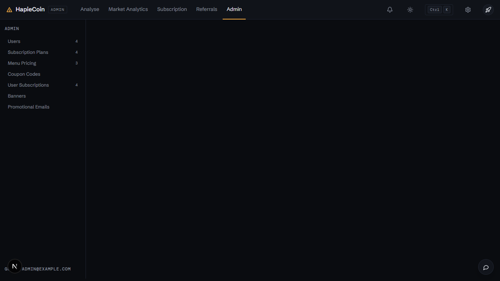
*Admin home*

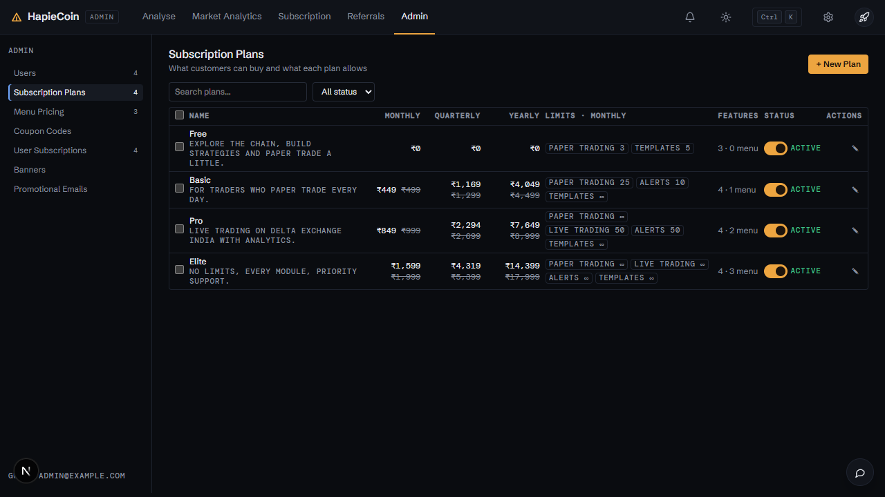
*Subscription plans*

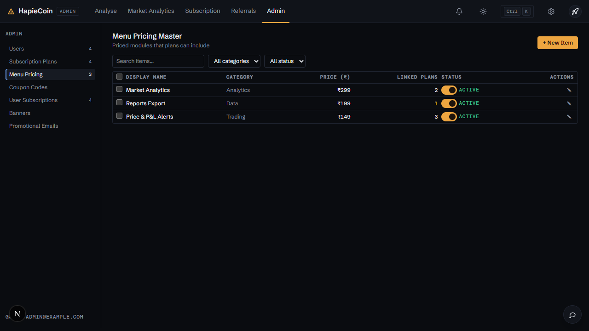
*Pricing master*

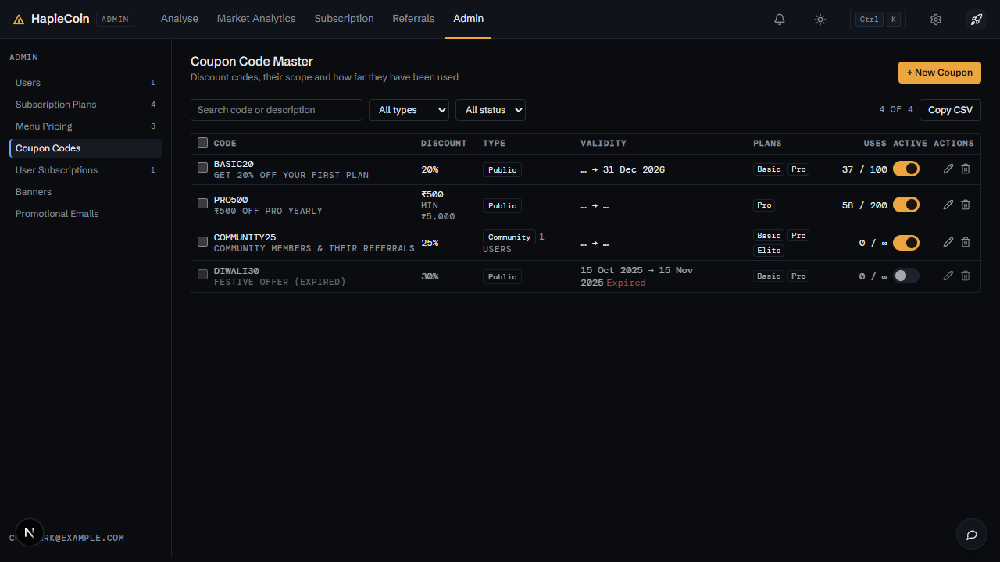
*Coupons*

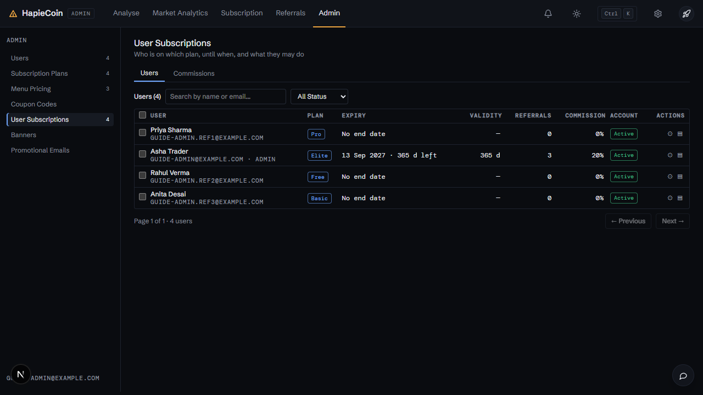
*User subscriptions*

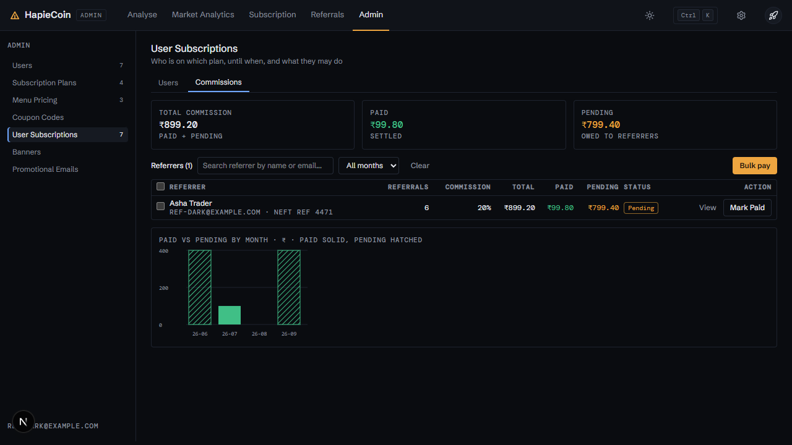
*Commissions*

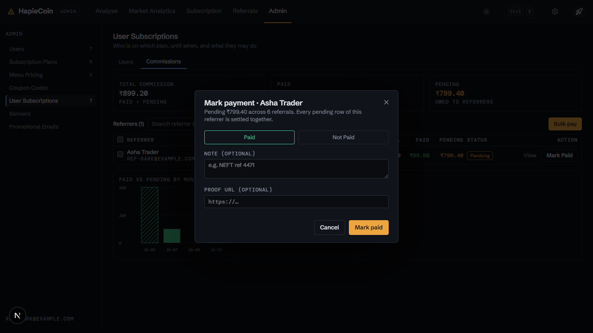
*Mark a commission paid*

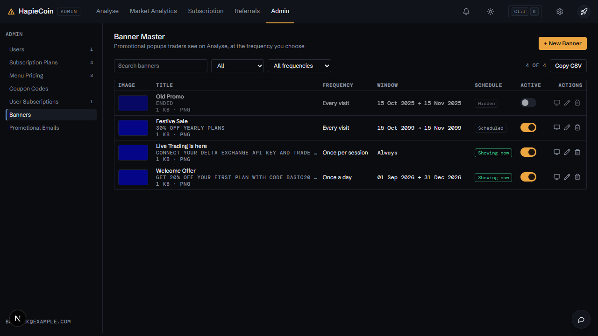
*Banners*

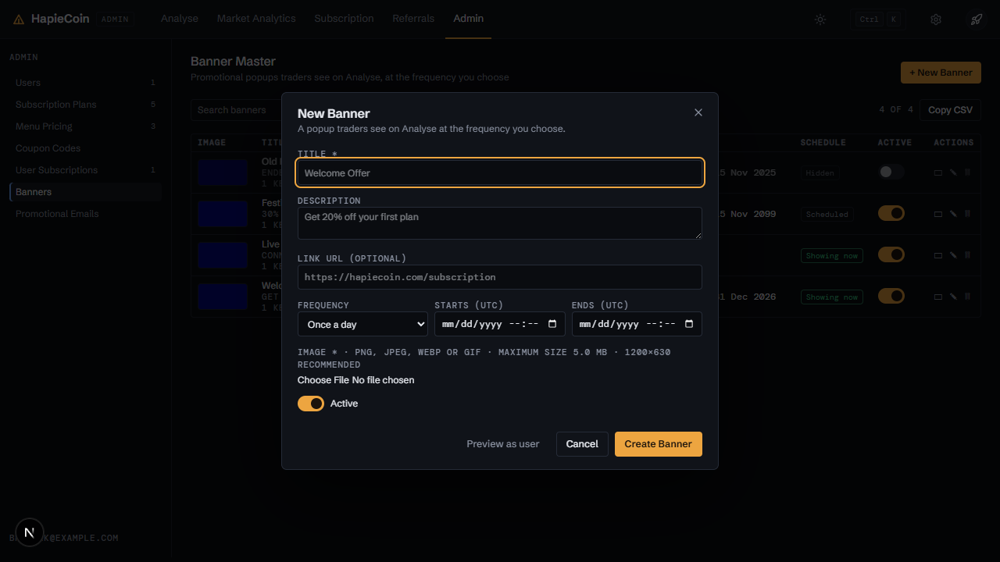
*Banner dialog*

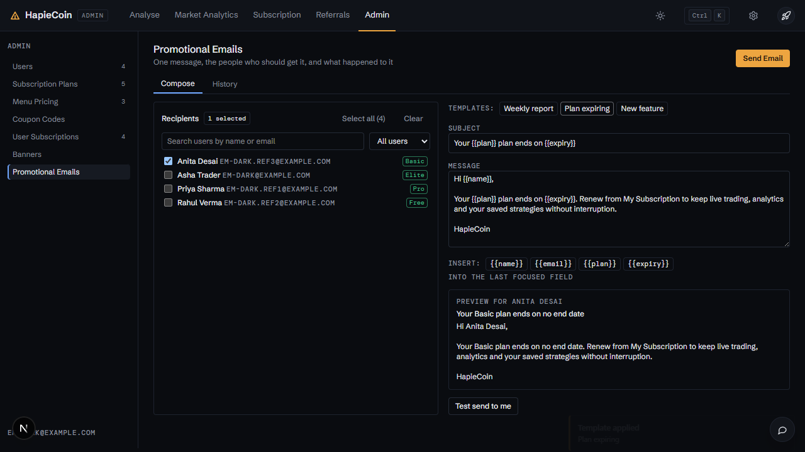
*Promotional emails*

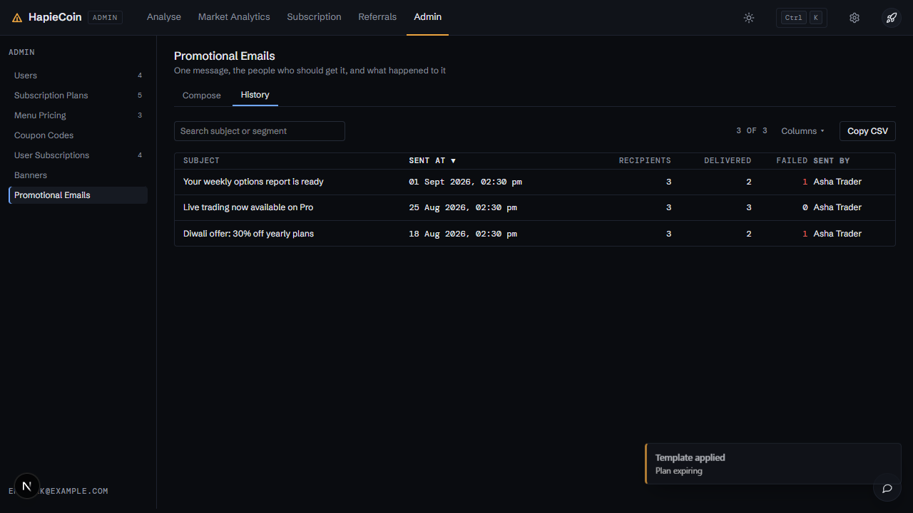
*Campaign history*

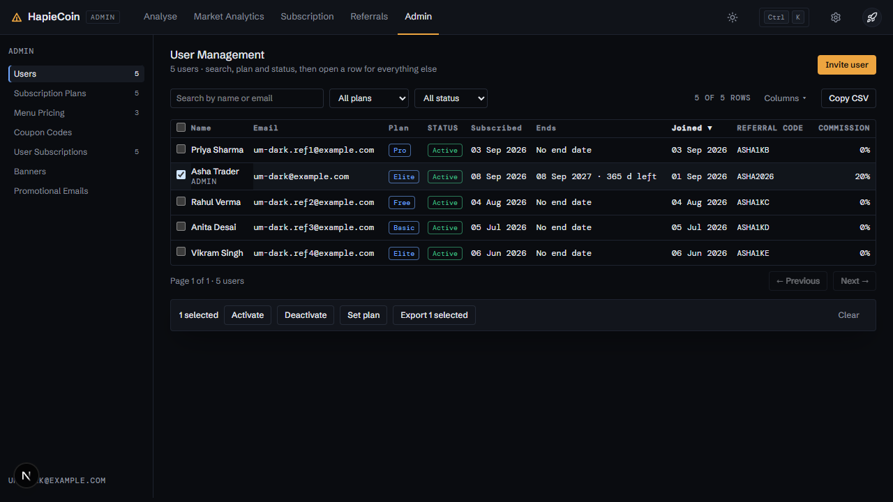
*User management*

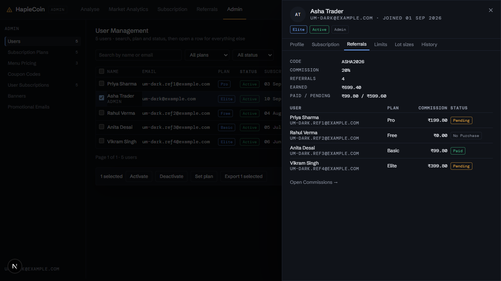
*User drawer*

## Every feature, in detail

Each row is one traced feature from the build spec: the id, what it is, how it behaves (the acceptance rule the tests check), and how it is tested. Status "mock-only" means the screen exists but the data feed behind it is not connected yet.

### Admin (index) · `/admin`

| ID | Feature | How it behaves | Status | Tested by |
|---|---|---|---|---|
| HC-AD-001 | Redirect /admin → /admin/users | Section with data-redirect; router replaces the hash | built | e2e (Playwright) · api contract · security |
| HC-AD-002 | Admin-only guard (data-auth=admin) | Non-admin / logged-out users are redirected by the router (CG.auth.isAdmin) | built | e2e (Playwright) · api contract · security |
| HC-AD-003 | Admin navigation rail (CG.chrome['admin-nav']) | On ≥1100px a sticky left rail with an ADMIN micro label, icon + label links (Users · Subscription Plans · Menu Pricing · Coupon Codes · User Subscriptions · Banners · Promotional Emails), live counts per page, amber inset rule on the active item and a footer with the admin email; below 1100px it collapses into a horizontal top bar | built | unit (pricing) · e2e (Playwright) · api contract · security |
| HC-AD-091 | Palette commands 'Admin → …' | Seven commands (Users, Plans, Menu Pricing, Coupons, User Subscriptions, Banners, Emails) registered with CG.palette.register when the chrome exposes it | built | e2e (Playwright) · api contract · security |
| HC-AD-092 | Sticky filter row on every page | Search + selects + the tools cluster (row count, Columns ▾, Copy CSV) stick under the 50px header while the table scrolls | built | e2e (Playwright) |
| HC-AD-093 | Column visibility menu ('Columns ▾') | Checkbox menu per table (menu stays open while toggling); at least one column must stay; Reset to default; choices persisted in CG.state.adminCols[page] via CG.saveState() | built | e2e (Playwright) · api contract · security |
| HC-AD-094 | Sortable column headers | Sortable columns show a ▲/▼ indicator; click toggles direction; numeric columns default to descending | built | e2e (Playwright) |
| HC-AD-095 | Bulk selection + floating action bar | Header checkbox selects every filtered row, row checkboxes toggle one; a floating bar at the bottom shows the count, per-page actions and Clear; selected rows are tinted | built | e2e (Playwright) |
| HC-AD-096 | Copy CSV of the current view | Copies the filtered + sorted rows with only the visible (non-action) columns as CSV and toasts rows × columns | built | e2e (Playwright) |
| HC-AD-097 | Improved empty states | Icon + one-line hint + primary action (Create … / Invite user / Compose) when there is no data, and a Clear filters action when filters hide everything | built | e2e (Playwright) |
| HC-AD-098 | Row density | All admin tables switch between 36px and 28px rows on CG.emit('density', …) | built | e2e (Playwright) · api contract · security |

### Subscription Plans · `/admin/subscriptions`

| ID | Feature | How it behaves | Status | Tested by |
|---|---|---|---|---|
| HC-AD-004 | Page title + subtitle | Slim title row: 'Subscription Plans' / 'Manage subscription tiers and pricing' left, the single amber primary action right, hairline underneath | mock-only | visual (screenshot diff) |
| HC-AD-005 | '+ New Plan' button | Opens the 'Create New Plan' dialog | built | e2e (Playwright) |
| HC-AD-006 | Card 'All Plans (N)' table: Name, Monthly, Quarterly, Yearly, Status, Actions | Rendered from CG.mock.plans; price cells show discount price with struck-through list price and % off, plus paper/live limits | built | unit (pricing) · e2e (Playwright) · security |
| HC-AD-007 | Status switch (Active / Inactive) per plan | Toggles plan.isActive in CG.mock, toast 'Updated' | built | unit (pricing) · e2e (Playwright) |
| HC-AD-008 | Edit (pencil) action | Opens 'Edit Plan' dialog pre-filled; submit label 'Update' | built | e2e (Playwright) |
| HC-AD-009 | Empty state 'No Plans Yet · Create your first subscription plan · + Create Plan' | Shown when CG.mock.plans is empty; button opens the create dialog | built | e2e (Playwright) |
| HC-AD-010 | Dialog field 'Plan Name *' (placeholder e.g. Basic Plan) | Required text input | built | e2e (Playwright) |
| HC-AD-011 | Dialog field 'Description' | Textarea saved to plan.description | built | e2e (Playwright) |
| HC-AD-012 | Dialog 'Features' chip input ('Add a feature' + Enter / Add button, removable chips) | Enter or the secondary Add button appends a chip; × removes it; saved as plan.features[] | built | e2e (Playwright) |
| HC-AD-013 | Dialog 'Billing Intervals': Monthly / Quarterly / Yearly blocks with Price and Discount Price (₹) | Three input groups saved to plan.monthly/quarterly/yearly {price, discountPrice} | built | e2e (Playwright) |
| HC-AD-014 | Dialog 'Feature Limits' per interval: Paper Trading Limit (Per Month), Live Trading Limit (Per Month) | Saved to plan.<interval>.featureLimits {paper_trading, live_trading}; 0 = unlimited | built | unit (pricing) · e2e (Playwright) · security |
| HC-AD-015 | Dialog 'Menu Items' multi-select checkboxes | Checklist built from CG.mock.menuItems with category and price; saved to plan.menuItems[]; counter 'x of y menu items linked' | built | e2e (Playwright) |
| HC-AD-016 | Dialog 'Active · Plan visible to users' switch | Sets plan.isActive | built | unit (pricing) · e2e (Playwright) |
| HC-AD-017 | Dialog footer Cancel / Create \| Update | Cancel closes; submit validates then mutates CG.mock.plans and re-renders the table | built | e2e (Playwright) |
| HC-AD-018 | Validation toast 'Validation · Plan name is required' | Destructive toast when the name is empty; focus returns to the field | built | unit (pricing) · e2e (Playwright) |
| HC-AD-019 | Toasts 'Created' / 'Updated' / 'Failed to save' | Success toasts after save; 'Failed to save' is raised if the in-memory mutation throws | built | e2e (Playwright) |
| HC-AD-110 | Search + status filter | Filters plans by name/description and Active/Inactive | built | unit (pricing) · e2e (Playwright) |
| HC-AD-111 | Bulk Activate / Deactivate | Selected plans are toggled and plans:changed is emitted | built | unit (pricing) · e2e (Playwright) |
| HC-AD-112 | Limits and Features columns | Yearly paper/live limits column, plus a hideable Features column (features · menu items count) | built | unit (pricing) · e2e (Playwright) · security |

### Menu Pricing Master · `/admin/menu-pricing`

| ID | Feature | How it behaves | Status | Tested by |
|---|---|---|---|---|
| HC-AD-020 | Page title + subtitle | 'Menu Pricing Master' / 'Manage menu items linked to subscription plans' | mock-only | visual (screenshot diff) |
| HC-AD-021 | '+ New Item' button | Opens 'New Menu Item' dialog | built | e2e (Playwright) |
| HC-AD-022 | Card 'All Menu Items (N)' table: Display Name, Category, Price (₹), Status, Actions (+ linked plans count) | Rendered from CG.mock.menuItems; 'Linked plans' column counts plans referencing the item | built | e2e (Playwright) |
| HC-AD-023 | Status switch per item | Toggles isActive, toast 'Updated' (the bundle's 'Failed to update status' path is never hit in the mock) | built | unit (pricing) · e2e (Playwright) |
| HC-AD-024 | Edit (pencil) action → 'Edit Menu Item' dialog | Pre-fills the form; renaming an item also renames it inside every plan's menuItems list | built | e2e (Playwright) |
| HC-AD-025 | Empty state 'No Menu Items · Add menu items that can be linked to plans · + Add Item' | Shown when the list is empty | built | e2e (Playwright) |
| HC-AD-026 | Dialog fields: 'Display Name *' (e.g. Reports Export), Category (e.g. Trading, Analytics, Data), 'Price (₹)' number, Active switch | Saved to CG.mock.menuItems | built | unit (pricing) · e2e (Playwright) |
| HC-AD-027 | Validation 'Validation · Display Name is required' | Destructive toast on empty name | built | unit (pricing) · e2e (Playwright) |
| HC-AD-028 | Toasts 'Created' / 'Updated' / 'Failed to save'; footer Cancel / Create \| Update | Same save pipeline as plans | built | e2e (Playwright) |
| HC-AD-113 | Search, category and status filters | Category options are built from the data; all three combine | built | e2e (Playwright) |
| HC-AD-114 | Bulk Activate / Deactivate | Toggles the selected menu items | built | unit (pricing) · e2e (Playwright) |

### Coupon Code Master · `/admin/coupons`

| ID | Feature | How it behaves | Status | Tested by |
|---|---|---|---|---|
| HC-AD-029 | Page title + subtitle, '+ New Coupon' button | 'Coupon Code Master' / 'Manage discount coupons'; button opens 'New Coupon' dialog | built | e2e (Playwright) · api contract |
| HC-AD-030 | Card 'All Coupons (N)' table: Code, Discount, Type, Validity, Plans, Uses, Status, Actions | Code in mono with description; Discount '20%' or '₹500' (+ min order); Type badge Public / Community (+ assigned users count); Validity 'starts → expires' with red 'Expired' when past; Plans as badges (interval list in tooltip); Uses 'used / max' + per-user limit | built | e2e (Playwright) · api contract · security |
| HC-AD-031 | Status switch per coupon | Toggles isActive, toast 'Updated' | built | unit (pricing) · e2e (Playwright) · api contract |
| HC-AD-032 | Edit (pencil) → 'Edit Coupon' dialog | Pre-fills every field incl. assigned users and plan×interval grid; submit 'Update' | built | e2e (Playwright) · api contract |
| HC-AD-033 | Delete (trash) → confirm 'Delete Coupon? · This action cannot be undone. The coupon will be permanently deleted.' → toast 'Deleted' | CG.modal.confirm (destructive); removes the coupon from CG.mock.coupons | built | unit (pricing) · e2e (Playwright) · api contract |
| HC-AD-034 | Empty state 'No Coupons · Create your first coupon code · + Create Coupon' | Shown when the list is empty | built | e2e (Playwright) · api contract |
| HC-AD-035 | Dialog 'Code *' (placeholder BASIC20, forced uppercase) | Input filter uppercases and strips invalid characters; duplicate codes rejected | built | e2e (Playwright) |
| HC-AD-036 | Dialog 'Coupon Type': Public (All listed) / Community (Assigned to specific users & their referrals) | Select mapped to scope public_all_listed / private_community_listed | built | unit (pricing) · e2e (Playwright) · api contract |
| HC-AD-037 | 'Assign to Users' block (Community only): 'Search users...', Select All / Deselect All / '↔ Invert' (title 'Invert selection'), checkbox list, 'x of y users selected', 'No users found' | Appears when type = Community; list from CG.mock.users; bulk buttons act on the filtered set; saved to coupon.assignedUsers | built | e2e (Playwright) · api contract |
| HC-AD-038 | Dialog fields Description, 'Discount Type' Percent/Fixed, 'Discount Value', 'Min Order (₹)', 'Max Uses', 'Per User Limit', 'Starts At', 'Expires At' | Number/date inputs saved on the coupon; percent > 100 rejected | built | e2e (Playwright) · api contract · security |
| HC-AD-039 | 'Applicable Plans & Intervals' grid (plan × Monthly/Quarterly/Yearly checkboxes; 'No plans available') | Built from CG.mock.plans; saved as coupon.planIntervals plus flat plans[]/intervals[] | built | e2e (Playwright) · api contract |
| HC-AD-040 | Active switch, footer Cancel / Create \| Update | Standard save pipeline | built | unit (pricing) · e2e (Playwright) |
| HC-AD-041 | Validation 'Validation · Code is required'; toasts Created / Updated / Failed to save | Destructive toast on empty code | built | unit (pricing) · e2e (Playwright) |
| HC-AD-115 | Search, type and status filters | Code/description search, Public/Community type, Active / Inactive / Expired status | built | unit (pricing) · e2e (Playwright) |
| HC-AD-116 | Bulk Activate / Deactivate / Delete | Delete asks for confirmation listing the codes, then removes them and emits coupons:changed | built | unit (pricing) · e2e (Playwright) · api contract |

### User Subscriptions · `/admin/user-subscriptions`

| ID | Feature | How it behaves | Status | Tested by |
|---|---|---|---|---|
| HC-AD-042 | Page title + subtitle, tabs 'Users' / 'Commissions' | 'User Subscriptions' / 'Manage users and commissions'; tabs switch panels (also via ?tab= query) | built | e2e (Playwright) |
| HC-AD-043 | Users tab header 'Users (N)' with search 'Search by name or email...' and Status select (All Statuses / Active / Expired / Cancelled / Free) | Filters CG.mock.users live; count reflects the filtered list | built | unit (pricing) · e2e (Playwright) · security |
| HC-AD-044 | Users table columns: User (name, email), Plan (badge; 'Free Plan'), Expiry, Validity, Referrals, Commission %, Account, Limits | 10 rows per page from the filtered list | built | e2e (Playwright) · api contract |
| HC-AD-045 | Expiry cell: date + 'N d left', '(Soon)' when under 7 days, 'Expired N d ago' when past | Computed against the mock clock CG.NOW | built | e2e (Playwright) |
| HC-AD-046 | Inline edit of Validity (days), Referrals and Commission % ('Click to edit') | Click → number input; Enter saves (toast 'Updated', validity also recomputes endsAt), Escape / blur cancels | built | e2e (Playwright) · api contract |
| HC-AD-047 | Account toggle button Active / Deactive | Flips user.activated, toast 'Updated' | built | unit (pricing) · e2e (Playwright) |
| HC-AD-048 | Limits icon 'Edit feature limits' → dialog 'Feature Limits' | Paper Trading Limit / Live Trading Limit inputs with 'trades / month' suffix and hint 'Set to 0 for plan default. Higher values override plan limit.'; 'Save Limits' shows 'Saving...' then toast 'Updated' | built | unit (pricing) · e2e (Playwright) · security |
| HC-AD-049 | Per-user 'Lot size settings' icon → dialog with BTC / ETH / XAUT lot sizes | Per-user lot sizes are edited inside the user drawer's Limits tab (not a separate icon), validated as > 0, written to the audit log with before/after values, and take effect on the user's next chain load. | built | visual (screenshot diff) |
| HC-AD-050 | Pagination 'Page x of y · N users · ← Previous · Next →' (10 per page) | Buttons disabled at the ends; resets to page 1 on filter change | built | e2e (Playwright) |
| HC-AD-051 | Users empty state 'No users found' | Shown when search/status filter matches nothing | built | e2e (Playwright) |
| HC-AD-052 | Commissions tiles: Total Commission / Paid / Pending (₹) | Sums over the filtered CG.mock.commissions | built | e2e (Playwright) |
| HC-AD-053 | Commissions filters: 'Search referrer name...', 'Filter by month' select (All Months + months), 'Clear' | Filters the table and tiles; Clear resets both | built | e2e (Playwright) |
| HC-AD-054 | Commissions table: Referrer, Referrals, Commission %, Total, Paid, Pending, Status, Action | Status badge Paid / Pending / Not Paid; 'Mark Paid' only while pending; 'View' (eye) always | built | e2e (Playwright) · api contract |
| HC-AD-055 | Empty state 'No commissions found' | Shown when filters match nothing | built | e2e (Playwright) |
| HC-AD-056 | 'View' → dialog "<Name>'s Referrals · N referred user(s)": table User, Joined (dd MMM yyyy), Plan, Amount, Commission, Status Paid/Not Paid + 'Total: ₹ · Paid: ₹ · Pending: ₹', Close | Per-referral rows generated deterministically from CG.mock.users and stored on the commission record (CG.mock.commissions[i].details) | built | e2e (Playwright) · api contract |
| HC-AD-057 | 'Mark Paid' → dialog 'Mark Payment — <Name> · Total: ₹x': Payment Status radio '✓ Paid' / '✗ Not Paid', 'Proof Link per Referral' inputs, 'Comment' textarea, Cancel / 'Confirm Paid' \| 'Confirm Not Paid' ('Saving...') | Paid marks all pending referrals paid (record → Paid, pending 0); Not Paid requires a comment ('Reason for not paying (required)') and marks the record Not Paid; proof URLs validated and stored per referral | built | e2e (Playwright) · api contract · security |
| HC-AD-058 | 'Bulk pay' button (all pending commissions) | 'Bulk pay' requires a payment reference (UTR / transaction id) and shows the total and count before confirming; on confirm every pending commission is marked paid with that reference, a CSV of the batch is offered, and the action is audit-logged. Individual 'Mark Paid' remains for exceptions. | built | e2e (Playwright) · api contract |
| HC-AD-117 | Users tab bulk Activate / Deactivate | Flips the account flag for the selected users; the Account cell is now a clickable status pill | built | unit (pricing) · e2e (Playwright) |
| HC-AD-118 | Commissions · Paid vs pending by month chart | Grouped SVG bars per commission month: paid solid green, pending hatched; ₹ axis, tooltips, legend and a still-pending readout; tiles above, table below | built | e2e (Playwright) |
| HC-AD-119 | Commissions bulk 'Mark paid' | Select referrers → Mark paid confirms the pending amount and settles them; Bulk pay (header primary) still settles everyone | built | e2e (Playwright) |
| HC-AD-120 | Tabs restyled + header primary | Users / Commissions as underline tabs in the title row; Bulk pay is the amber header action on the Commissions tab | built | e2e (Playwright) |

### Banner Master · `/admin/banners`

| ID | Feature | How it behaves | Status | Tested by |
|---|---|---|---|---|
| HC-AD-059 | Page title + subtitle, '+ New Banner' button | 'Banner Master' / 'Manage promotional banners and popups'; opens 'New Banner' dialog | built | unit (pricing) · e2e (Playwright) |
| HC-AD-060 | Card 'All Banners (N)' table: Image (thumbnail), Title (+ description, link), Type (popup), Frequency, Schedule, Active, Actions | Thumbnail renders the uploaded data-URL or a gradient; schedule shows 'Showing now' / 'Scheduled / ended' / 'Hidden' | built | unit (pricing) · e2e (Playwright) |
| HC-AD-061 | Active switch per banner | Toggles isActive, toast 'Updated' | built | unit (pricing) · e2e (Playwright) |
| HC-AD-062 | Edit (pencil) → 'Edit Banner' dialog; submit 'Save Changes' | Pre-fills fields; image hint '(leave empty to keep current)' | built | e2e (Playwright) |
| HC-AD-063 | Delete (trash) → confirm 'Delete banner? · This permanently removes the banner. This action cannot be undone.' → toast 'Deleted' | Destructive confirm; removes from CG.mock.banners | built | unit (pricing) · e2e (Playwright) |
| HC-AD-064 | Empty state 'No Banners · Create your first banner · + Create Banner' | Shown when the list is empty | built | e2e (Playwright) |
| HC-AD-065 | Dialog fields: Title (Welcome Offer), Description (Get 20% off your first plan), Link URL (https://hapiecoin.com/offers), 'Starts At (optional)' / 'Ends At (optional)' datetime-local, Frequency select (once_per_day / every_time / once_per_session) | Ids banner-title, banner-description, banner-link, banner-starts, banner-ends; link must be http(s); end must be after start | built | e2e (Playwright) · api contract |
| HC-AD-066 | 'Image' file input (accept image/*, 'Maximum size 5 MB') with Preview | FileReader renders the chosen file; non-images → 'Invalid image · Only image files are allowed'; > 5 MB → 'Invalid image · Image must be 5 MB or smaller' | built | e2e (Playwright) |
| HC-AD-067 | 'Use gradient' fallback (mock only) | Production requires an uploaded image (PNG/JPG/WebP, max 5 MB, recommended 1200×630); the form shows a live preview and a size/format validation message. No gradient fallback in the real product. | built | visual (screenshot diff) |
| HC-AD-068 | Active switch, footer Cancel / 'Create Banner' \| 'Save Changes' | Standard save pipeline; new banners are inserted at the top | built | unit (pricing) · e2e (Playwright) |
| HC-AD-069 | Validation 'Validation · Title is required' and 'Validation · Image is required' (create only); toasts Created / Updated / Failed to save | Destructive toasts; image check skipped when editing | built | unit (pricing) · e2e (Playwright) |
| HC-AD-070 | Error state "Couldn't load banners · Retry" | Banners page has an error state 'Couldn't load banners' with Retry; when a cached list exists it is shown with a 'showing last loaded data' notice. | built | e2e (Playwright) |
| HC-AD-121 | 'Preview as user' popup | Monitor icon per row (and a Preview as user button inside the form using the current values) opens the popup exactly as a logged-in user sees it: image, title, description, Don’t show again, Dismiss and Learn more | built | unit (pricing) · e2e (Playwright) |
| HC-AD-122 | Status + frequency filters | Showing now / Active / Inactive and the three frequency rules combine with search | built | unit (pricing) · e2e (Playwright) |
| HC-AD-123 | Bulk Activate / Deactivate | Toggles isActive on the selection | built | unit (pricing) · e2e (Playwright) |

### Promotional Emails · `/admin/emails`

| ID | Feature | How it behaves | Status | Tested by |
|---|---|---|---|---|
| HC-AD-071 | Page title 'Promotional Emails' with tabs Compose / History | Tabs switch panels; sending a campaign switches to History automatically | built | e2e (Playwright) |
| HC-AD-072 | 'Recipients' card with 'N selected' badge | Badge tracks the selection set | built | e2e (Playwright) |
| HC-AD-073 | Recipient search 'Search users by name or email' | Filters the checkbox list live | built | unit (pricing) · e2e (Playwright) · security |
| HC-AD-074 | 'Segment' select: All users / Paid users / Free users / Expired | Filters CG.mock.users by status/plan | built | e2e (Playwright) |
| HC-AD-075 | 'Select all (N)' / 'Clear' buttons | Select all adds every visible user; Clear empties the selection | built | e2e (Playwright) |
| HC-AD-076 | Recipient checkbox list with status badges; 'No users match the search.' | Toggling a checkbox updates the selection, badge and preview | built | e2e (Playwright) |
| HC-AD-077 | 'Subject' (placeholder 'Your report is ready') and 'Message' textarea | Ids promo-subject / promo-message; both required to enable Send | built | e2e (Playwright) |
| HC-AD-078 | 'Insert:' placeholder chips {{name}} {{email}} {{plan}} {{expiry}} ('into the last-focused field') | Inserts at the caret of whichever field was focused last (defaults to Message) | built | e2e (Playwright) |
| HC-AD-079 | 'Preview for <first selected user>' card | Renders subject and message with placeholders filled from the first selected user; highlights raw placeholders when nobody is selected | built | e2e (Playwright) |
| HC-AD-080 | 'Send Email' → confirm 'Send to N user(s)? · N selected user(s). Placeholders are filled per recipient.' Cancel / Confirm | Confirm dialog; button disabled until recipients, subject and message are set | built | e2e (Playwright) |
| HC-AD-081 | Sending: 'Sending...' state, toast 'Emails sent', campaign added to CG.mock.campaigns, compose form reset, switch to History | Simulated delivery with a small failure rate on large sends; 'Send failed · Please try again.' path guarded | built | unit (pricing) · e2e (Playwright) · security |
| HC-AD-082 | History table: Subject, Sent at, Recipients, Delivered, Failed, Sent by (click a row for details) | Rendered from CG.mock.campaigns, newest first; rows are keyboard-accessible | built | unit (pricing) · e2e (Playwright) · security |
| HC-AD-083 | History empty state 'No campaigns sent yet.' | Shown when CG.mock.campaigns is empty | built | e2e (Playwright) |
| HC-AD-084 | Campaign detail: '← Back to campaigns', subject, 'Sent <date> · By <name>', tiles Recipients / Delivered / Failed / Success % | Per-campaign view inside the History tab | built | unit (pricing) · e2e (Playwright) · security |
| HC-AD-085 | Campaign recipients table: Name, Email, Status, Sent at, Error; 'No recipients recorded.'; pagination 'Page x of y · ← Prev · Next →' (10 per page) | Recipient rows for seeded campaigns are generated deterministically from CG.mock.users; failed rows carry an SMTP-style error | built | e2e (Playwright) |
| HC-AD-124 | Template picker | Weekly report / Plan expiring / New feature chips fill subject and message (placeholders included) and toast | built | e2e (Playwright) |
| HC-AD-125 | 'Test send to me' button | Validates subject/message, shows a sending state and toasts a test email to the admin address with placeholders filled from the admin profile | built | e2e (Playwright) · api contract · security |
| HC-AD-126 | History sticky search + columns + CSV | Campaign history is a grid with subject/segment search, hideable Segment column, sortable headers and Copy CSV; no bulk actions | built | e2e (Playwright) |
| HC-AD-127 | Recipients Copy CSV | Campaign detail copies the per-recipient delivery rows as CSV | built | unit (pricing) · e2e (Playwright) · security |
| HC-AD-128 | Send Email as header primary | The amber Send Email button lives in the title row next to the Compose / History tabs and hides on History | built | unit (pricing) · e2e (Playwright) · security |

### User Management · `/admin/users`

| ID | Feature | How it behaves | Status | Tested by |
|---|---|---|---|---|
| HC-AD-086 | Page title 'User Management' with 'N users' subtitle and search 'Search by name or email' | Count from CG.mock.users; search filters name/email and shows the match count | built | e2e (Playwright) |
| HC-AD-087 | Table: Name, Email, Plan, Status, Subscribed, Ends, Joined, Referral code (mono), Commission %, Referrals | 10 rows per page; status badge per user state, 'deactivated' note for disabled accounts | built | unit (pricing) · e2e (Playwright) · api contract |
| HC-AD-088 | Empty state 'No users found.' | Shown when the search matches nothing | built | e2e (Playwright) |
| HC-AD-089 | Pagination 'Page x of y · N users · ← Prev · Next →' | Chevron buttons, disabled at the ends | built | e2e (Playwright) |
| HC-AD-090 | Row click → user detail drawer | Row click or Enter opens the quick-view drawer (profile, subscription, referrals, limits, lot sizes, history as a tab; ADR-032). Esc, scrim and ✕ close the drawer; focus is trapped while open. A full page /admin/users/:id is not needed while every edit fits the drawer. | built | e2e (Playwright) |
| HC-AD-099 | Plan + status filters | Plan select (from CG.mock.plans) and status select (Active / Expired / Cancelled / Free / Deactivated) combine with the search | built | unit (pricing) · e2e (Playwright) |
| HC-AD-100 | Bulk actions: Activate / Deactivate / Set plan / Export CSV | Activate and Deactivate flip activated for the selection; Set plan opens a menu of plans and moves the users (yearly, dates recomputed); Export CSV copies only the selected rows | built | unit (pricing) · e2e (Playwright) |
| HC-AD-101 | User detail drawer | Slides in from the right (560px) with avatar initials, name, plan/status/admin/deactivated pills, email · mobile · joined, and tabs Profile / Subscription / Referrals / Limits / Lot sizes | built | unit (pricing) · e2e (Playwright) · api contract · security |
| HC-AD-102 | 'Impersonate (mock)' button | In the drawer header; toasts that you would now see the app as this user | built | visual (screenshot diff) |
| HC-AD-103 | Drawer · Profile tab | Key/value grid (name, email, mobile, role, joined, last login, referral code, amount paid, account, id) with Copy email and Activate/Deactivate account buttons | built | unit (pricing) · e2e (Playwright) · api contract |
| HC-AD-104 | Drawer · Subscription tab | Plan, interval, status, subscribed, ends, validity, amount paid, days left plus a Change plan form (plan + interval → Set plan) that updates the user and the table | built | e2e (Playwright) |
| HC-AD-105 | Drawer · Referrals tab | Referral code, commission %, count and earned, then the referred users table from the commission records or an empty state; link to Commissions | built | e2e (Playwright) · api contract |
| HC-AD-106 | Drawer · Limits tab | Paper / live trading limit form with the plan default in the hint; Save Limits toasts | built | unit (pricing) · e2e (Playwright) · security |
| HC-AD-107 | Drawer · Lot sizes tab | BTC / ETH / XAUT lot size form (validates > 0); saving the demo user also updates CG.state.lotSizes | built | e2e (Playwright) |
| HC-AD-108 | Invite user dialog (mock) | Header primary action: name, email (validated, must be unique) and plan; creates the user in CG.mock.users and toasts Invitation sent | built | e2e (Playwright) |
| HC-AD-109 | Hideable extra columns | Mobile and Last login are available in the Columns menu but hidden by default | built | e2e (Playwright) · api contract |
| HC-AD-129 | 2FA column: whether the account has the authenticator on | AdminUserRow.twoFactorEnabled from users.two_factor_enabled; a 2FA column (on / off) in the users table and its CSV | built | unit (api + web) |

