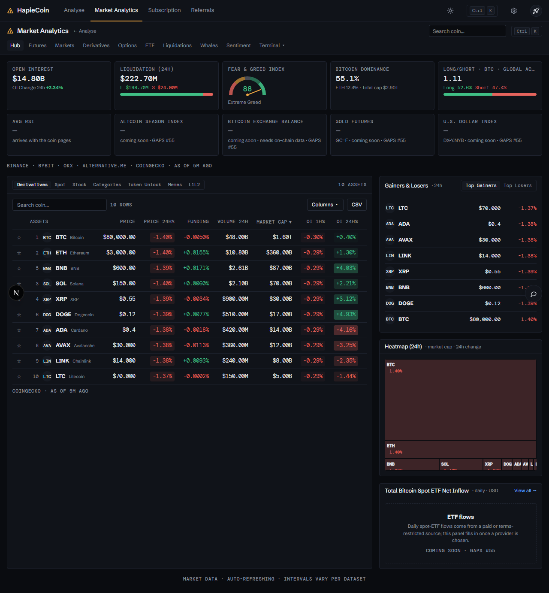
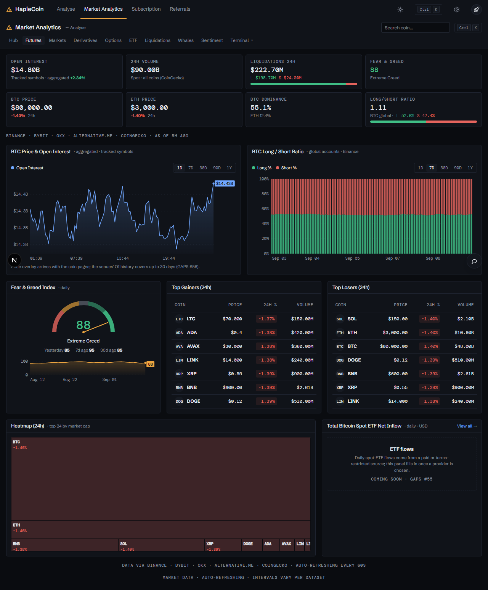
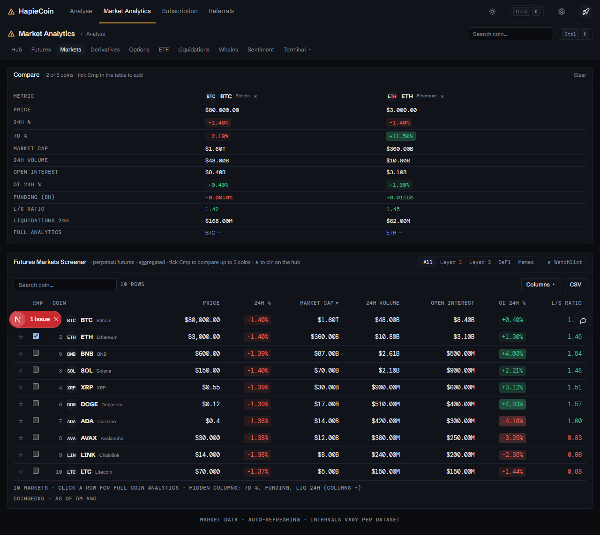
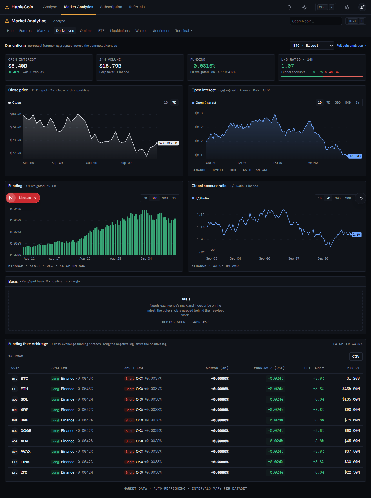
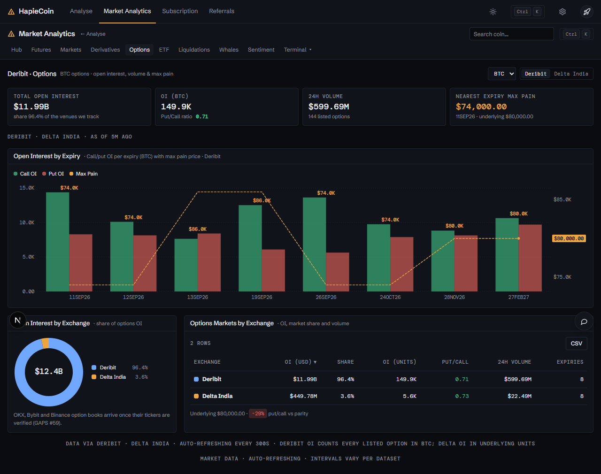
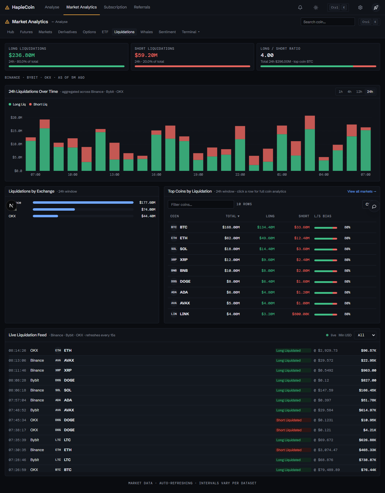
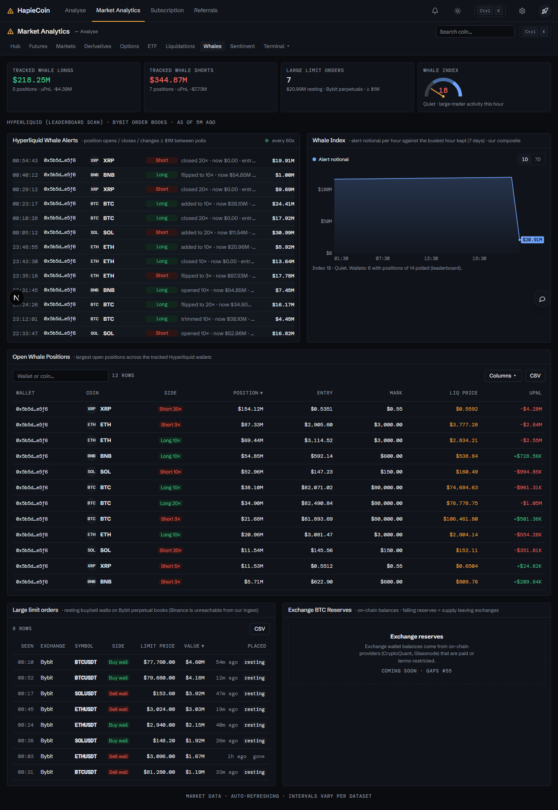
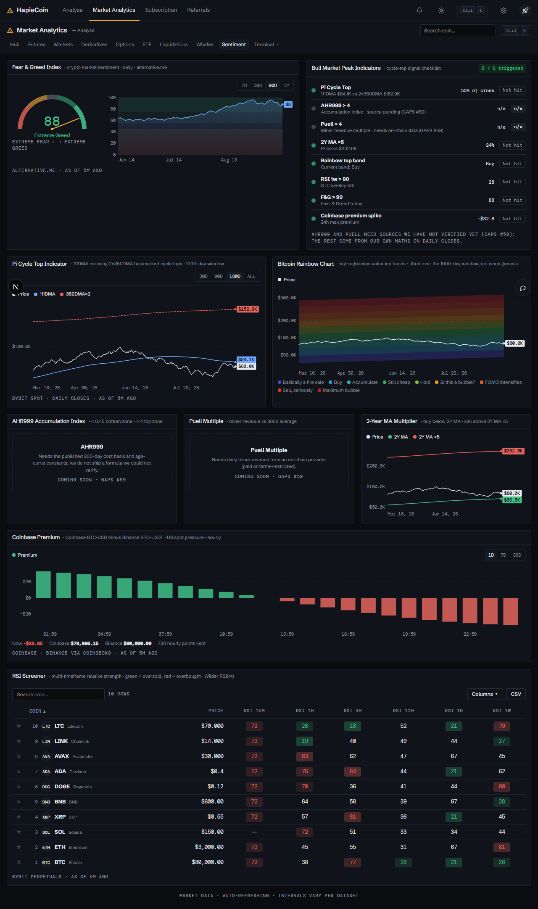
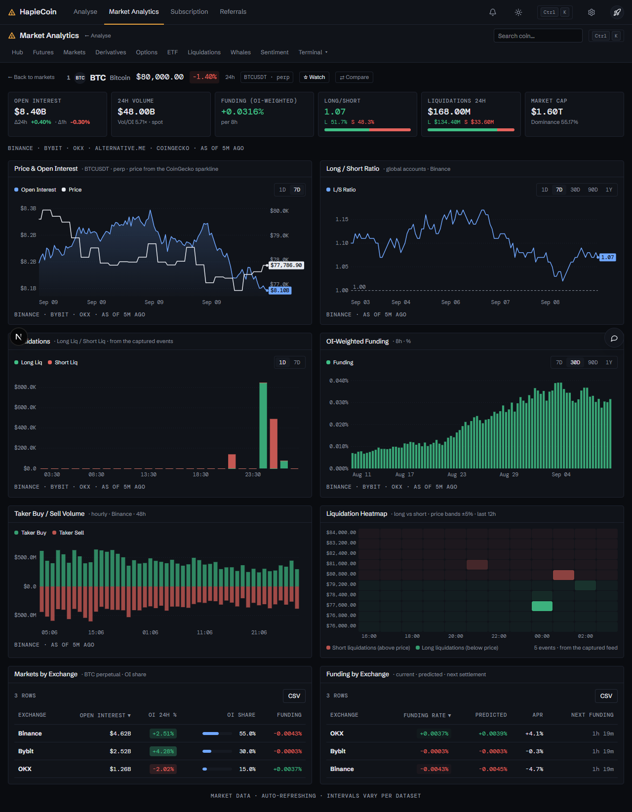
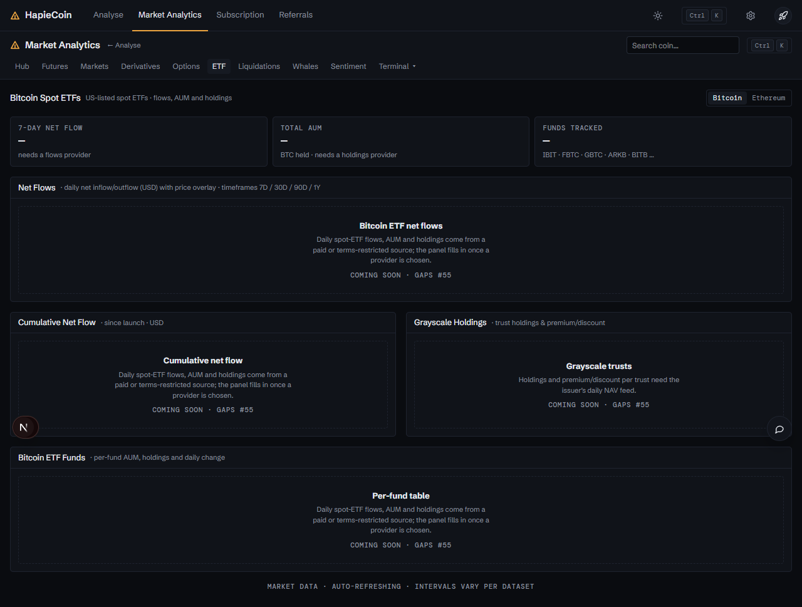

# Market Analytics

Part of the [HapieCoin feature guide](README.md). 128 traced features on 13 screens; 118 built and tested, 10 still mock-only (listed in the backlog).

## What it does

Market-wide pages fed by the ingest worker from public venue data (Bybit, Deribit, Delta, Hyperliquid, CoinGecko): the hub with open interest, funding and liquidation tiles, the markets screener with compare, derivatives (basis, long / short), options (expiries, max pain), liquidations feed and heat map, whales (Hyperliquid positions), sentiment (RSI, rainbow, fear and greed), and per-coin analytics. Pages marked "coming soon" wait on paid data feeds (see the backlog).

## Try it

1. `/analytics/hub`, then Markets with `?compare=BTC,ETH`, Derivatives, Options, Liquidations, Whales, Sentiment, Coin BTC.

## Screens

*Hub*

*Overview*

*Markets screener with compare*

*Derivatives*

*Options*

*Liquidations*

*Whales*

*Sentiment*

*Coin analytics*

*ETF (coming soon)*

## Every feature, in detail

Each row is one traced feature from the build spec: the id, what it is, how it behaves (the acceptance rule the tests check), and how it is tested. Status "mock-only" means the screen exists but the data feed behind it is not connected yet.

### Market Analytics (index) · `/analytics`

| ID | Feature | How it behaves | Status | Tested by |
|---|---|---|---|---|
| HC-MA-001 | /analytics redirects to /analytics/coinglass | Section with data-redirect; the router replaces the hash with #/analytics/coinglass (login required) | built | e2e (Playwright) · api contract |

### Markets (legacy path) · `/markets`

| ID | Feature | How it behaves | Status | Tested by |
|---|---|---|---|---|
| HC-MA-002 | /markets redirects to /analytics/coinglass | data-redirect section, same as /analytics | built | e2e (Playwright) |

### Market Analytics shell · `/analytics/*`

| ID | Feature | How it behaves | Status | Tested by |
|---|---|---|---|---|
| HC-MA-003 | Shared header: HapieCoin mark + 'Market Analytics' title | CG.chrome['analytics-tabs'] renders the v2 shared header (same header as /terminal): logo, 'Market Analytics' title, '← Analyse' link, Live pill, coin search, Ctrl K palette button, theme toggle | built | unit (pricing) · e2e (Playwright) · api contract · security |
| HC-MA-004 | '← Analyse' back link | Navigates to #/analyse (the trading workspace) | built | e2e (Playwright) |
| HC-MA-005 | Coin search box 'Search coin...' with dropdown | Typing filters CG.mock.coins by symbol/name (top 8; empty query shows top coins by market cap); click, Enter or ↑/↓ + Enter opens #/analytics/coin/SYM; Esc closes; 'No coins match' state | built | e2e (Playwright) |
| HC-MA-006 | Theme toggle (sun/moon) in the shared header | Button calls CG.theme.toggle(); the analytics app now follows the page theme (html.dark). The private cg2-theme toggle and localStorage key were removed; both light and dark are token-based | built | unit (pricing) · e2e (Playwright) |
| HC-MA-007 | Section switcher spanning both apps: Hub · Futures · Markets · Derivatives · Options · ETF · Liquidations · Whales · Sentiment · Terminal ▾ | One tab bar under the header; the active tab gets an animated amber underline (section-tab-indicator); /analytics/coin/* highlights Markets; Terminal ▾ opens a grouped dropdown of every terminal page and is active on /terminal/* | built | unit (pricing) · e2e (Playwright) |
| HC-MA-008 | Footer note 'Market data · auto-refreshing · intervals vary per dataset' | Static footer on every analytics screen | built | e2e (Playwright) |
| HC-MA-009 | Reusable inline-SVG chart helper (line/area with gradient, bars ±, stacked/grouped bars, dual axis, log axis, regions/bands, gauge, treemap, donut, sparkline) | CG2.chart (shared with /terminal): line/area/bars/stacked/dual axis/log/regions/bands + v2 timeframe chips, toggleable legend, crosshair tooltip with all series, hover dots, last-value tags, faint horizontal grid only, 10.5px DM Mono axis labels, skeleton first paint and empty state. Colours only from tokens: price = foreground, OI/secondary = --curve, up/down = profit/loss, accent marks = --primary | built | e2e (Playwright) |
| HC-MA-010 | Chart tooltips with crosshair on hover | Moving over any main chart shows a dashed crosshair at the nearest data point and a tooltip listing every series value (plus extras such as Ratio/Total/Band) | built | e2e (Playwright) |
| HC-MA-011 | DataTable: sortable headers, sticky header, right-aligned mono numbers, heat-coloured % cells (HeatCell) | CG2.table (shared with /terminal): sticky header inside a scroll container, sortable columns, right-aligned DM Mono numbers, heat cells for %, plus v2 toolbar: per-table search (auto when > 15 rows), row count, Columns ▾ visibility menu, CSV copy, watchlist star column, compare checkbox column; 36px rows (28px when CG.state.density === "compact") | built | e2e (Playwright) |
| HC-MA-088 | ONE unified skin on the shell tokens (both apps) | The private cg2 palette (teal accent, Inter/JetBrains fonts, cg2-* variables) was deleted; every colour comes from --background/--card/--border/--foreground/--muted-foreground/--profit/--loss/--primary/--curve and fonts from --font-body/--font-mono; dark and light both polished (tested) | built | unit (pricing) · e2e (Playwright) · api contract · security |
| HC-MA-089 | Terminal ▾ dropdown in the section switcher | Lists every terminal page grouped (Markets / Derivatives / ETF / On-chain / Indicators) via CG.menu; the current page is highlighted in amber | built | unit (pricing) · e2e (Playwright) |
| HC-MA-090 | Coin search → coin page (context aware) | Header search opens /analytics/coin/SYM (in the terminal app the same header opens /terminal/coin/SYM); top-8 matches by symbol/name, ↑↓/Enter/Esc, starred coins show a star, hint row explains the keys | built | e2e (Playwright) |
| HC-MA-091 | Ctrl K palette button | Header kbd button opens the command palette (CG.palette.open()); falls back to dispatching Ctrl+K and a hint toast if no palette is present | built | e2e (Playwright) |
| HC-MA-092 | Palette commands registered | CG2.registerPalette registers every analytics + terminal page ("Market Analytics · Hub", "Terminal · Funding Rates"…), "Compare coins…" (opens /analytics/markets?compare=1) and "Add to watchlist → BTC/ETH/SOL/BNB/XRP/DOGE/ADA/AVAX/LINK/PEPE" with CG.palette.register (guarded, also exposed via CG.commandProviders) | built | e2e (Playwright) |
| HC-MA-093 | Chart timeframe chips 1D · 7D · 30D · 90D · 1Y | CG2.tfChart/tfSeries: the mock series is sliced when it covers the range, otherwise regenerated with a seeded random walk (CG.rng) anchored on the current value and scaled by sqrt(step); daily/8h sources keep their native step (180D for cycle charts); the choice is remembered per chart | built | unit (pricing) · e2e (Playwright) |
| HC-MA-094 | Toggleable chart legend | Click a legend item to hide/show that series (strikethrough when off); axis rescales; hiding everything shows an inline empty state | built | e2e (Playwright) |
| HC-MA-095 | Crosshair tooltip with all series values | Dashed crosshair + hover dots on every line series; the tooltip lists every visible series with its own formatter (plus extra rows like Ratio/Total/Net) | built | e2e (Playwright) |
| HC-MA-096 | Last-value tag at the right edge | Each line/area series ends with a dot and a coloured value pill on the right edge (collision-nudged; right padding grows to fit) | built | e2e (Playwright) |
| HC-MA-097 | Faint horizontal grid + 10.5px mono axis labels | Grid lines only on the y axis in --border; all axis labels DM Mono 10.5px muted | built | e2e (Playwright) · api contract · security |
| HC-MA-098 | Chart loading skeleton and empty state | First paint shows a shimmer skeleton for one frame (also gives the chart its measured width); series with no data render a "No data" empty state | built | unit (pricing) · e2e (Playwright) |
| HC-MA-099 | Per-table search | Tables with more than 15 rows (or search:true) get a search box that filters by symbol/name while keeping focus and caret | built | e2e (Playwright) |
| HC-MA-100 | Columns ▾ visibility menu on screeners | Checkbox menu (stays open while toggling) + "Show all columns"; used on the hub, markets screener, RSI screener, ETF funds, terminal dashboard/spot/liquidations | built | e2e (Playwright) |
| HC-MA-101 | CSV copy button | Copies the visible (filtered + sorted) rows and visible columns as CSV to the clipboard (execCommand fallback) and toasts the row count | built | e2e (Playwright) |
| HC-MA-102 | Compact density | Rows drop from 36px to 28px when CG.state.density === 'compact' (reacts to CG.emit('density')) | built | e2e (Playwright) |
| HC-MA-103 | Watchlist star on coin rows | Star column on every coin table toggles CG.state.watchlist (persisted with CG.saveState); toasts; strips and filters update through the "watchlist" event | built | e2e (Playwright) |
| HC-MA-104 | Compact arc gauges with the amber needle | CG2.gauge: 180° track with semantic segments (loss/warning/muted/profit) and an amber --primary needle + hub; inline variant inside tiles (Alt season, Fear & Greed, Whale Index), large variant with a scale on Futures/Sentiment | built | e2e (Playwright) |

### Markets Hub · `/analytics/coinglass`

| ID | Feature | How it behaves | Status | Tested by |
|---|---|---|---|---|
| HC-MA-012 | Stat tile: Open Interest with 'OI Change 24h' | CG.mock.global.totalOi ($62.4B) with 24h change derived from CG.mock.oiHistory | built | unit (pricing) · e2e (Playwright) |
| HC-MA-013 | Stat tile: Liquidation (24h) with long/short split bar | global.liq24h with L/S amounts and a green/red proportion bar | built | e2e (Playwright) |
| HC-MA-014 | Stat tile: AVG RSI with oversold/neutral/overbought badge | global.avgRsi; badge text follows the bundle's oversold/neutral/overbought states | built | e2e (Playwright) |
| HC-MA-015 | Stat tile: Altcoin Season Index gauge (0-100) | Semi-circular gauge (Bitcoin season / neutral / altcoin season segments) with needle at global.altSeason | built | e2e (Playwright) |
| HC-MA-016 | Stat tile: Gold Futures (GC=F) and U.S. Dollar Index (DX-Y.NYB) | Price and signed % change from global.gold/dxy (original fetched a tradfi-quote endpoint) | built | e2e (Playwright) |
| HC-MA-017 | Stat tile: Bitcoin Dominance (with ETH dominance and total cap) | global.btcDominance / ethDominance / totalMarketCap (original: coingecko global) | built | e2e (Playwright) |
| HC-MA-018 | Stat tile: Bitcoin Exchange Balance with Δ 24h | global.btcExchangeBalance; Δ weighted from CG.mock.exchanges btcBalanceChg24 | built | e2e (Playwright) |
| HC-MA-019 | Stat tile: Fear & Greed Index mini gauge + label | Colour-banded gauge with CG.mock.fearGreedNow and fgLabel (Extreme Fear … Extreme Greed) | built | e2e (Playwright) |
| HC-MA-020 | Stat tile: Long/Short · BTC · Global accounts (Long % / Ratio / Short % bar) | Latest CG.mock.lsHistory global ratio converted to long/short percentages with a split bar | built | e2e (Playwright) |
| HC-MA-021 | Main table tabs: Derivatives / Spot / Stock / Categories / Token Unlock / Memes / L1L2 | Segmented control; Derivatives and Spot list all coins with different column sets, Memes and L1L2 filter by sector, Categories aggregates sectors, Stock and Token Unlock show the original's placeholder | built | unit (pricing) · e2e (Playwright) |
| HC-MA-022 | Stock / Token Unlock tabs show 'Cryptocurrency Data Analysis · Coming soon' | Placeholder panel exactly as the original | built | e2e (Playwright) |
| HC-MA-023 | Derivatives table columns: Assets (rank, icon, symbol, name), Price, Price 24h%, Funding, Volume 24h, Market Cap, OI 1h%, OI 24h%, Liquidation 24h | All columns sortable; % columns are HeatCells; default sort Market Cap desc; row click opens #/analytics/coin/SYM | built | unit (pricing) · e2e (Playwright) |
| HC-MA-024 | Spot table columns: Assets, Price, Price 24h%, Volume 24h, Market Cap, 1h%, 4h%, 7d% | Spot-oriented column set from the price_change_* fields; sortable; row click opens coin page | built | e2e (Playwright) |
| HC-MA-025 | Categories table: Category, Coins, Market Cap, Volume 24h, Open Interest, Avg 24h%, Top coin | Aggregates CG.mock.coins by sector; row click opens the Markets screener filtered to that category | built | e2e (Playwright) |
| HC-MA-026 | Assets count label ('50 assets') | Updates with the active tab / filter | built | unit (pricing) · e2e (Playwright) |
| HC-MA-027 | Gainers & Losers panel with Top Gainers / Top Losers toggle | Segmented toggle swaps the list (8 rows: asset, price, Chg% heat cell); rows open the coin page | built | e2e (Playwright) |
| HC-MA-028 | Heatmap (24h) treemap | Binary-split treemap of the top 24 coins by market cap, coloured by 24h change intensity; hover shows title, click opens the coin page | built | e2e (Playwright) |
| HC-MA-029 | Total Bitcoin Spot ETF Net Inflow table (Date, Total) + 'N BTC ETFs tracked' + 'View all →' | Last 8 sessions from CG.mock.etfFlows; link opens #/analytics/etf | built | e2e (Playwright) |
| HC-MA-105 | Watchlist strip | Cards for each starred coin (price, 24h heat, 7D sparkline coloured by 7d change, remove star); click opens the coin; empty state links to the screener; "Manage in Markets →" | built | e2e (Playwright) |
| HC-MA-106 | Inline gauges in the Altcoin Season and Fear & Greed tiles | Compact arc gauge with amber needle beside the value | built | e2e (Playwright) |
| HC-MA-107 | Main table: star · search · Columns ▾ · CSV | Derivatives/Spot/Memes/L1L2 tabs share the upgraded table; sticky header inside a 640px scroll area | built | unit (pricing) · e2e (Playwright) |

### Futures overview · `/analytics/overview`

| ID | Feature | How it behaves | Status | Tested by |
|---|---|---|---|---|
| HC-MA-030 | Tiles: Open Interest (All exchanges), 24h Volume, Liquidations 24h, Fear & Greed, BTC Price, ETH Price, BTC Dominance, Long/Short Ratio (BTC global) | Rendered from CG.mock.global / fearGreed / lsHistory; BTC & ETH price tiles update live on the 'tick' event with a flash | built | unit (pricing) · e2e (Playwright) · security |
| HC-MA-031 | Chart: BTC Price & Open Interest (dual axis) | OI area (teal, left axis) + price line (blue, right axis) from CG.mock.oiHistory (96h); crosshair tooltip | built | e2e (Playwright) |
| HC-MA-032 | Chart: BTC Long / Short Ratio (Long % / Short % stacked bars) | Stacked 100% bars from lsHistory (48h) with a 50% reference line; tooltip shows Long %, Short % and Ratio | built | e2e (Playwright) |
| HC-MA-033 | Fear & Greed Index gauge + label + yesterday/7d/30d values + 30-day sparkline | Gauge from fearGreedNow with history from CG.mock.fearGreed | built | e2e (Playwright) |
| HC-MA-034 | Top Gainers (24h) / Top Losers (24h) tables (Coin, Price, 24h %, Volume) | Sortable tables of the 7 best/worst 24h movers; rows open the coin page | built | e2e (Playwright) |
| HC-MA-035 | Heatmap (24h) treemap | Same treemap component, larger; click opens coin page | built | e2e (Playwright) |
| HC-MA-036 | Total Bitcoin Spot ETF Net Inflow table (Date, Net Flow, Cumulative) + 'N BTC ETFs tracked' + 'View all →' | Last 10 sessions from etfFlows; link to #/analytics/etf | built | unit (pricing) · e2e (Playwright) |
| HC-MA-037 | Footer 'Data via Coinglass · auto-refreshing every 60s' | Static note under the grid | built | e2e (Playwright) |
| HC-MA-108 | Timeframe chips on BTC Price & OI and Long/Short charts | 1D slices the hourly mock; 7D–1Y regenerate anchored series | built | e2e (Playwright) |
| HC-MA-109 | Compact Fear & Greed gauge | Large arc gauge with amber needle, label and scale, plus yesterday/7d/30d values and a 30-day sparkline | built | e2e (Playwright) |

### Futures Markets Screener · `/analytics/markets`

| ID | Feature | How it behaves | Status | Tested by |
|---|---|---|---|---|
| HC-MA-038 | 'Search coin...' filter | Filters rows by symbol/name as you type; empty state 'No coins match' | built | e2e (Playwright) |
| HC-MA-039 | Category chips: All / Layer 1 / Layer 2 / DeFi / Memes driven by ?category= | Chips navigate to #/analytics/markets?category=<slug>; the query param selects the active chip and filters by coin sector (also reachable from Markets Hub → Categories) | built | unit (pricing) · e2e (Playwright) |
| HC-MA-040 | Table columns: Coin, Price, 24h %, Market Cap, 24h Volume, Open Interest, OI 24h %, L/S Ratio | Sortable; heat cells for 24h % and OI 24h %; L/S coloured by >1 / <1; row click opens #/analytics/coin/SYM; footer shows market count | built | e2e (Playwright) |
| HC-MA-110 | Compare mode (up to 3 coins) | Cmp checkbox column; picking 1–3 coins shows a Compare panel above the table: normalised price lines (base 100, timeframe chips 1D–1Y, base-100 reference line) and a side-by-side stats table (Price, 24h/7d %, cap, volume, OI, OI 24h %, funding, L/S, liq, RSI) with the best value highlighted; ✕ removes a coin, Clear empties; a 4th coin is refused with a toast; state in CG.state.compare is shared with /terminal/spot; ?compare=1 opens the panel with a hint | built | e2e (Playwright) |
| HC-MA-111 | Watchlist filter chip | ★ Watchlist chip limits the screener to starred coins (empty state when none); stars in rows toggle the list | built | e2e (Playwright) |
| HC-MA-112 | Hidden columns 7d %, Funding, Liq 24h | Available through Columns ▾; CSV export respects visible columns | built | e2e (Playwright) |

### Derivatives · `/analytics/derivatives`

| ID | Feature | How it behaves | Status | Tested by |
|---|---|---|---|---|
| HC-MA-041 | Coin selector (BTC default, top 20 by market cap) + 'Full coin analytics →' link | Changing the select re-renders every tile and chart for that coin (also honours ?symbol=) | built | e2e (Playwright) |
| HC-MA-042 | Tiles: Open interest, 24h volume, Funding (OI-weighted, APR), L/S ratio · 24h | From CG.mock.coins + derived per-coin series | built | unit (pricing) · e2e (Playwright) |
| HC-MA-043 | Chart: Close price (area) | CG.mock.priceHistory(sym, 96) hourly closes with gradient fill and tooltip | built | e2e (Playwright) |
| HC-MA-044 | Chart: Open Interest · Aggregated · Binance · OKX · Bybit (area) | Per-coin OI random-walk derived from oiHistory scaled by the coin's OI share | built | unit (pricing) · e2e (Playwright) |
| HC-MA-045 | Chart: Funding · OI-weighted · % (± bars) | 60 × 8h funding bars, green positive / red negative, from CG.mock.fundingHistory offset by the coin's funding | built | unit (pricing) · e2e (Playwright) |
| HC-MA-046 | Chart: Global account ratio · L/S Ratio (line with 1.00 reference) | Per-coin ratio series derived from lsHistory | built | unit (pricing) · e2e (Playwright) |
| HC-MA-047 | Chart: Basis · Perp/spot basis % · positive = contango (± bars) | Amber bars for contango, red for backwardation, hourly | mock-only | unit (pricing) · visual (screenshot diff) |
| HC-MA-048 | Table: Funding Rate Arbitrage (Coin, Long leg, Short leg, Spread, Funding Δ, Est. APR, Min OI) | CG.mock.fundingArb; sortable, default Est. APR desc; Long/Short badges; row opens coin page | built | e2e (Playwright) |
| HC-MA-113 | Timeframe chips on all five charts | Close price / OI / L/S / Basis: 1D–1Y; Funding: 7D–1Y at the native 8h step | built | unit (pricing) · e2e (Playwright) |

### Options · `/analytics/options`

| ID | Feature | How it behaves | Status | Tested by |
|---|---|---|---|---|
| HC-MA-049 | 'Deribit · Options' header with exchange toggle (Deribit / OKX / Binance / Bybit / Delta) | Selecting an exchange rescales tiles and the expiry chart by that exchange's share | built | unit (pricing) · e2e (Playwright) |
| HC-MA-050 | Tiles: Total open interest, OI (contracts), 24h volume, Nearest expiry max pain | From CG.mock.optionsByExchange / optionsExpiries; includes put/call ratio and Δ 24h | built | unit (pricing) · e2e (Playwright) |
| HC-MA-051 | Chart: Call/put OI per expiry with max pain price · Deribit | Grouped Call OI (green) / Put OI (red) bars per expiry with Max Pain labels above each group and a dashed Max Pain line on the right axis; tooltip per expiry | built | unit (pricing) · e2e (Playwright) |
| HC-MA-052 | Open Interest by Exchange donut with share legend | Donut of optionsByExchange oiUsd using the bundle's exchange palette; centre shows total OI | built | e2e (Playwright) |
| HC-MA-053 | Table: Options Markets by Exchange (Exchange, OI (USD), Share, OI Δ 24h, 24h Volume, Vol Δ 24h) | Sortable; heat cells for the Δ columns | built | e2e (Playwright) |
| HC-MA-114 | Max pain as the amber accent line | Call/put OI bars in profit/loss tints, Max Pain dashed in --primary with per-expiry labels; CSV on the exchange table | built | unit (pricing) · e2e (Playwright) |

### ETF · `/analytics/etf`

| ID | Feature | How it behaves | Status | Tested by |
|---|---|---|---|---|
| HC-MA-054 | Bitcoin / Ethereum toggle | Switches every tile, chart and table between CG.mock.etfs (BTC) and CG.mock.ethEtfs (ETH); ETH flows derived from etfFlows | built | unit (pricing) · e2e (Playwright) |
| HC-MA-055 | Tiles: 7-day net flow, Total AUM, Funds tracked | Sum of last 7 flows, sum of fund AUM (+ coins held), count of funds | mock-only | visual (screenshot diff) |
| HC-MA-056 | Chart: Daily net inflow/outflow (USD) with price overlay · last 60 sessions | Heat-coloured ± bars (inflow green / outflow red) with the asset price line on the right axis; tooltip | mock-only | visual (screenshot diff) |
| HC-MA-057 | Chart: Cumulative Net Flow (area) | Running total of flows since launch | mock-only | unit (pricing) · visual (screenshot diff) |
| HC-MA-058 | Table: Per-fund AUM, holdings and daily change (Ticker, Fund, Type, Price, 24h %, Volume, AUM, Holdings, Δ 24h) | Sortable; Spot badge; heat cell for 24h %; holdings in BTC/ETH; Δ 24h coloured | mock-only | visual (screenshot diff) |
| HC-MA-059 | Table: Grayscale Holdings · Trust holdings & premium/discount (Asset, Holdings, Value, Premium, Δ 30d) | Grayscale funds from both ETF lists; premium and Δ 30d as heat cells | mock-only | unit (pricing) · visual (screenshot diff) |
| HC-MA-115 | Timeframe chips on Net Flows and Cumulative Net Flow | Net flows 7D/30D/90D/1Y (daily bins, generated flows for ranges beyond the mock), cumulative 30D/90D/1Y; funds table has Columns ▾ + CSV | mock-only | unit (pricing) · visual (screenshot diff) |

### Liquidations · `/analytics/liquidations`

| ID | Feature | How it behaves | Status | Tested by |
|---|---|---|---|---|
| HC-MA-060 | Tiles: Long Liquidations, Short Liquidations, Long / Short Ratio (24h) | From CG.mock.global long/short liq with share-of-total bars | built | e2e (Playwright) |
| HC-MA-061 | Chart: 'Nh Liquidations Over Time · Aggregated across Binance · OKX · Bybit' stacked Long Liq / Short Liq bars | Stacked bars from CG.mock.liqHistory; tooltip shows long, short and total | built | e2e (Playwright) |
| HC-MA-062 | Window chips 1h / 4h / 12h / 24h | Re-buckets the chart (5-minute buckets for 1h/4h, hourly for 12h/24h) and updates the panel title | built | e2e (Playwright) |
| HC-MA-063 | Liquidations by Exchange · 24h window (horizontal bars) | CG.mock.exchanges liq24h sorted desc | built | e2e (Playwright) |
| HC-MA-064 | Table: Top Coins by Liquidation (Coin, Total, Long, Short, L/S Bias) with 'Filter coins...' and 'View all markets →' | Sortable top-12 table; filter input narrows rows ('No coins' empty state); L/S Bias is a split bar with long %; row click opens coin page; link goes to the Markets screener | built | e2e (Playwright) |
| HC-MA-065 | Live Liquidation Feed · Binance · refreshes every 12s | Rows (time, exchange, coin, Long/Short Liquidated badge, price, USD) from CG.mock.liqFeed; a new mock liquidation is prepended every 12 s with a flash while the screen is shown; the interval is cleared in hide() | built | unit (pricing) · e2e (Playwright) · security |
| HC-MA-066 | Min USD select (All / $1K / $10K / $50K / $100K / $500K) | Filters the feed; shows 'No liquidations above $X' when nothing qualifies | built | unit (pricing) · e2e (Playwright) |
| HC-MA-116 | Top-coins table search + CSV | Filter box inside the table toolbar replaces the old panel input; window chips 1h/4h/12h/24h retained | built | e2e (Playwright) |
| HC-MT-129 | Page title "Liquidations" | Tiles: 24h Total, Long Liquidations (red), Short Liquidations (green), Largest Coin | built | e2e (Playwright) |
| HC-MT-130 | Chart stacked bars "Long Liq / Short Liq" | CG.mock.liqHistory 48h; long red, short green; legend + tooltip | built | e2e (Playwright) |
| HC-MT-131 | "By Coin (24h)" column "Coin" (sortable) | from CG.mock.coins liq24h / longLiq24h / shortLiq24h; default sort 24h Total desc; row click opens the coin | built | e2e (Playwright) |
| HC-MT-132 | "By Coin (24h)" column "24h Total" (sortable) | from CG.mock.coins liq24h / longLiq24h / shortLiq24h; default sort 24h Total desc; row click opens the coin | built | e2e (Playwright) |
| HC-MT-133 | "By Coin (24h)" column "Long (red)" (sortable) | from CG.mock.coins liq24h / longLiq24h / shortLiq24h; default sort 24h Total desc; row click opens the coin | built | e2e (Playwright) |
| HC-MT-134 | "By Coin (24h)" column "Short (green)" (sortable) | from CG.mock.coins liq24h / longLiq24h / shortLiq24h; default sort 24h Total desc; row click opens the coin | built | e2e (Playwright) |
| HC-MT-170 | Timeframe chips + table search/Columns/star | Shared chart + table | built | e2e (Playwright) |

### Whales · `/analytics/whales`

| ID | Feature | How it behaves | Status | Tested by |
|---|---|---|---|---|
| HC-MA-067 | Tiles: Tracked whale longs, Tracked whale shorts, Large limit orders | Sums of CG.mock.whalePositions by side (with uPnL) and count/value of CG.mock.largeOrders | built | e2e (Playwright) · api contract · security |
| HC-MA-068 | Hyperliquid Whale Alerts · Live large position opens/closes (>$1M) feed | Shows 'Waiting for events…' for 1.5 s, then rows from CG.mock.whaleAlerts (time, wallet, coin, Long/Short badge, opened/closed · leverage · entry, value); a new alert arrives every ~20 s with a flash; timers cleared in hide() | built | unit (pricing) · e2e (Playwright) · api contract · security |
| HC-MA-069 | Chart: Whale Index · Composite large-trader activity score · hourly (area) | CG.mock.whaleIndex 0-100 with a 50 reference line and tooltip | built | unit (pricing) · e2e (Playwright) |
| HC-MA-070 | Table: Open Whale Positions · Largest open positions on Hyperliquid (Wallet, Coin, Side, Position, Entry, Mark, Liq Price, uPnL) | Sortable; Side badge includes leverage; uPnL signed and coloured | built | e2e (Playwright) |
| HC-MA-071 | Table: Large limit orders · Resting buy/sell walls on Binance futures (Time, Exchange, Symbol, Side, Limit Price, Value, Placed) | CG.mock.largeOrders; Buy/Sell badges; 'Placed' shows relative time and placed/filled status | built | unit (pricing) · e2e (Playwright) · api contract · security |
| HC-MA-072 | Table: Exchange BTC Reserves · On-chain balances · falling reserves = supply leaving exchanges (Exchange, BTC Balance, Δ 24h, Δ 7d, Δ 30d) | CG.mock.exchanges balances with heat cells for each Δ | mock-only | visual (screenshot diff) |
| HC-MA-117 | Whale Index gauge tile + timeframe chips | New tile with a compact arc gauge (Quiet/Active/Frenzy); the Whale Index chart gets 1D–1Y chips; positions/reserves tables get CSV | built | unit (pricing) · e2e (Playwright) |

### Sentiment · `/analytics/sentiment`

| ID | Feature | How it behaves | Status | Tested by |
|---|---|---|---|---|
| HC-MA-073 | Fear & Greed Index · Crypto market sentiment · daily: gauge + 90-day area chart with coloured bands | Gauge from fearGreedNow; chart of CG.mock.fearGreed with Extreme Fear/Fear/Greed/Extreme Greed background bands; tooltip shows value and label | built | e2e (Playwright) |
| HC-MA-074 | Bull Market Peak Indicators · Cycle-top signal checklist (8 rows with hit / not-hit dots) | Pi Cycle Top, AHR999 > 4, Puell > 4, 2Y MA ×5, Rainbow top band, RSI 1w > 90, F&G > 90, Coinbase premium spike — each evaluated from CG.mock.cycle / coins / fearGreed / coinbasePremium with the current reading and a 'N / 8 triggered' badge | built | unit (pricing) · e2e (Playwright) |
| HC-MA-075 | Chart: Pi Cycle Top Indicator · 111DMA crossing 2×350DMA has marked cycle tops | Log-scale lines for price, 111DMA and 350DMA×2 from CG.mock.cycleHistory | built | e2e (Playwright) |
| HC-MA-076 | Chart: Bitcoin Rainbow Chart · Log-regression valuation bands | Nine coloured regression bands (log fit of cycleHistory price) using the bundle's band palette with the price line; tooltip names the current band | built | e2e (Playwright) |
| HC-MA-077 | Chart: AHR999 Accumulation Index · < 0.45 bottom zone · > 4 top zone | Log-scale area with 0.45 (green) and 4 (red) reference lines | mock-only | visual (screenshot diff) |
| HC-MA-078 | Chart: Puell Multiple · Miner revenue vs 365d average | Amber area with 0.5 / 4 reference lines | mock-only | visual (screenshot diff) |
| HC-MA-079 | Chart: 2-Year MA Multiplier · Buy below 2Y MA · sell above 2Y MA ×5 | Log-scale price, 2Y MA (green) and 2Y MA ×5 (red) lines | built | e2e (Playwright) |
| HC-MA-080 | Chart: Coinbase Premium · US institutional spot pressure vs Binance · hourly (± bars) | CG.mock.coinbasePremium, green premium / red discount bars | built | unit (pricing) · e2e (Playwright) |
| HC-MA-081 | Table: RSI Screener · Multi-timeframe relative strength · green = oversold, red = overbought (Coin, Price, RSI 15m/1h/4h/12h/24h/1w) | Top 25 coins; each RSI value is a heat cell (green ≤35, red ≥65); sortable per timeframe; row opens coin page | built | unit (pricing) · e2e (Playwright) |
| HC-MA-118 | Timeframe chips on F&G (7D–1Y), AHR999/Puell (30D/90D/180D) and Coinbase Premium (1D/7D/30D) | Cycle charts keep 180D as the default; Pi Cycle/Rainbow/2Y MA stay 180D | built | unit (pricing) · e2e (Playwright) |
| HC-MA-119 | RSI screener: star · search · Columns ▾ · CSV | Upgraded shared table | built | e2e (Playwright) |

### Coin analytics · `/analytics/coin/:symbol`

| ID | Feature | How it behaves | Status | Tested by |
|---|---|---|---|---|
| HC-MA-082 | Back link, coin header (icon, symbol, name, rank, sector, live price, 24h heat cell) | Reads :symbol from the route; price updates on the 'tick' event for BTC/ETH; unknown symbol shows a toast and redirects to /analytics/markets | built | unit (pricing) · e2e (Playwright) · security |
| HC-MA-083 | Tiles: Open Interest (+Δ24h/1h), 24h Volume, Funding (avg), Long/Short, Liquidations 24h, Market Cap | From CG.mock.coins + derived series; split bars for L/S and liquidations | built | unit (pricing) · e2e (Playwright) |
| HC-MA-084 | Charts: Price & Open Interest (dual axis), Long / Short Ratio, Liquidations (Long Liq / Short Liq stacked), OI-Weighted Funding (± bars), Taker Buy / Sell Volume (mirrored bars) | All from CG2.coinSeries(symbol) (priceHistory + scaled global histories); crosshair tooltips | built | e2e (Playwright) |
| HC-MA-085 | Liquidation Heatmap (long vs short) grid | 12h × ±5% price-level grid; short-liquidation levels above price in red, long levels below in green; cell title shows level and estimated USD | built | e2e (Playwright) |
| HC-MA-086 | Table: Markets by Exchange (Exchange, Open Interest, 24h Vol, OI Share, Funding) | Coin OI/volume split across CG.mock.exchanges; sortable; OI share bar | built | e2e (Playwright) |
| HC-MA-087 | Table: Funding by Exchange (Exchange, Funding rate, Predicted, APR, Next funding) | Heat-cell funding per exchange with predicted rate, annualised APR and countdown to the next 8h settlement | built | e2e (Playwright) |
| HC-MA-120 | Watch and Compare chips in the coin header | ★ Watch toggles the watchlist; Compare adds the coin to CG.state.compare and opens /analytics/markets?compare=1 | built | e2e (Playwright) |
| HC-MA-121 | Timeframe chips on Price & OI, L/S, Liquidations and Funding | Per-coin seeded series; exchange tables get CSV | built | e2e (Playwright) |

