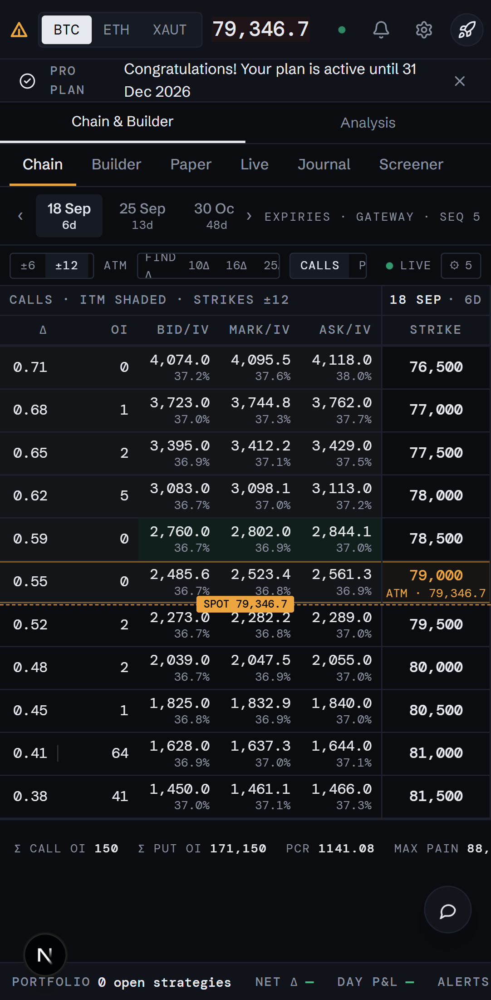
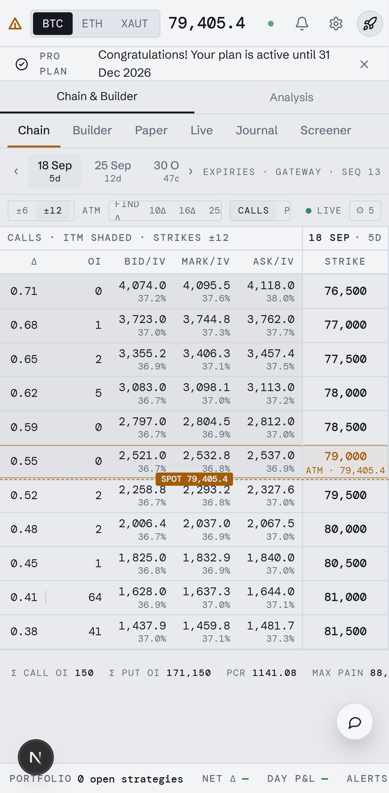
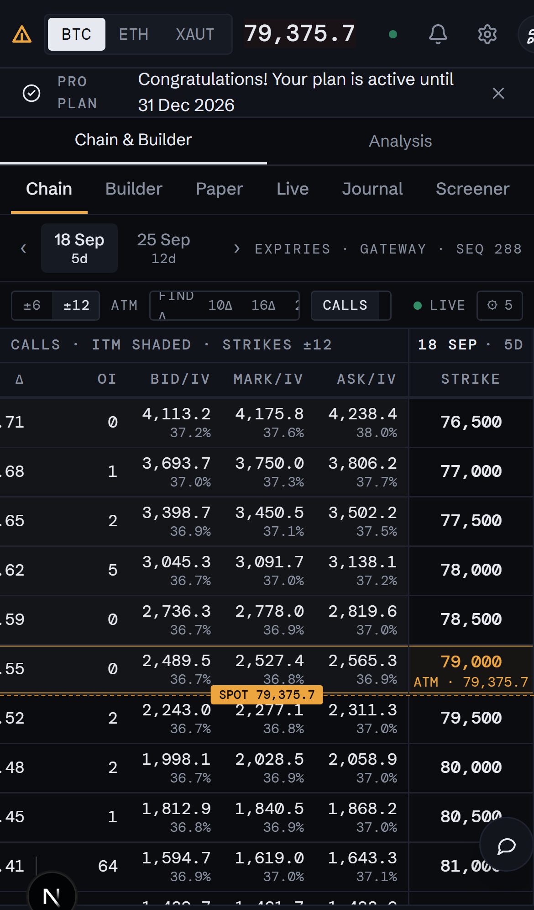
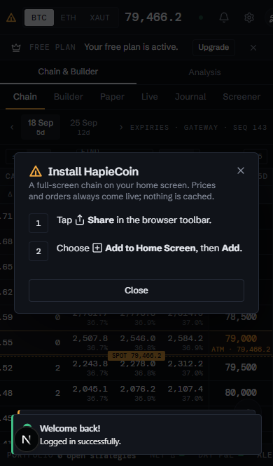
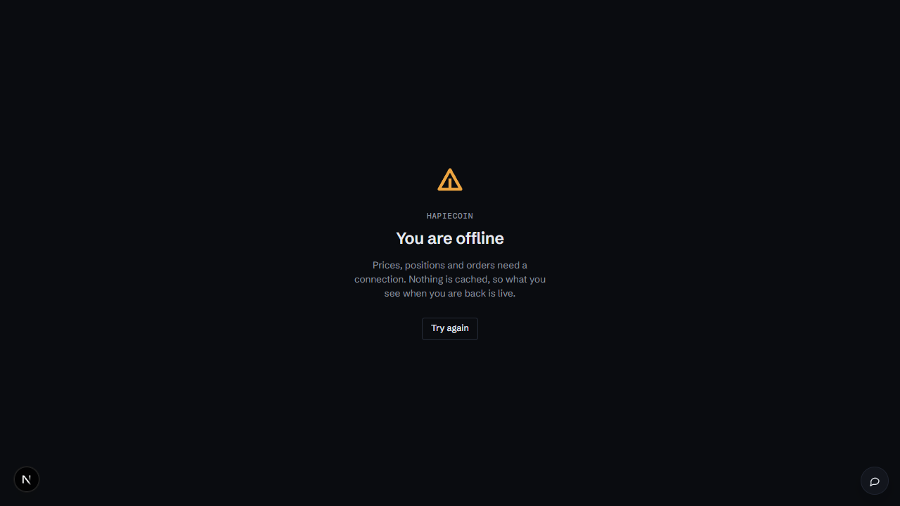

# Phone and the home-screen app

Part of the [HapieCoin feature guide](README.md). 5 traced features on 5 screens; 5 built and tested, 0 still mock-only (listed in the backlog).

## What it does

On a phone the header compacts, the two panes stack behind a Chain & Builder / Analysis switch, the tab strips scroll, the chain pans by touch and a tapped row shows finger-sized controls, and cards and tables scroll inside their own frames. HapieCoin installs to the home screen: Chrome and Android get the native prompt from the settings menu, an iPhone gets the two Share-sheet steps. A service worker serves a branded offline page when the connection drops and never caches prices, positions, orders or sessions.

## Try it

1. On the desktop, Chrome DevTools → device toolbar → Pixel 7: stack, scroll the strips, tap a chain row, tap B.
2. Settings → **Install app** (or the one-time hint). DevTools → Application → Service Workers → Offline → reload: the offline page; untick and **Try again**.

## Screens

*Pixel 7, dark*

*Pixel 7, light*

*iPhone 14*

*Install dialog on an iPhone*

*Offline page*

## Every feature, in detail

Each row is one traced feature from the build spec: the id, what it is, how it behaves (the acceptance rule the tests check), and how it is tested. Status "mock-only" means the screen exists but the data feed behind it is not connected yet.

### Shared chrome · phone

| ID | Feature | How it behaves | Status | Tested by |
|---|---|---|---|---|
| HC-SH-130 | The workspace on a phone: a compact header, stacked panes, tab strips that scroll to their last tab, no sideways page scroll | Below 768 px the analyse header tightens its gaps; the exchange chip, currency toggle, theme toggle and venue switch step back into their menus, the logo keeps its mark, the futures price keeps its figure (no 24 h change), the feed status keeps its dot; below 1000 px the panes stack behind the Chain & Builder / Analysis switch, the strip info and collapse buttons hide, and both tab strips scroll sideways with a hidden scrollbar; an explicit viewport (device width, no forced zoom, notch painted); one shared useMediaQuery hook | built | e2e (phone) |

### Analyse · Chain · phone

| ID | Feature | How it behaves | Status | Tested by |
|---|---|---|---|---|
| HC-SH-131 | The chain on touch: one side at a time, a drag pans the columns, a tapped row shows finger-sized B / S / lots / details controls | A touch drag on either side track moves the mirrored offset through the wheel path once it is clearly horizontal (10 px slop), otherwise the page scrolls; on a coarse pointer a tapped row becomes the focused row that carries the controls, and the controls are 36 px targets; a tap alone never adds a leg | built | unit (web), e2e (phone) |

### Analyse · cards, panels and dialogs · phone · `/analyse`

| ID | Feature | How it behaves | Status | Tested by |
|---|---|---|---|---|
| HC-WS-115 | Cards, panels and dialogs fit a phone: tables scroll inside their container, search boxes go full width, stats tiles stack, dialogs stay inside the viewport | Net positions, the backtest trades and the replay ladder scroll sideways inside their own container instead of squashing; the paper and journal search boxes are full width below 640 px; the journal stats go 2-up, then 3-up, then 6-up; the workbench ticket pills relax below 640 px; dialogs keep their calc(100% − 40 px) width with stacked footers; the public trader page fits | built | e2e (phone) |

### Shared chrome · home-screen app

| ID | Feature | How it behaves | Status | Tested by |
|---|---|---|---|---|
| HC-SH-134 | HapieCoin installs to the home screen: a manifest with 192 / 512 px icons, an Install entry in the settings menu (native prompt on Chrome, Share-sheet steps on an iPhone), one hint on a phone | app/manifest.ts serves /manifest.webmanifest (standalone, start /analyse, no orientation lock, body ground + header tone); the layout links it and sets Safari's standalone flags (opaque black status bar); lib/pwa/install.ts keeps Chrome's deferred beforeinstallprompt in an external store; the settings menu shows Install app (Ready / iPhone) only while there is something to do; the Install dialog prompts or shows the two share-menu steps; the shell shows one hint toast per browser below 768 px whose action opens a dialog the shell hosts itself | built | unit (web), e2e (phone, phone-ios) |

### Shared chrome · offline

| ID | Feature | How it behaves | Status | Tested by |
|---|---|---|---|---|
| HC-SH-135 | A deny-by-default service worker: navigations fall back to a branded offline page, hashed assets come from the cache, and the API, auth, gateway and orders are never cached | public/sw.js answers only same-origin GET navigations (network first, the cached /offline on failure) and /_next/static assets (cache first, kept only when the server marks them immutable, so dev chunks never go stale); /v1, /api, /__test, Next data and image routes, other origins and non-GET pass through; the offline page is fetched fresh at install with its stylesheets and refreshed once per worker start, the asset cache is trimmed to 200; CSP adds worker-src and manifest-src 'self'; the offline page has no client script and one Try again link | built | unit (web), e2e (phone, phone-ios) |

